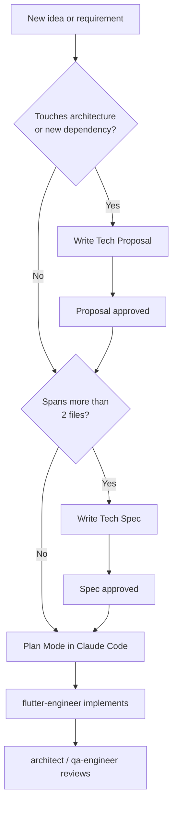

# Unishare Engineering Docs

Internal engineering documentation for the Unishare Flutter project.

## Quick links

| | |
|---|---|
| [Tech Proposals](tech-proposals/index.md) | Problem definitions and option analysis before architecture work |
| [Tech Specs](tech-specs/index.md) | Implementation contracts before coding begins |
| [Decisions](decisions/index.md) | Architecture Decision Records (ADRs) |
| [Templates](stencils/tech-proposal.md) | Copy these to start a new document |

## When to write what

## Workflow summary

1. **Tech Proposal** — define the problem, list options, make a recommendation. Reviewed and approved before any design work.
2. **Tech Spec** — implementation contract: file map, API surface, test plan. Reviewed and approved before any code is written.
3. **ADR** — record the key decision and its rationale after it's made. Immutable audit trail.
