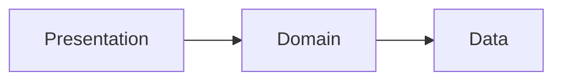

# Tech Spec Template

Copy the markdown below into `tech-specs/NNNN-slug.md` on the `main` branch and fill it in.

**When to write one:** Any change spanning more than 2 files or with a defined test contract. Must be approved before coding begins.

---

## Template

````markdown
---
id: SPEC-NNNN
title: "Short title"
status: DRAFT
author: ""
date: YYYY-MM-DD
proposal: PROP-NNNN
---

# SPEC-NNNN: Title

**Status:** DRAFT | **Author:** | **Date:** | **Proposal:** [NNNN](../tech-proposals/nnnn-slug.md)

---

## Overview

One paragraph: what is being built and why.

## Architecture



## File map

| Action | Path | Responsibility |
|---|---|---|
| Create | `lib/features/<name>/domain/entities/foo.dart` | |
| Create | `lib/features/<name>/data/models/foo_model.dart` | |
| Modify | `lib/main.dart` | |

## API contracts

```dart
// Public interfaces the implementation must expose
abstract class FooRepository {
  Future<void> doSomething(String id);
}
```

## Test plan

| Test file | Covers |
|---|---|
| `test/unit/features/<name>/foo_test.dart` | |
| `test/widget/features/<name>/foo_screen_test.dart` | |

## Out of scope

- Explicitly list what this spec does NOT cover.

## Open questions

- [ ] Must be resolved before status moves to APPROVED.
````

---

## Status values

| Status | Meaning |
|---|---|
| `DRAFT` | Work in progress |
| `REVIEW` | Ready for architect/QA review |
| `APPROVED` | Implementation can begin |
| `IMPLEMENTED` | Done and merged |
| `SUPERSEDED` | Replaced by a newer spec |
