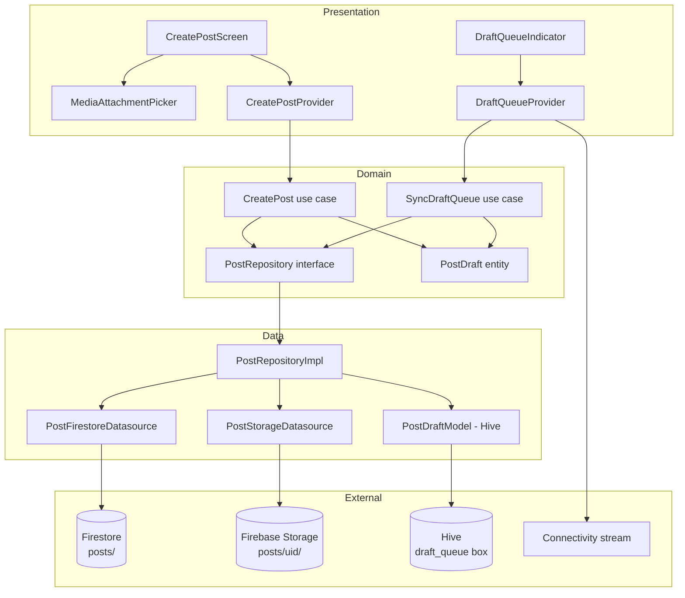

# SPEC-0004: Post Integration

**Status:** APPROVED | **Author:** architect | **Date:** 2026-05-03 | **Proposal:** [PROP-0004](../tech-proposals/0004-post-integration.md) | **Approved by:** Slade (CTO) on 2026-05-03

---

## Overview

This spec describes the complete write path for post creation in Unishare. Students can currently read the feed (established by PROP-0003) but have no mechanism to author or publish content. SPEC-0004 adds a guarded `/posts/create` route that collects title, body, tags, and optional media attachments. All media is uploaded to Firebase Storage first; the resulting download URLs are collected before a single atomic Firestore document write to `posts/{postId}`. If the device is offline when the user taps Publish, the full draft — including any already-uploaded Storage URLs — is persisted to a Hive queue and auto-published on the next connectivity event. No Cloud Functions are introduced; the entire write path runs on the client.

---

## Architecture



The Domain layer holds zero Flutter or Firebase imports. `PostRepository` and both use cases depend only on pure Dart types. The Data layer owns all Firebase SDK calls. The Presentation layer wires Riverpod providers to Domain use cases; it never imports from `data/` directly.

---

## File map

| Action | Path | Responsibility |
|---|---|---|
| Create | `lib/features/post/domain/entities/post_draft.dart` | Pure Dart offline draft entity; holds `DraftStatus` enum |
| Create | `lib/features/post/domain/entities/post.dart` | Published post entity (read by feed; authoritative shape from PROP-0003) |
| Modify | `lib/features/post/domain/repositories/post_repository.dart` | Add `createPost` method; may already exist from PROP-0003 — extend it |
| Create | `lib/features/post/domain/usecases/create_post.dart` | Validates draft, delegates upload + write to repository, handles offline queue |
| Create | `lib/features/post/domain/usecases/sync_draft_queue.dart` | Drains Hive queue on reconnect; delegates each draft through `createPost` logic |
| Create | `lib/features/post/data/datasources/post_firestore_datasource.dart` | Writes one atomic document to `posts/{postId}` via `cloud_firestore` |
| Create | `lib/features/post/data/datasources/post_storage_datasource.dart` | Uploads a single file to `posts/{uid}/{filename}` and returns download URL |
| Create | `lib/features/post/data/models/post_draft_model.dart` | Hive-serializable model mirroring `PostDraft`; generated `TypeAdapter` |
| Modify | `lib/features/post/data/repositories/post_repository_impl.dart` | Implement `createPost`; orchestrate storage uploads then Firestore write; persist/remove Hive drafts |
| Create | `lib/features/post/presentation/screens/create_post_screen.dart` | Form: title (required), body, tags, media picker; submit triggers `CreatePostProvider` |
| Create | `lib/features/post/presentation/widgets/media_attachment_picker.dart` | Displays selected files, enforces 10 MB / MIME limits, opens file/image picker |
| Create | `lib/features/post/presentation/widgets/draft_queue_indicator.dart` | Badge or banner showing count of pending queued drafts |
| Create | `lib/features/post/presentation/providers/create_post_provider.dart` | Riverpod `AsyncNotifier`; exposes `CreatePostState`; calls `CreatePost` use case |
| Create | `lib/features/post/presentation/providers/draft_queue_provider.dart` | Watches Hive queue box; reacts to connectivity; triggers `SyncDraftQueue` |
| Modify | `lib/core/router/router.dart` | Add `/posts/create` `GoRoute`; redirect to `/welcome` when unauthenticated |
| Create | `lib/core/storage/post_draft_box.dart` | Opens and exposes the `draft_queue` Hive box; registers `PostDraftModelAdapter` |
| Modify | `lib/main.dart` | Call `postDraftBox.init()` after `Hive.initFlutter()` to register adapter and open box |
| Modify | `firestore.rules` | Add `posts` collection rule: `allow create` when `request.auth != null && request.resource.data.authorId == request.auth.uid` |
| Create | `storage.rules` | Restrict `posts/{uid}/{file}`: `allow write` when `request.auth.uid == uid && request.resource.size <= 10 * 1024 * 1024 && request.resource.contentType.matches('image/jpeg\|image/png\|image/webp\|application/pdf')` |

---

## API contracts

### Domain entity — `PostDraft`

```dart
// lib/features/post/domain/entities/post_draft.dart

enum DraftStatus { idle, uploading, publishing, published, queued, error }

class PostDraft {
  const PostDraft({
    required this.id,
    required this.title,
    required this.body,
    required this.tags,
    required this.localMediaPaths,
    required this.uploadedUrls,
    required this.createdAt,
    this.status = DraftStatus.idle,
    this.errorMessage,
  });

  /// Stable identifier used as the Firestore document ID and Hive key.
  final String id;

  /// Required. Publish is blocked when empty.
  final String title;

  /// Optional.
  final String body;

  final List<String> tags;

  /// Absolute local file-system paths selected by the user, in insertion order.
  final List<String> localMediaPaths;

  /// Maps localPath → Firebase Storage download URL for files already uploaded.
  /// On retry, any localPath present in this map is skipped in the upload loop.
  final Map<String, String> uploadedUrls;

  final DateTime createdAt;

  final DraftStatus status;

  /// Non-null only when status == DraftStatus.error.
  final String? errorMessage;

  PostDraft copyWith({
    String? title,
    String? body,
    List<String>? tags,
    List<String>? localMediaPaths,
    Map<String, String>? uploadedUrls,
    DraftStatus? status,
    String? errorMessage,
  });
}
```

### Domain entity — `Post`

```dart
// lib/features/post/domain/entities/post.dart

class Post {
  const Post({
    required this.id,
    required this.authorId,
    required this.authorName,
    required this.authorAvatar,
    required this.title,
    required this.body,
    required this.mediaUrls,
    required this.tags,
    required this.likesCount,
    required this.createdAt,
    required this.updatedAt,
  });

  final String id;
  final String authorId;
  final String authorName;
  final String authorAvatar;
  final String title;
  final String body;
  final List<String> mediaUrls;
  final List<String> tags;
  final int likesCount;
  final DateTime createdAt;
  final DateTime updatedAt;
}
```

### Domain repository interface — `PostRepository` additions

```dart
// lib/features/post/domain/repositories/post_repository.dart

abstract interface class PostRepository {
  // --- existing methods from PROP-0003 (preserved) ---
  Stream<List<Post>> watchFeed({int limit = 20});

  // --- new for SPEC-0004 ---

  /// Persists [draft] to the local Hive queue.
  Future<void> saveDraft(PostDraft draft);

  /// Removes the draft with [draftId] from the local Hive queue.
  Future<void> removeDraft(String draftId);

  /// Returns all drafts currently in the Hive queue, ordered by createdAt.
  Future<List<PostDraft>> loadDraftQueue();

  /// Uploads media for [draft], writes the Firestore document, and removes the
  /// draft from the Hive queue on success. Throws on unrecoverable failure;
  /// updates [onProgress] with fraction [0.0, 1.0] during upload.
  Future<void> publishDraft(
    PostDraft draft, {
    void Function(double progress)? onProgress,
  });
}
```

### Domain use case — `CreatePost`

```dart
// lib/features/post/domain/usecases/create_post.dart

class CreatePost {
  const CreatePost(this._repository);

  final PostRepository _repository;

  /// Validates [draft], saves it to the queue, then attempts to publish.
  /// Returns the same [draft] with status updated to [DraftStatus.published]
  /// on success, or [DraftStatus.queued] when offline,
  /// or [DraftStatus.error] on unrecoverable failure.
  Future<PostDraft> call({
    required PostDraft draft,
    required bool isConnected,
    void Function(double progress)? onProgress,
  });
}
```

Validation rules enforced inside `call`:
- `draft.title.trim().isNotEmpty` — throws `ArgumentError('title_required')` otherwise.
- Each `localMediaPaths` entry must resolve to a file whose size is at most 10 MB and whose MIME type is one of `image/jpeg`, `image/png`, `image/webp`, `application/pdf`. Throws `ArgumentError('invalid_media')` on first violation.
- When `isConnected == false`, the method saves to the Hive queue and returns the draft with `status = DraftStatus.queued` without attempting any network call.

### Domain use case — `SyncDraftQueue`

```dart
// lib/features/post/domain/usecases/sync_draft_queue.dart

class SyncDraftQueue {
  const SyncDraftQueue(this._repository);

  final PostRepository _repository;

  /// Loads all queued drafts and attempts to publish each in createdAt order.
  /// Emits each draft's updated [PostDraft] as it transitions.
  /// Stops processing on the first unrecoverable error to preserve ordering.
  Stream<PostDraft> call();
}
```

### Presentation state — `CreatePostState`

```dart
// lib/features/post/presentation/providers/create_post_provider.dart

sealed class CreatePostState {
  const CreatePostState();
}

final class CreatePostIdle extends CreatePostState {
  const CreatePostIdle();
}

final class CreatePostUploading extends CreatePostState {
  const CreatePostUploading({required this.progress});
  /// Upload fraction in [0.0, 1.0].
  final double progress;
}

final class CreatePostPublishing extends CreatePostState {
  const CreatePostPublishing();
}

final class CreatePostPublished extends CreatePostState {
  const CreatePostPublished({required this.postId});
  final String postId;
}

final class CreatePostQueued extends CreatePostState {
  const CreatePostQueued({required this.draftId});
  final String draftId;
}

final class CreatePostError extends CreatePostState {
  const CreatePostError({required this.message, required this.draft});
  final String message;
  final PostDraft draft;
}
```

### Riverpod notifier signatures

```dart
// lib/features/post/presentation/providers/create_post_provider.dart

@riverpod
class CreatePostNotifier extends _$CreatePostNotifier {
  @override
  CreatePostState build();

  Future<void> submit({
    required String title,
    required String body,
    required List<String> tags,
    required List<String> localMediaPaths,
  });

  void reset();
}

// lib/features/post/presentation/providers/draft_queue_provider.dart

@riverpod
class DraftQueueNotifier extends _$DraftQueueNotifier {
  @override
  List<PostDraft> build();

  Future<void> sync();
}
```

---

## Firestore schema

Collection: `posts`

```
posts/{postId}
  authorId:     string   — must equal request.auth.uid (Security Rules enforce)
  authorName:   string   — denormalized from FirebaseAuth.currentUser.displayName at write time
  authorAvatar: string   — denormalized from FirebaseAuth.currentUser.photoURL at write time; may be empty string
  title:        string   — non-empty, validated client-side and by Rules (size > 0)
  body:         string   — may be empty
  mediaUrls:    string[] — Firebase Storage download URLs; empty array when no attachments
  tags:         string[] — may be empty
  likesCount:   int      — written as 0 at creation; incremented by separate interactions feature (out of scope)
  createdAt:    Timestamp
  updatedAt:    Timestamp — same value as createdAt on initial write; reserved for future edit path
```

Indexes: no new composite indexes required. The feed query from PROP-0003 (`collectionGroup('posts').orderBy('createdAt', descending: true)`) already covers the read pattern. A per-author query (`where('authorId', isEqualTo: uid).orderBy('createdAt')`) will require a composite index — add `posts | authorId ASC, createdAt ASC` to `firestore.indexes.json` in this spec's scope.

Storage path convention: `posts/{uid}/{uuid}-{filename}` where `uuid` is a client-generated v4 UUID. This scopes each user's uploads to a predictable path that Security Rules can match on `uid`.

---

## Security rules

### `firestore.rules` addition

```
match /posts/{postId} {
  allow read: if request.auth != null;
  allow create: if request.auth != null
                && request.resource.data.authorId == request.auth.uid
                && request.resource.data.title is string
                && request.resource.data.title.size() > 0
                && request.resource.data.likesCount == 0;
  allow update, delete: if false; // edit/delete out of scope for v1
}
```

### `storage.rules` addition

```
match /posts/{uid}/{fileName} {
  allow read: if request.auth != null;
  allow write: if request.auth != null
               && request.auth.uid == uid
               && request.resource.size <= 10 * 1024 * 1024
               && request.resource.contentType.matches(
                    'image/jpeg|image/png|image/webp|application/pdf'
                  );
}
```

---

## Hive draft queue

Box name: `draft_queue`

Key: `PostDraft.id` (string)

`PostDraftModel` mirrors all `PostDraft` fields with Hive type annotations. The `DraftStatus` enum is stored as its integer index. The `uploadedUrls` map is stored as a `Map<String, String>` (Hive natively supports this).

```dart
// lib/features/post/data/models/post_draft_model.dart
// (manual Hive TypeAdapter — no Freezed, to avoid generated file conflicts)

@HiveType(typeId: 1)
class PostDraftModel extends HiveObject {
  @HiveField(0) late String id;
  @HiveField(1) late String title;
  @HiveField(2) late String body;
  @HiveField(3) late List<String> tags;
  @HiveField(4) late List<String> localMediaPaths;
  @HiveField(5) late Map<String, String> uploadedUrls;
  @HiveField(6) late DateTime createdAt;
  @HiveField(7) late int statusIndex; // DraftStatus.index
  @HiveField(8) String? errorMessage;

  PostDraft toEntity();
  static PostDraftModel fromEntity(PostDraft draft);
}
```

`typeId: 1` is reserved for `PostDraftModel`. The engineer must verify that no existing Hive model in the codebase already uses `typeId: 1` before assigning it.

Registration call in `lib/core/storage/post_draft_box.dart`:

```dart
Future<void> initPostDraftBox() async {
  Hive.registerAdapter(PostDraftModelAdapter());
  await Hive.openBox<PostDraftModel>('draft_queue');
}
```

Called in `main.dart` immediately after `Hive.initFlutter()`.

---

## GoRouter route

Add to the `routes` list in `lib/core/router/router.dart`:

```dart
GoRoute(
  path: '/posts/create',
  builder: (context, state) => const CreatePostScreen(),
),
```

The existing `_RouterNotifier.redirect` already redirects unauthenticated users to `/welcome` for all non-auth routes, so no additional guard is needed in the route definition itself. The engineer must confirm this redirect logic covers `/posts/create` before closing the PR.

---

## Upload sequencing and partial-recovery algorithm

The `PostRepositoryImpl.publishDraft` implementation must follow this sequence exactly:

1. Load `draft.uploadedUrls` (may be partially populated from a prior attempt).
2. For each path in `draft.localMediaPaths`, in order:
   a. If `draft.uploadedUrls.containsKey(path)`, skip — already uploaded.
   b. Otherwise, call `PostStorageDatasource.upload(localPath, uid)` to obtain a download URL.
   c. On success, update `draft.uploadedUrls[path] = downloadUrl` and persist the updated draft to Hive (so the URL survives a crash).
   d. On failure, update Hive with partial `uploadedUrls`, update `draft.status = DraftStatus.error`, and rethrow.
3. Once all uploads are complete, derive `mediaUrls` from `draft.uploadedUrls.values`.
4. Call `PostFirestoreDatasource.createPost(...)` with the complete document payload.
5. On Firestore write success, call `PostRepository.removeDraft(draft.id)`.
6. On Firestore write failure, leave the draft in the Hive queue with `status = DraftStatus.queued` so `SyncDraftQueue` will retry with the already-uploaded URLs.

---

## Test plan

| Test file | Covers |
|---|---|
| `test/unit/features/post/domain/usecases/create_post_test.dart` | `CreatePost.call` — title validation throws when empty; valid draft with connectivity publishes; valid draft without connectivity is queued; media MIME/size validation rejects invalid files |
| `test/unit/features/post/domain/usecases/sync_draft_queue_test.dart` | `SyncDraftQueue.call` — empty queue emits nothing; single queued draft is published and removed; second draft is skipped when first fails unrecoverably; emits DraftStatus transitions in order |
| `test/unit/features/post/data/repositories/post_repository_impl_upload_test.dart` | Upload-ordering logic — already-uploaded paths are skipped (idempotency); Hive draft is updated with partial `uploadedUrls` after each successful file; Firestore write is not called until all uploads complete |
| `test/unit/features/post/data/repositories/post_repository_impl_recovery_test.dart` | Partial-upload recovery — draft with one pre-populated `uploadedUrls` entry only uploads the remaining files; on Storage failure mid-sequence, existing URLs are preserved in Hive |
| `test/widget/features/post/screens/create_post_screen_test.dart` | Submit button is disabled when title field is empty; submit button is enabled when title is non-empty; tapping submit with no connectivity transitions to Queued chip; error banner appears when provider state is `CreatePostError` |
| `test/widget/features/post/widgets/media_attachment_picker_test.dart` | Displays zero items by default; shows a chip for each added file; displays file size warning when a file exceeds 10 MB; remove button clears the file from the list |
| `test/widget/features/post/widgets/draft_queue_indicator_test.dart` | Renders nothing when queue is empty; shows correct count badge when queue has items; badge updates reactively when queue changes |

---

## Out of scope

- Post editing or deletion.
- Comment threads, reactions, or likes beyond the existing `likesCount` field (which is written as `0` at creation and never modified by this feature).
- Full-text search, content moderation, or spam filtering at publish time.
- Cloud Functions involvement in the write path.
- NestJS or REST API involvement in the write path.
- Background reconciliation of stale author display name or avatar on existing posts.
- Admin or moderation tooling.
- Video or audio media types (only JPEG, PNG, WebP, and PDF are in scope).
- Push notifications triggered by a new post.
- Draft sharing across devices (Hive is local-only).

---

## Open questions

- [ ] **Hive typeId assignment** — Confirm that `typeId: 1` is not already claimed by another Hive model in the project (only the `settings` box is known at spec time). The flutter-engineer must audit existing registered adapters before assigning the ID.
- [ ] **`post_repository.dart` pre-existence** — PROP-0003 may have scaffolded a `PostRepository` interface for the read path. The engineer must determine whether to extend an existing file or create a new one, and must not break the feed's `watchFeed` stream in doing so.
- [x] **Connectivity detection package** — **Resolved:** use `connectivity_plus`. Provides a real-time `Stream<ConnectivityResult>` needed to trigger `SyncDraftQueue` on reconnect. Add to `pubspec.yaml`; no platform permission entries required.
- [x] **File picker package** — **Resolved:** use `file_picker`. Covers all four required MIME types (JPEG, PNG, WebP, PDF) in a single package. `image_picker` is camera/gallery only and cannot pick PDF files. Add to `pubspec.yaml`; add `NSPhotoLibraryUsageDescription` to `Info.plist` and `READ_EXTERNAL_STORAGE` to `AndroidManifest.xml`.
