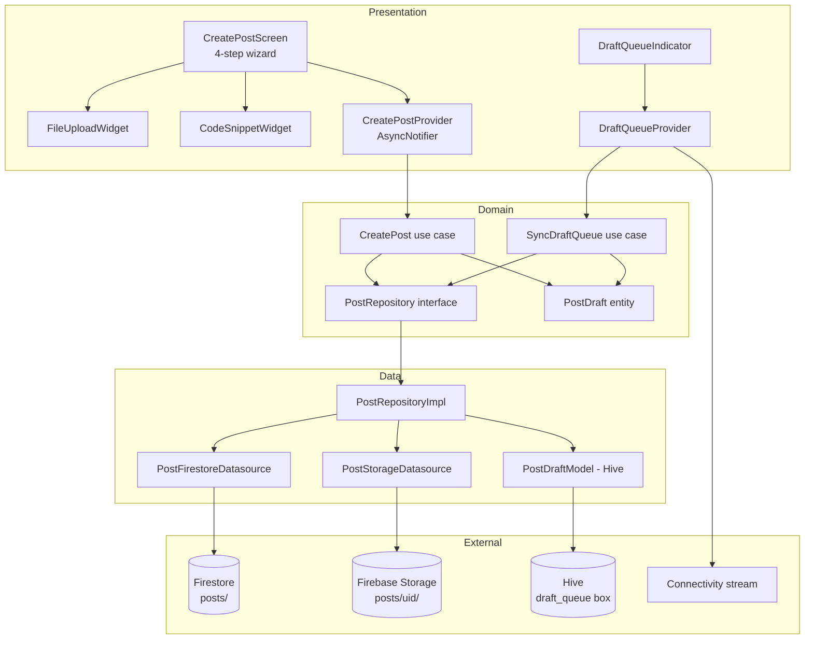

# SPEC-0004: Post Integration

**Status:** REVISED  
**Author:** architect  
**Date:** 2026-05-05  
**Proposal:** [PROP-0004](../tech-proposals/0004-post-integration.md)  
**Approved by:** Slade (CTO) on 2026-05-03  
**Revised:** 2026-05-05 — updated to match Figma design (node ids 12:1868–12:2339); original single-form design replaced with 4-step wizard.

---

## Overview

This spec describes the complete write path for post creation in Unishare. Students can currently read the feed but have no mechanism to author or publish content. SPEC-0004 adds a guarded `/posts/create` route that guides the user through a **4-step wizard**:

1. **Type** — choose content category (Lecture Note / Assignment; Past Exam is unavailable v1)
2. **Course** — select academic year and course from Firestore reference data
3. **Details** — title, description, posting identity (named/anonymous), semester, module number, external URL, tags
4. **Files** — optional file uploads (max 50 MB each) and/or an inline code snippet with language and filename

All media is uploaded to Firebase Storage first; the resulting download URLs are collected before a single atomic Firestore document write to `posts/{postId}`. If the device is offline when the user taps Submit, the full draft is persisted to a Hive queue and auto-published on the next connectivity event. No Cloud Functions are introduced; the entire write path runs on the client.

---

## Architecture



The Domain layer holds zero Flutter or Firebase imports. `PostRepository` and both use cases depend only on pure Dart types. The Data layer owns all Firebase SDK calls. The Presentation layer wires Riverpod providers to Domain use cases; it never imports from `data/` directly.

---

## Wizard steps

| Step | Screen name (Figma) | Required inputs | Next enabled when |
|---|---|---|---|
| 1 | TypeStep | `postType` | one type selected |
| 2 | CourseStep | `year`, `courseId` | both dropdowns selected |
| 3 | DetailsStep | `title`, `description`, `semester`, `moduleNumber` | all required fields non-empty |
| 4 | FilesStep | files / snippet (optional) | always (Submit enabled) |

---

## File map

| Action | Path | Responsibility |
|---|---|---|
| Create | `lib/features/post/domain/entities/post_draft.dart` | Pure Dart wizard draft entity; holds `PostType`, `DraftStatus`, `PostingIdentity` enums |
| Create | `lib/features/post/domain/entities/post.dart` | Published post entity (authoritative shape for feed) |
| Create | `lib/features/post/domain/entities/code_snippet.dart` | Inline code snippet value object: language, filename, content |
| Modify | `lib/features/post/domain/repositories/post_repository.dart` | Add `createPost` and draft queue methods; preserve existing `watchFeed` |
| Create | `lib/features/post/domain/usecases/create_post.dart` | Validates draft, delegates upload + write, handles offline queue |
| Create | `lib/features/post/domain/usecases/sync_draft_queue.dart` | Drains Hive queue on reconnect |
| Create | `lib/features/post/data/datasources/post_firestore_datasource.dart` | Writes atomic document to `posts/{postId}` |
| Create | `lib/features/post/data/datasources/post_storage_datasource.dart` | Uploads single file to `posts/{uid}/{filename}`, returns download URL |
| Create | `lib/features/post/data/models/post_draft_model.dart` | Hive-serializable model mirroring `PostDraft`; manual `TypeAdapter` |
| Modify | `lib/features/post/data/repositories/post_repository_impl.dart` | Orchestrate storage uploads then Firestore write; persist/remove Hive drafts |
| Create | `lib/features/post/presentation/screens/create_post_screen.dart` | 4-step `PageView` wizard with `StepIndicator` and `StepNav` |
| Create | `lib/features/post/presentation/widgets/type_step.dart` | Step 1: content type selection cards |
| Create | `lib/features/post/presentation/widgets/course_step.dart` | Step 2: year + course dropdowns |
| Create | `lib/features/post/presentation/widgets/details_step.dart` | Step 3: title, description, identity, semester, module, URL, tags |
| Create | `lib/features/post/presentation/widgets/files_step.dart` | Step 4: file drop zone + code snippet panel |
| Create | `lib/features/post/presentation/widgets/file_upload_widget.dart` | Displays selected files, enforces 50 MB limit |
| Create | `lib/features/post/presentation/widgets/code_snippet_widget.dart` | Language dropdown, filename input, code textarea |
| Create | `lib/features/post/presentation/widgets/draft_queue_indicator.dart` | Badge showing count of pending queued drafts |
| Create | `lib/features/post/presentation/providers/create_post_provider.dart` | `AsyncNotifier` holding `CreatePostState`; calls `CreatePost` use case |
| Create | `lib/features/post/presentation/providers/draft_queue_provider.dart` | Watches Hive queue; reacts to connectivity; triggers `SyncDraftQueue` |
| Modify | `lib/core/router/router.dart` | `/posts/create` `GoRoute` (redirect guard already covers unauthenticated users) |
| Create | `lib/core/storage/post_draft_box.dart` | Opens `draft_queue` Hive box; registers `PostDraftModelAdapter` |
| Modify | `lib/main.dart` | Call `initPostDraftBox()` after `Hive.initFlutter()` |
| Modify | `firestore.rules` | `posts` collection create/read rules |
| Create | `storage.rules` | `posts/{uid}/{file}` write rule (50 MB, allowed MIME types) |

---

## API contracts

### Enums

```dart
enum PostType { lectureNote, assignment }

enum DraftStatus { idle, uploading, publishing, published, queued, error }

enum PostingIdentity { named, anonymous }
```

### Domain entity — `CodeSnippet`

```dart
// lib/features/post/domain/entities/code_snippet.dart

class CodeSnippet {
  const CodeSnippet({
    required this.language,
    required this.filename,
    required this.content,
  });

  final String language;   // e.g. "TypeScript"
  final String filename;   // without extension, e.g. "snippet"
  final String content;
}
```

### Domain entity — `PostDraft`

```dart
// lib/features/post/domain/entities/post_draft.dart

class PostDraft {
  const PostDraft({
    required this.id,
    required this.postType,
    required this.year,
    required this.courseId,
    required this.title,
    required this.description,
    required this.postingIdentity,
    required this.semester,
    required this.moduleNumber,
    required this.localMediaPaths,
    required this.uploadedUrls,
    required this.createdAt,
    this.externalUrl,
    this.tags = const [],
    this.codeSnippet,
    this.status = DraftStatus.idle,
    this.errorMessage,
  });

  final String id;
  final PostType postType;

  // Step 2
  final int year;           // e.g. 2
  final String courseId;    // Firestore reference data ID

  // Step 3
  final String title;
  final String description;
  final PostingIdentity postingIdentity;
  final int semester;       // 1 or 2
  final String moduleNumber;
  final String? externalUrl;
  final List<String> tags;  // max 5

  // Step 4
  final List<String> localMediaPaths;
  final Map<String, String> uploadedUrls; // localPath → Storage download URL
  final CodeSnippet? codeSnippet;

  final DateTime createdAt;
  final DraftStatus status;
  final String? errorMessage;

  PostDraft copyWith({ ... });
}
```

### Domain entity — `Post`

```dart
// lib/features/post/domain/entities/post.dart

class Post {
  const Post({
    required this.id,
    required this.authorId,
    required this.authorName,
    required this.authorAvatar,
    required this.postType,
    required this.year,
    required this.courseId,
    required this.title,
    required this.description,
    required this.postingIdentity,
    required this.semester,
    required this.moduleNumber,
    required this.mediaUrls,
    required this.tags,
    required this.likesCount,
    required this.createdAt,
    required this.updatedAt,
    this.externalUrl,
    this.codeSnippetUrl,
  });

  final String id;
  final String authorId;
  final String authorName;   // empty string when anonymous
  final String authorAvatar; // empty string when anonymous
  final PostType postType;
  final int year;
  final String courseId;
  final String title;
  final String description;
  final PostingIdentity postingIdentity;
  final int semester;
  final String moduleNumber;
  final List<String> mediaUrls;
  final List<String> tags;
  final int likesCount;
  final DateTime createdAt;
  final DateTime updatedAt;
  final String? externalUrl;
  final String? codeSnippetUrl; // Storage download URL for uploaded snippet file
}
```

### Domain repository interface additions

```dart
abstract interface class PostRepository {
  // --- existing (preserved) ---
  Stream<List<Post>> watchFeed({int limit = 20});

  // --- new for SPEC-0004 ---
  Future<void> saveDraft(PostDraft draft);
  Future<void> removeDraft(String draftId);
  Future<List<PostDraft>> loadDraftQueue();
  Future<void> publishDraft(
    PostDraft draft, {
    void Function(double progress)? onProgress,
  });
}
```

### Domain use case — `CreatePost`

```dart
class CreatePost {
  const CreatePost(this._repository);
  final PostRepository _repository;

  /// Validates [draft], saves to queue, then attempts to publish.
  /// Returns draft with updated status: published, queued, or error.
  Future<PostDraft> call({
    required PostDraft draft,
    required bool isConnected,
    void Function(double progress)? onProgress,
  });
}
```

Validation rules:
- `draft.title.trim().isNotEmpty` — throws `ArgumentError('title_required')`
- `draft.description.trim().isNotEmpty` — throws `ArgumentError('description_required')`
- `draft.moduleNumber.trim().isNotEmpty` — throws `ArgumentError('module_required')`
- Each `localMediaPaths` entry must resolve to a file ≤ 50 MB. Throws `ArgumentError('file_too_large')` on first violation.
- When `isConnected == false`, saves to Hive queue and returns `DraftStatus.queued` without any network call.

### Domain use case — `SyncDraftQueue`

```dart
class SyncDraftQueue {
  const SyncDraftQueue(this._repository);
  final PostRepository _repository;

  Stream<PostDraft> call();
}
```

### Presentation state — `CreatePostState`

```dart
sealed class CreatePostState { const CreatePostState(); }

final class CreatePostIdle extends CreatePostState {
  const CreatePostIdle();
}

final class CreatePostUploading extends CreatePostState {
  const CreatePostUploading({required this.progress});
  final double progress; // [0.0, 1.0]
}

final class CreatePostPublishing extends CreatePostState {
  const CreatePostPublishing();
}

final class CreatePostPublished extends CreatePostState {
  const CreatePostPublished({required this.postId});
  final String postId;
}

final class CreatePostQueued extends CreatePostState {
  const CreatePostQueued({required this.draftId});
  final String draftId;
}

final class CreatePostError extends CreatePostState {
  const CreatePostError({required this.message, required this.draft});
  final String message;
  final PostDraft draft;
}
```

### Riverpod notifier signatures

```dart
@riverpod
class CreatePostNotifier extends _$CreatePostNotifier {
  @override
  CreatePostState build() => const CreatePostIdle();

  Future<void> submit({required PostDraft draft});
  void reset();
}

@riverpod
class DraftQueueNotifier extends _$DraftQueueNotifier {
  @override
  List<PostDraft> build() => [];

  Future<void> sync();
}
```

---

## Firestore schema

Collection: `posts`

```
posts/{postId}
  authorId:        string   — request.auth.uid
  authorName:      string   — FirebaseAuth displayName; empty string when anonymous
  authorAvatar:    string   — FirebaseAuth photoURL; empty string when anonymous
  postingIdentity: string   — "named" | "anonymous"
  postType:        string   — "lectureNote" | "assignment"
  year:            int
  courseId:        string
  title:           string   — non-empty
  description:     string   — non-empty
  semester:        int      — 1 or 2
  moduleNumber:    string
  externalUrl:     string?  — null when not provided
  mediaUrls:       string[] — Storage download URLs; empty array when none
  codeSnippetUrl:  string?  — Storage download URL for snippet file; null when none
  tags:            string[] — up to 5 items; may be empty
  likesCount:      int      — written as 0 at creation
  createdAt:       Timestamp
  updatedAt:       Timestamp — same as createdAt on initial write
```

Indexes: add `posts | authorId ASC, createdAt ASC` to `firestore.indexes.json`.

Storage path convention: `posts/{uid}/{uuid}-{filename}`

---

## Security rules

### `firestore.rules` addition

```
match /posts/{postId} {
  allow read: if request.auth != null;
  allow create: if request.auth != null
                && request.resource.data.authorId == request.auth.uid
                && request.resource.data.title is string
                && request.resource.data.title.size() > 0
                && request.resource.data.description is string
                && request.resource.data.description.size() > 0
                && request.resource.data.likesCount == 0;
  allow update, delete: if false;
}
```

### `storage.rules` addition

```
match /posts/{uid}/{fileName} {
  allow read: if request.auth != null;
  allow write: if request.auth != null
               && request.auth.uid == uid
               && request.resource.size <= 50 * 1024 * 1024
               && request.resource.contentType.matches(
                    'image/jpeg|image/png|image/webp|application/pdf|text/plain'
                  );
}
```

`text/plain` covers uploaded code snippet files.

---

## Hive draft queue

Box name: `draft_queue`  
Key: `PostDraft.id`  
`typeId: 1` — engineer must verify no existing model claims this ID.

```dart
@HiveType(typeId: 1)
class PostDraftModel extends HiveObject {
  @HiveField(0)  late String id;
  @HiveField(1)  late int postTypeIndex;
  @HiveField(2)  late int year;
  @HiveField(3)  late String courseId;
  @HiveField(4)  late String title;
  @HiveField(5)  late String description;
  @HiveField(6)  late int postingIdentityIndex;
  @HiveField(7)  late int semester;
  @HiveField(8)  late String moduleNumber;
  @HiveField(9)  String? externalUrl;
  @HiveField(10) late List<String> tags;
  @HiveField(11) late List<String> localMediaPaths;
  @HiveField(12) late Map<String, String> uploadedUrls;
  @HiveField(13) late DateTime createdAt;
  @HiveField(14) late int statusIndex;
  @HiveField(15) String? errorMessage;
  @HiveField(16) String? codeSnippetLanguage;
  @HiveField(17) String? codeSnippetFilename;
  @HiveField(18) String? codeSnippetContent;

  PostDraft toEntity();
  static PostDraftModel fromEntity(PostDraft draft);
}
```

---

## Upload sequencing and partial-recovery algorithm

`PostRepositoryImpl.publishDraft` must follow this sequence:

1. Load `draft.uploadedUrls` (may be partially populated from a prior attempt).
2. For each path in `draft.localMediaPaths`, in order:
   a. If `draft.uploadedUrls.containsKey(path)`, skip — already uploaded.
   b. Call `PostStorageDatasource.upload(localPath, uid)` → download URL.
   c. On success, update `draft.uploadedUrls[path] = url` and persist to Hive.
   d. On failure, persist partial `uploadedUrls`, set `DraftStatus.error`, rethrow.
3. If `draft.codeSnippet != null`, upload snippet content as `text/plain` to `posts/{uid}/{uuid}-{filename}.{ext}`. Store the download URL in the Firestore document as `codeSnippetUrl`.
4. Derive `mediaUrls` from `draft.uploadedUrls.values`.
5. Call `PostFirestoreDatasource.createPost(...)` with the complete payload.
6. On success, call `removeDraft(draft.id)`.
7. On Firestore failure, leave draft in Hive with `DraftStatus.queued`.

---

## GoRouter route

```dart
GoRoute(
  path: '/posts/create',
  builder: (context, state) => const CreatePostScreen(),
),
```

The existing `_RouterNotifier.redirect` already redirects unauthenticated users to `/welcome` for all non-auth routes — no additional guard needed.

---

## Test plan

| Test file | Covers |
|---|---|
| `test/unit/features/post/domain/usecases/create_post_test.dart` | title/description/module validation throws; valid draft with connectivity publishes; offline draft is queued; file > 50 MB is rejected |
| `test/unit/features/post/domain/usecases/sync_draft_queue_test.dart` | empty queue emits nothing; single draft publishes and is removed; second draft skipped when first fails; status transitions emitted in order |
| `test/unit/features/post/data/repositories/post_repository_impl_upload_test.dart` | already-uploaded paths are skipped; Hive updated after each file; Firestore not called until all uploads complete; snippet uploaded before Firestore write |
| `test/unit/features/post/data/repositories/post_repository_impl_recovery_test.dart` | partial uploadedUrls only re-uploads missing files; on Storage failure existing URLs preserved |
| `test/widget/features/post/screens/create_post_screen_test.dart` | Next disabled on step 1 until type selected; Next disabled on step 2 until year+course selected; Next disabled on step 3 until required fields filled; Submit always enabled on step 4; Back navigates to previous step |
| `test/widget/features/post/widgets/type_step_test.dart` | tapping Lecture Note highlights card; tapping Assignment highlights card; Past Exam card is disabled |
| `test/widget/features/post/widgets/details_step_test.dart` | anonymous toggle hides author name in preview; tag input accepts up to 5 tags; 6th tag is rejected |
| `test/widget/features/post/widgets/files_step_test.dart` | file > 50 MB shows size warning; code snippet panel shows language dropdown and filename input; empty snippet is not uploaded |
| `test/widget/features/post/widgets/draft_queue_indicator_test.dart` | renders nothing when queue empty; shows correct count; updates reactively |

---

## Out of scope

- Post editing or deletion.
- Past Exam type (marked "Unavailable" in design — reserved for a future spec).
- Comment threads, reactions, or likes beyond the initial `likesCount: 0` write.
- Full-text search, content moderation, or spam filtering.
- Cloud Functions in the write path.
- Video or audio media types.
- Push notifications on new post.
- Draft sharing across devices (Hive is local-only).
- Background sync of stale author display name or avatar.

---

## Open questions

- [ ] **Hive typeId** — confirm `typeId: 1` is not already claimed.
- [ ] **`post_repository.dart` pre-existence** — determine whether to extend existing file from PROP-0003 or create new; must not break `watchFeed`.
- [ ] **Course reference data shape** — confirm Firestore path and field names for year/course dropdowns (seeded by `tools/seed_firestore.js`).
- [ ] **Semester values** — confirm whether semester is always 1 or 2, or can vary by university.
- [x] **Connectivity package** — `connectivity_plus`.
- [x] **File picker package** — `file_picker`.
