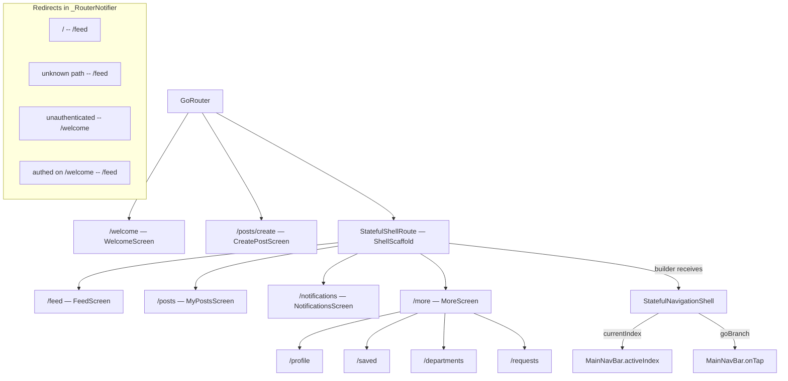

# SPEC-0005: Main Navigation Bar

**Status:** APPROVED  
**Author:** architect  
**Date:** 2026-05-05  
**Proposal:** [PROP-0005](../tech-proposals/0005-main-navbar.md)  
**Approved by:** Pyae Sone Shin Thant

---

## Overview

This spec covers the complete implementation of the authenticated navigation shell for Unishare. The shell wraps four tab branches — FEED, POSTS, NOTIFS, MORE — inside a `StatefulShellRoute` declared within the authenticated route tree. A custom-painted `MainNavBar` widget renders the bottom bar. The existing `_RouterNotifier` is extended to redirect `/` to `/feed` and unknown routes to `/feed`. An Android back-button override navigates to FEED from any non-FEED branch before allowing the system exit. A `ScrollController`-based tap-to-scroll-to-top contract is defined here for use by each tab screen's own spec.

No new pub.dev dependencies are introduced.

---

## Architecture



---

## File Map

| Action | Path | Responsibility |
|--------|------|----------------|
| Modify | `apps/mobile/lib/core/router/router.dart` | Replace `_HomeScreen` `GoRoute` with `StatefulShellRoute`; add 4 branches with their child routes; extend `_RouterNotifier.redirect` to map `/` → `/feed` and any unrecognised path → `/feed`; wire `PopScope` Android back-button behavior inside `ShellScaffold` |
| Create | `apps/mobile/lib/core/router/shell_scaffold.dart` | `ShellScaffold` widget — wraps `StatefulNavigationShell` in a `Scaffold`, owns `PopScope` for Android back handling, passes `navigationShell.currentIndex` and `navigationShell.goBranch` to `MainNavBar`, detects same-index tap and fires scroll-to-top |
| Create | `apps/mobile/lib/shared/widgets/main_nav_bar.dart` | Custom 4-tab bottom bar; accepts `activeIndex`, `onTap`, `notificationsBadgeCount`; reads active accent from theme tokens; no internal state |
| Create | `apps/mobile/lib/shared/widgets/scroll_to_top_target.dart` | `ScrollToTopTarget` mixin on `State`; exposes `scrollController` getter and `scrollToTop()` |
| Create | `apps/mobile/lib/features/feed/presentation/screens/feed_screen.dart` | FEED tab skeleton — `AppBar` + placeholder body; implements `ScrollToTopTarget`; content filled in by SPEC-0003 |
| Create | `apps/mobile/lib/features/post/presentation/screens/my_posts_screen.dart` | POSTS tab skeleton — `AppBar` + placeholder body; implements `ScrollToTopTarget` |
| Create | `apps/mobile/lib/features/notifications/presentation/screens/notifications_screen.dart` | NOTIFS tab skeleton — `AppBar` + placeholder body; implements `ScrollToTopTarget` |
| Create | `apps/mobile/lib/features/more/presentation/screens/more_screen.dart` | MORE tab — scrollable `ListView.builder` with 4 destination tiles; implements `ScrollToTopTarget` |
| Create | `apps/mobile/lib/features/profile/presentation/screens/profile_screen.dart` | User Profile skeleton — `AppBar("Profile")` + placeholder body; teammate fills in content |
| Create | `apps/mobile/lib/features/saved/presentation/screens/saved_screen.dart` | Saved Posts skeleton — `AppBar("Saved")` + placeholder body |
| Create | `apps/mobile/lib/features/departments/presentation/screens/departments_screen.dart` | Departments skeleton — `AppBar("Departments")` + placeholder body |
| Create | `apps/mobile/lib/features/requests/presentation/screens/requests_screen.dart` | Requests skeleton — `AppBar("Requests")` + placeholder body |

---

## API Contracts

### `NavTab` enum — `apps/mobile/lib/core/router/router.dart`

```dart
enum NavTab {
  feed,
  posts,
  notifs,
  more;

  String get rootPath {
    switch (this) {
      case NavTab.feed:
        return '/feed';
      case NavTab.posts:
        return '/posts';
      case NavTab.notifs:
        return '/notifications';
      case NavTab.more:
        return '/more';
    }
  }

  int get index => NavTab.values.indexOf(this);
}
```

`NavTab` is used by both `router.dart` (to keep branch declaration and index mapping in one place) and by `main_nav_bar.dart` (to build the tab items). It lives in `router.dart` because it is inseparable from the branch-index contract; if the tab order changes, `NavTab.values` ordering changes in lockstep.

---

### `MainNavBar` — `apps/mobile/lib/shared/widgets/main_nav_bar.dart`

```dart
class MainNavBar extends StatelessWidget {
  const MainNavBar({
    super.key,
    required this.activeIndex,
    required this.onTap,
    this.notificationsBadgeCount,
  });

  /// Zero-based index of the currently active branch.
  /// Must match [NavTab.index] for each tab.
  final int activeIndex;

  /// Called with the new branch index when a tab item is tapped.
  final ValueChanged<int> onTap;

  /// Reserved for future badge wiring to the notifications collection.
  /// When null, no badge is rendered on the NOTIFS tab.
  /// When non-null and > 0, a badge overlay is shown on the NOTIFS icon.
  final int? notificationsBadgeCount;

  @override
  Widget build(BuildContext context) {
    // Implementation by flutter-engineer.
    // Must read color tokens from Theme.of(context).extension<AppColors>()
    // and typography from AppTypography. No hardcoded hex literals.
    throw UnimplementedError();
  }
}

/// Describes a single tab item rendered inside [MainNavBar].
/// Internal to main_nav_bar.dart — not exported.
class _NavTabItem extends StatelessWidget {
  const _NavTabItem({
    required this.tab,
    required this.isActive,
    required this.onTap,
    this.badgeCount,
  });

  final NavTab tab;
  final bool isActive;
  final VoidCallback onTap;
  final int? badgeCount;

  @override
  Widget build(BuildContext context) {
    throw UnimplementedError();
  }
}
```

**Visual contract (read from existing tokens — do not hardcode):**

| State | Color source | Token field |
|-------|-------------|-------------|
| Bar background | `AppThemeData.background` | `#f7f3ee` in unishare theme |
| Top border | `AppThemeData.border` | `#e2dad0` in unishare theme |
| Active icon + label | `AppThemeData.amber` | `#d97706` in unishare theme |
| Inactive icon + label | `AppThemeData.textMuted` | `#8a837e` in unishare theme |

Label style: Space Grotesk, uppercase, 11 px, letter-spacing 0.55 px. Use `AppTypography.textTheme(color).labelSmall?.copyWith(...)` — do not construct `GoogleFonts.spaceGrotesk` directly.

Tab icons (use `Icons` constants from Flutter's material library):

| Tab | Icon constant |
|-----|--------------|
| FEED | `Icons.home_outlined` / `Icons.home` |
| POSTS | `Icons.article_outlined` / `Icons.article` |
| NOTIFS | `Icons.notifications_outlined` / `Icons.notifications` |
| MORE | `Icons.menu` |

Active tab uses the filled variant; inactive uses the outlined variant.

Each tab item must have a `Semantics` widget with `label` set to the tab name and `button: true` for accessibility.

---

### `ShellScaffold` — `apps/mobile/lib/core/router/shell_scaffold.dart`

```dart
class ShellScaffold extends StatelessWidget {
  const ShellScaffold({
    super.key,
    required this.navigationShell,
  });

  final StatefulNavigationShell navigationShell;

  /// Global keys used by [ShellScaffold] to call [ScrollController.animateTo]
  /// when the already-active tab is tapped.
  ///
  /// Each tab screen owns its own [ScrollController] and registers it against
  /// the key matching its [NavTab.index]. The shell calls the controller only
  /// if it is attached and has clients.
  static final List<GlobalKey<ScrollToTopTarget>> scrollTargetKeys =
      List.generate(NavTab.values.length, (_) => GlobalKey<ScrollToTopTarget>());

  @override
  Widget build(BuildContext context) {
    throw UnimplementedError();
  }
}
```

**`PopScope` behavior (Android back button):**

```dart
// Inside ShellScaffold.build — conceptual structure only,
// not full implementation code.
PopScope(
  canPop: navigationShell.currentIndex == NavTab.feed.index,
  onPopInvokedWithResult: (didPop, result) {
    if (!didPop && navigationShell.currentIndex != NavTab.feed.index) {
      navigationShell.goBranch(
        NavTab.feed.index,
        initialLocation: true,
      );
    }
    // When branch index == 0 and canPop == true, the system handles the pop
    // (exits the app on Android).
  },
  child: Scaffold(
    body: navigationShell,
    bottomNavigationBar: MainNavBar(
      activeIndex: navigationShell.currentIndex,
      onTap: (index) => _handleTabTap(index, navigationShell),
    ),
  ),
)
```

**Same-index tap (scroll-to-top) behavior:**

```dart
void _handleTabTap(int index, StatefulNavigationShell navigationShell) {
  if (index == navigationShell.currentIndex) {
    final key = ShellScaffold.scrollTargetKeys[index];
    key.currentState?.scrollToTop();
    return;
  }
  navigationShell.goBranch(index);
}
```

---

### `ScrollToTopTarget` mixin contract

Each tab screen's root `State` class must implement this interface so the shell can trigger the scroll without depending on any concrete screen class:

```dart
/// Mixin for the root [State] of a tab branch screen.
/// The screen registers its [ScrollController] and exposes [scrollToTop]
/// so [ShellScaffold] can animate to the top without knowing which screen
/// is currently mounted.
///
/// Usage in a tab screen:
///   class _FeedScreenState extends ConsumerState<FeedScreen>
///       with ScrollToTopTarget {
///     final ScrollController _scrollController = ScrollController();
///
///     @override
///     ScrollController get scrollController => _scrollController;
///
///     @override
///     void dispose() {
///       _scrollController.dispose();
///       super.dispose();
///     }
///   }
mixin ScrollToTopTarget on State<StatefulWidget> {
  ScrollController get scrollController;

  void scrollToTop() {
    if (scrollController.hasClients) {
      scrollController.animateTo(
        0,
        duration: const Duration(milliseconds: 300),
        curve: Curves.easeInOut,
      );
    }
  }
}
```

`ScrollToTopTarget` lives at `apps/mobile/lib/shared/widgets/scroll_to_top_target.dart`. It is a pure Dart mixin on `State` — no framework imports beyond `package:flutter/widgets.dart`.

The `GlobalKey<ScrollToTopTarget>` pattern requires `ShellScaffold.scrollTargetKeys[index]` to reference the same key instance that the screen uses when it creates its `StatefulWidget`. Each tab screen accepts its key from the shell; the shell allocates the keys once at `static final` level so they survive hot reload.

---

### Router modifications — `apps/mobile/lib/core/router/router.dart`

#### Redirect additions to `_RouterNotifier.redirect`

```dart
String? redirect(BuildContext context, GoRouterState state) {
  final authAsync = _ref.read(authStateProvider);
  final isGuest = _ref.read(guestModeProvider);

  final isAuthenticated = authAsync.hasValue && authAsync.value != null;

  const authRoutes = {'/welcome'};
  final currentPath = state.uri.path;

  // 1. No session + not guest → force /welcome
  if (!isAuthenticated && !isGuest) {
    if (!authRoutes.contains(currentPath)) {
      return '/welcome';
    }
    return null;
  }

  // 2. Authenticated on an auth route → go to /feed
  if (isAuthenticated && authRoutes.contains(currentPath)) {
    return '/feed';
  }

  // 3. Legacy root redirect → /feed
  if (currentPath == '/') {
    return '/feed';
  }

  // 4. Unknown path (not matched by any route) → /feed
  // GoRouter calls redirect before route matching for 404-like paths.
  // The shell branches cover /feed, /posts, /notifications, /more and their
  // children. All other authenticated paths that are not declared as top-level
  // routes fall here.
  // NOTE: GoRouter also has an errorBuilder for truly unmatched routes;
  // this redirect handles the case where a stale deep link resolves to an
  // authenticated path that no longer exists.
  final knownPrefixes = {
    '/feed',
    '/posts',
    '/notifications',
    '/more',
    '/profile',
    '/saved',
    '/departments',
    '/requests',
    '/welcome',
  };
  final isKnown = knownPrefixes.any((p) => currentPath.startsWith(p));
  if (!isKnown) {
    return '/feed';
  }

  return null;
}
```

#### `StatefulShellRoute` declaration structure

```dart
StatefulShellRoute.indexedStack(
  builder: (context, state, navigationShell) => ShellScaffold(
    navigationShell: navigationShell,
  ),
  branches: [
    // Branch 0 — FEED
    StatefulShellBranch(
      routes: [
        GoRoute(
          path: '/feed',
          builder: (context, state) => FeedScreen(
            scrollKey: ShellScaffold.scrollTargetKeys[NavTab.feed.index],
          ),
        ),
      ],
    ),
    // Branch 1 — POSTS
    StatefulShellBranch(
      routes: [
        GoRoute(
          path: '/posts',
          builder: (context, state) => MyPostsScreen(
            scrollKey: ShellScaffold.scrollTargetKeys[NavTab.posts.index],
          ),
        ),
      ],
    ),
    // Branch 2 — NOTIFS
    StatefulShellBranch(
      routes: [
        GoRoute(
          path: '/notifications',
          builder: (context, state) => NotificationsScreen(
            scrollKey: ShellScaffold.scrollTargetKeys[NavTab.notifs.index],
          ),
        ),
      ],
    ),
    // Branch 3 — MORE
    StatefulShellBranch(
      routes: [
        GoRoute(
          path: '/more',
          builder: (context, state) => MoreScreen(
            scrollKey: ShellScaffold.scrollTargetKeys[NavTab.more.index],
          ),
          routes: [
            GoRoute(path: '/profile', builder: (context, state) => const ProfilePlaceholderScreen()),
            GoRoute(path: '/saved', builder: (context, state) => const SavedPlaceholderScreen()),
            GoRoute(path: '/departments', builder: (context, state) => const DepartmentsPlaceholderScreen()),
            GoRoute(path: '/requests', builder: (context, state) => const RequestsPlaceholderScreen()),
          ],
        ),
      ],
    ),
  ],
)
```

Each destination under the MORE branch is a **named skeleton screen** in its own file. Teammates pick up each file and flesh it out independently. All four follow the same pattern — an `AppBar` with the page title and a centred placeholder body — and are `StatelessWidget`s (no scroll-to-top needed; they are sub-destinations, not tab roots).

```dart
// Pattern for each skeleton screen (ProfileScreen shown as example):
class ProfileScreen extends StatelessWidget {
  const ProfileScreen({super.key});

  @override
  Widget build(BuildContext context) {
    return Scaffold(
      appBar: AppBar(title: const Text('Profile')),
      body: const Center(child: Text('Coming soon')),
    );
  }
}
```

The router imports each by name — no anonymous lambdas for navigable destinations.

`/posts/create` remains a top-level `GoRoute` outside the shell — `CreatePostScreen` must not render the navbar.

---

### Tab screen skeleton pattern

All four tab-root screens (FEED, POSTS, NOTIFS, MORE) ship as skeletons so teammates can navigate to them immediately and fill in content independently. Because they are tab roots they must be `StatefulWidget`s (the `ScrollToTopTarget` mixin attaches to `State`), but the build output is intentionally minimal until the feature spec for each screen is implemented:

```dart
// Pattern for each tab skeleton (MyPostsScreen shown as example):
class MyPostsScreen extends StatefulWidget {
  const MyPostsScreen({required this.scrollKey}) : super(key: scrollKey);

  final GlobalKey<ScrollToTopTarget> scrollKey;

  @override
  State<MyPostsScreen> createState() => _MyPostsScreenState();
}

class _MyPostsScreenState extends State<MyPostsScreen> with ScrollToTopTarget {
  final ScrollController _scrollController = ScrollController();

  @override
  ScrollController get scrollController => _scrollController;

  @override
  void dispose() {
    _scrollController.dispose();
    super.dispose();
  }

  @override
  Widget build(BuildContext context) {
    return Scaffold(
      appBar: AppBar(title: const Text('My Posts')),
      body: const Center(child: Text('Coming soon')),
    );
  }
}
```

Apply the same pattern for `FeedScreen` ("Feed"), `NotificationsScreen` ("Notifications"), and `MoreScreen` (which renders the destination list instead of "Coming soon").

---

### Tab screen constructor contract

Each tab screen must accept a `scrollKey` parameter so the shell can attach its `GlobalKey`:

```dart
// Applies to: FeedScreen, MyPostsScreen, NotificationsScreen, MoreScreen
class FeedScreen extends StatefulWidget {
  const FeedScreen({super.key, required this.scrollKey});

  final GlobalKey<ScrollToTopTarget> scrollKey;

  @override
  State<FeedScreen> createState() => _FeedScreenState();
}

class _FeedScreenState extends State<FeedScreen> with ScrollToTopTarget {
  final ScrollController _scrollController = ScrollController();

  @override
  ScrollController get scrollController => _scrollController;

  @override
  void initState() {
    super.initState();
    // No explicit key registration needed — GlobalKey<ScrollToTopTarget>
    // resolves through the widget tree because this State mixes in
    // ScrollToTopTarget, which is the type parameter of the GlobalKey.
    // The flutter-engineer must ensure this State class is the direct
    // State of the widget that widget.scrollKey is assigned to via the
    // key: parameter on the StatefulWidget.
  }

  @override
  void dispose() {
    _scrollController.dispose();
    super.dispose();
  }

  @override
  Widget build(BuildContext context) {
    throw UnimplementedError();
  }
}
```

Note: the `GlobalKey<ScrollToTopTarget>` must be passed as the `key:` argument to the `StatefulWidget`, not stored as a separate field. The shell resolves `key.currentState` to get the `ScrollToTopTarget` mixin methods.

---

### `MoreScreen` — `apps/mobile/lib/features/more/presentation/screens/more_screen.dart`

```dart
class MoreScreen extends StatefulWidget {
  const MoreScreen({super.key, required this.scrollKey});

  final GlobalKey<ScrollToTopTarget> scrollKey;

  @override
  State<MoreScreen> createState() => _MoreScreenState();
}

class _MoreScreenState extends State<MoreScreen> with ScrollToTopTarget {
  final ScrollController _scrollController = ScrollController();

  @override
  ScrollController get scrollController => _scrollController;

  @override
  void dispose() {
    _scrollController.dispose();
    super.dispose();
  }

  @override
  Widget build(BuildContext context) {
    throw UnimplementedError();
    // Must render a ListView.builder (not ListView) containing exactly
    // 4 ListTile items navigating to:
    //   context.go('/profile')
    //   context.go('/saved')
    //   context.go('/departments')
    //   context.go('/requests')
  }
}
```

`MoreScreen.build` must use `ListView.builder` — unbounded `ListView` is prohibited by the project conventions.

---

## Test Plan

| Test file | Covers |
|-----------|--------|
| `apps/mobile/test/widget/shared/widgets/main_nav_bar_test.dart` | Correct tab renders as active at each index (0–3); amber accent color applied to active icon and label; inactive tabs use muted color; `onTap` fires with the correct index for each tab; badge widget is present when `notificationsBadgeCount` is non-null and > 0; badge is absent when `notificationsBadgeCount` is null; `Semantics` label is present on each tab item |
| `apps/mobile/test/widget/core/router/shell_router_test.dart` | `MainNavBar` is present in the widget tree on `/feed`, `/posts`, `/notifications`, `/more`; `MainNavBar` is absent on `/welcome`; `MainNavBar` is absent on `/posts/create`; navigating to an unknown path redirects to `/feed`; `PopScope` on non-FEED branch intercepts back press and navigates to FEED; `PopScope` on FEED branch allows system pop; tapping the active tab calls `scrollToTop` on the registered `ScrollToTopTarget` |
| `apps/mobile/test/widget/features/more/more_screen_test.dart` | All 4 destination `ListTile` items render with correct labels; tapping `/profile` tile calls `context.go('/profile')`; tapping `/saved` tile calls `context.go('/saved')`; tapping `/departments` tile calls `context.go('/departments')`; tapping `/requests` tile calls `context.go('/requests')` |

All tests use `pumpWidget` with a `ProviderScope` wrapping a `MaterialApp.router` seeded with an authenticated `authStateProvider` stub. No real Firebase calls.

---

## Out of Scope

- Content of FEED, POSTS, and NOTIFS tab screens — each is covered by its own spec.
- Content of `/profile`, `/saved`, `/departments`, `/requests` destinations — separate feature specs.
- NOTIFS badge wiring to the `notifications` Firestore collection — the `notificationsBadgeCount` parameter is reserved but always passed as `null` until a separate proposal covers real-time badge counts.
- Guest-mode partial access — unauthenticated and guest users are redirected to `/welcome` by `_RouterNotifier` and never reach the shell.
- Tab-switch transition animations — instant swap only; no fade or slide.
- Web-specific responsive layout (sidebar navigation rail) — deferred; the `StatefulShellRoute` builder can be extended to switch to a `NavigationRail` layout based on `MediaQuery` width in a future spec.
- Adaptive breakpoint logic from SPEC-0002 — that spec's `NavigationRail` approach is superseded by this spec for the mobile implementation. SPEC-0002 is not deleted but is not implemented in this iteration.

---

## Open Questions

- [ ] **`GlobalKey<ScrollToTopTarget>` resolution** — The pattern requires that the `StatefulWidget` passed `scrollKey` uses it as its `key:` argument. This means the `FeedScreen` (and peers) cannot independently manage their own `Key`. The flutter-engineer must confirm this is acceptable or propose an alternative (e.g., a `ScrollControllerRegistry` Riverpod provider) before implementing the tab screens. This must be resolved before SPEC-0003 implementation begins.
