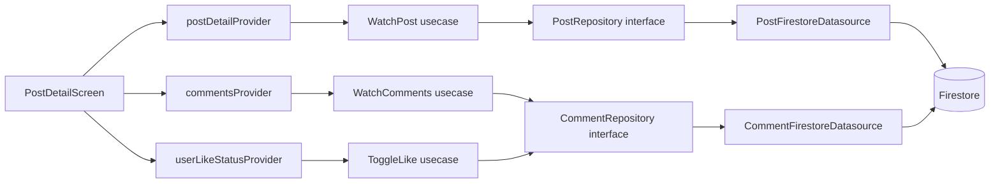

# SPEC-0006: Post Detail Page

**Status:** APPROVED  
**Author:** architect  
**Date:** 2026-05-06  
**Proposal:** [PROP-0006](../tech-proposals/0006-post-detail-page.md)  
**Approved by:**

---

## Overview

This spec covers the implementation of the Post Detail screen — the full-content view reached by tapping a `PostCard` in the feed or by opening a deep link to `/posts/:postId`. The screen renders the complete post body, a heterogeneous attachment carousel (images, PDFs, video), a real-time like button, and a flat comment list backed by a Firestore subcollection stream. Data loading uses the hybrid seed-then-stream strategy approved in PROP-0006 Option C: GoRouter `extra` carries the already-loaded `Post` entity for warm-start instant render, while a `snapshots()` stream runs concurrently and supersedes the seed as live updates arrive. Cold-start deep links fall back to stream-only with a skeleton loader.

---

## Architecture



The Domain layer (`PostRepository`, `CommentRepository`, all use cases, all entities) contains zero Flutter or Firebase imports. The Data layer implements the interfaces and owns all Firestore calls. The Presentation layer depends on Domain only — never on Data directly.

---

## File map

### Domain — new files

| Action | Path                                                                        | Responsibility                                              |
| ------ | --------------------------------------------------------------------------- | ----------------------------------------------------------- |
| Create | `apps/mobile/lib/features/post/domain/entities/comment.dart`                | Pure Dart `Comment` entity                                  |
| Create | `apps/mobile/lib/features/post/domain/repositories/comment_repository.dart` | Abstract `CommentRepository` interface                      |
| Create | `apps/mobile/lib/features/post/domain/usecases/watch_post.dart`             | Wraps `PostRepository.watchPost`                            |
| Create | `apps/mobile/lib/features/post/domain/usecases/watch_comments.dart`         | Wraps `CommentRepository.watchComments`                     |
| Create | `apps/mobile/lib/features/post/domain/usecases/add_comment.dart`            | Validates body, delegates to `CommentRepository.addComment` |
| Create | `apps/mobile/lib/features/post/domain/usecases/toggle_like.dart`            | Writes or deletes `posts/{postId}/likes/{userId}`           |

### Domain — modified files

| Action | Path                                                                     | Change                                             |
| ------ | ------------------------------------------------------------------------ | -------------------------------------------------- |
| Modify | `apps/mobile/lib/features/post/domain/entities/post.dart`                | Add `mediaTypes: List<String>` field               |
| Modify | `apps/mobile/lib/features/post/domain/repositories/post_repository.dart` | Add `Stream<Post> watchPost(String postId)` method |

### Data — new files

| Action | Path                                                                               | Responsibility                                                                    |
| ------ | ---------------------------------------------------------------------------------- | --------------------------------------------------------------------------------- |
| Create | `apps/mobile/lib/features/post/data/models/comment_dto.dart`                       | Freezed DTO with `fromJson`/`toJson` and `toEntity()` mapper                      |
| Create | `apps/mobile/lib/features/post/data/datasources/comment_firestore_datasource.dart` | Streams `posts/{postId}/comments` ordered by `createdAt asc`; writes new comments |
| Create | `apps/mobile/lib/features/post/data/repositories/comment_repository_impl.dart`     | Implements `CommentRepository`; maps `CommentDto` to `Comment`                    |

### Data — modified files

| Action | Path                                                                            | Change                                                                       |
| ------ | ------------------------------------------------------------------------------- | ---------------------------------------------------------------------------- |
| Modify | `apps/mobile/lib/features/post/data/datasources/post_firestore_datasource.dart` | Add `watchPost(String postId)`; update `createPost()` to write `mediaTypes`  |
| Modify | `apps/mobile/lib/features/post/data/repositories/post_repository_impl.dart`     | Implement `watchPost(String postId)` delegating to `PostFirestoreDatasource` |

### Presentation — new files

| Action | Path                                                                                  | Responsibility                                                            |
| ------ | ------------------------------------------------------------------------------------- | ------------------------------------------------------------------------- |
| Create | `apps/mobile/lib/features/post/presentation/providers/post_detail_provider.dart`      | `AsyncNotifier` family — seeds from `extra`, then switches to live stream |
| Create | `apps/mobile/lib/features/post/presentation/providers/comments_provider.dart`         | `StreamProvider` family keyed on `postId`                                 |
| Create | `apps/mobile/lib/features/post/presentation/providers/user_like_status_provider.dart` | `StreamProvider` family; checks `likes/{currentUserId}` existence         |
| Create | `apps/mobile/lib/features/post/presentation/screens/post_detail_screen.dart`          | Full-screen layout per Figma; no navbar                                   |
| Create | `apps/mobile/lib/features/post/presentation/widgets/comment_tile.dart`                | Single comment row: avatar, author, body, timestamp                       |
| Create | `apps/mobile/lib/features/post/presentation/widgets/attachment_carousel.dart`         | Horizontal media strip; renders image/PDF/video per slot                  |
| Create | `apps/mobile/lib/features/post/presentation/widgets/like_button.dart`                 | Stateless; receives `isLiked`, `count`, `onTap`, `enabled`                |

### Presentation — modified files

| Action | Path                                                                                 | Change                                                                                                                         |
| ------ | ------------------------------------------------------------------------------------ | ------------------------------------------------------------------------------------------------------------------------------ |
| Modify | `apps/mobile/lib/core/router/router.dart`                                            | Add `/posts/:postId` GoRoute **outside** `StatefulShellRoute`; update `_RouterNotifier` known-prefixes guard                   |
| Modify | `apps/mobile/lib/features/post/presentation/providers/post_repository_provider.dart` | Register `CommentFirestoreDatasource`, `CommentRepository`, `WatchPost`, `WatchComments`, `AddComment`, `ToggleLike` providers |

---

## API contracts

### Comment entity

```dart
// apps/mobile/lib/features/post/domain/entities/comment.dart
// Pure Dart — zero Flutter or Firebase imports.

class Comment {
  const Comment({
    required this.id,
    required this.authorId,
    required this.authorName,
    required this.authorAvatar,
    required this.body,
    required this.createdAt,
  });

  final String id;
  final String authorId;
  final String authorName;
  final String authorAvatar;
  final String body;
  final DateTime createdAt;
}
```

### Post entity (updated)

```dart
// apps/mobile/lib/features/post/domain/entities/post.dart
// Add mediaTypes alongside the existing fields.

class Post {
  const Post({
    required this.id,
    required this.authorId,
    required this.authorName,
    required this.authorAvatar,
    required this.title,
    required this.body,
    required this.mediaUrls,
    required this.mediaTypes,   // NEW — parallel to mediaUrls
    required this.tags,
    required this.likesCount,
    required this.createdAt,
    required this.updatedAt,
  });

  final String id;
  final String authorId;
  final String authorName;
  final String authorAvatar;
  final String title;
  final String body;
  final List<String> mediaUrls;
  final List<String> mediaTypes; // values: "image" | "pdf" | "video"
  final List<String> tags;
  final int likesCount;
  final DateTime createdAt;
  final DateTime updatedAt;
}
```

### PostRepository (extended)

```dart
// apps/mobile/lib/features/post/domain/repositories/post_repository.dart

import '../entities/post.dart';
import '../entities/post_draft.dart';

abstract interface class PostRepository {
  // Existing — must not be removed or renamed.
  Stream<List<Post>> watchFeed({int limit = 20});
  Future<void> saveDraft(PostDraft draft);
  Future<void> removeDraft(String draftId);
  Future<List<PostDraft>> loadDraftQueue();
  Future<void> publishDraft(
    PostDraft draft, {
    void Function(double progress)? onProgress,
  });

  // New for SPEC-0006.
  Stream<Post> watchPost(String postId);
}
```

### CommentRepository

```dart
// apps/mobile/lib/features/post/domain/repositories/comment_repository.dart
// Pure Dart — zero Flutter or Firebase imports.

import '../entities/comment.dart';

abstract interface class CommentRepository {
  /// Emits the full ordered comment list and re-emits on any change.
  /// Ordered by createdAt ascending. Flat list — no threading in v1.
  Stream<List<Comment>> watchComments(String postId);

  /// Writes a new comment document to posts/{postId}/comments.
  /// [body] must be trimmed and non-empty; the use case enforces this.
  /// Sets authorId, authorName, authorAvatar from the current Firebase Auth user.
  Future<void> addComment(String postId, String body);
}
```

### Use cases

```dart
// apps/mobile/lib/features/post/domain/usecases/watch_post.dart
// Pure Dart — zero Flutter or Firebase imports.

import '../entities/post.dart';
import '../repositories/post_repository.dart';

class WatchPost {
  const WatchPost(this._repository);
  final PostRepository _repository;

  Stream<Post> call(String postId) => _repository.watchPost(postId);
}
```

```dart
// apps/mobile/lib/features/post/domain/usecases/watch_comments.dart
// Pure Dart — zero Flutter or Firebase imports.

import '../entities/comment.dart';
import '../repositories/comment_repository.dart';

class WatchComments {
  const WatchComments(this._repository);
  final CommentRepository _repository;

  Stream<List<Comment>> call(String postId) =>
      _repository.watchComments(postId);
}
```

```dart
// apps/mobile/lib/features/post/domain/usecases/add_comment.dart
// Pure Dart — zero Flutter or Firebase imports.

import '../repositories/comment_repository.dart';

class AddComment {
  const AddComment(this._repository);
  final CommentRepository _repository;

  /// Throws [ArgumentError] if body is blank after trimming.
  Future<void> call(String postId, String body) {
    final trimmed = body.trim();
    if (trimmed.isEmpty) {
      throw ArgumentError.value(body, 'body', 'Comment body must not be blank');
    }
    return _repository.addComment(postId, trimmed);
  }
}
```

```dart
// apps/mobile/lib/features/post/domain/usecases/toggle_like.dart
// Pure Dart — zero Flutter or Firebase imports.

import '../repositories/comment_repository.dart';

/// Checks posts/{postId}/likes/{userId}:
///   absent  → creates the document (like)
///   present → deletes the document (unlike)
/// likesCount on the post document is maintained by a Cloud Function;
/// the client never writes it directly.
class ToggleLike {
  const ToggleLike(this._repository);
  final LikeRepository _repository;

  Future<void> call(String postId) => _repository.toggleLike(postId);
}
```

Note: `ToggleLike` depends on a `LikeRepository` interface. This interface is declared alongside `CommentRepository` in the domain layer. Its single method is `Future<void> toggleLike(String postId)`. The data implementation writes to or deletes from `posts/{postId}/likes/{currentUserId}` and reads the current user ID from the auth datasource injected at construction time — no Firebase import in the domain interface.

```dart
// apps/mobile/lib/features/post/domain/repositories/like_repository.dart
// Pure Dart — zero Flutter or Firebase imports.

abstract interface class LikeRepository {
  /// Creates posts/{postId}/likes/{currentUserId} if absent (like),
  /// or deletes it if present (unlike).
  Future<void> toggleLike(String postId);

  /// Emits true when posts/{postId}/likes/{currentUserId} exists.
  Stream<bool> watchLikeStatus(String postId);
}
```

### CommentDto (Freezed model)

```dart
// apps/mobile/lib/features/post/data/models/comment_dto.dart

@freezed
class CommentDto with _$CommentDto {
  const factory CommentDto({
    required String id,
    required String authorId,
    required String authorName,
    required String authorAvatar,
    required String body,
    required Timestamp createdAt,
  }) = _CommentDto;

  factory CommentDto.fromJson(Map<String, dynamic> json) =>
      _$CommentDtoFromJson(json);
}

extension CommentDtoMapper on CommentDto {
  Comment toEntity() => Comment(
        id: id,
        authorId: authorId,
        authorName: authorName,
        authorAvatar: authorAvatar,
        body: body,
        createdAt: createdAt.toDate(),
      );
}
```

### Provider families

```dart
// post_detail_provider — AsyncNotifier family
// Signature (codegen will generate the typed variant):
//   postDetailProvider(String postId, {Post? seed}) -> AsyncValue<Post>
//
// Build logic:
//   1. If seed != null, emit seed immediately as state.
//   2. Regardless of seed, open WatchPost(postId) stream.
//   3. On first stream event, overwrite state. On subsequent events, update state.
//   4. On stream error, set state to AsyncError (do not discard seed if stream fails).

// comments_provider — StreamProvider family
//   commentsProvider(String postId) -> AsyncValue<List<Comment>>
//   Delegates directly to WatchComments(postId).

// user_like_status_provider — StreamProvider family
//   userLikeStatusProvider(String postId) -> AsyncValue<bool>
//   Delegates to LikeRepository.watchLikeStatus(postId).
//   Emits false if the current user is a guest (unauthenticated).
```

---

## Firestore schema

### Updated `posts/{postId}` document

```
posts/{postId}:
  authorId:    string
  authorName:  string
  authorAvatar: string
  title:       string
  body:        string
  mediaUrls:   string[]      — download URLs for all attachments
  mediaTypes:  string[]      — parallel to mediaUrls; values: "image" | "pdf" | "video"
  tags:        string[]
  likesCount:  number        — maintained exclusively by Cloud Function; never written by client
  createdAt:   timestamp
  updatedAt:   timestamp
```

`mediaUrls` and `mediaTypes` are always the same length. Index `i` of `mediaTypes` describes the type of `mediaUrls[i]`. If the array lengths diverge (data corruption), `AttachmentCarousel` must fall back to treating the slot as `"image"`.

### `posts/{postId}/comments/{commentId}` subcollection

```
posts/{postId}/comments/{commentId}:
  id:           string        — same as the document ID
  authorId:     string
  authorName:   string
  authorAvatar: string
  body:         string
  createdAt:    timestamp
```

Flat list only — no threading, no `parentId`, no `likesCount` on individual comments in v1.

### `posts/{postId}/likes/{userId}` subcollection

```
posts/{postId}/likes/{userId}:
  createdAt: timestamp        — moment the like was created; used by Cloud Function
```

The document ID is the user's Firebase Auth UID. Presence of the document means the user has liked the post. Absence means they have not. `likesCount` on the parent document is updated by a Cloud Function trigger on this subcollection.

### Firestore index requirements

| Collection                | Fields indexed                              | Query issued by                            |
| ------------------------- | ------------------------------------------- | ------------------------------------------ |
| `posts/{postId}/comments` | `createdAt ASC`                             | `CommentFirestoreDatasource.watchComments` |
| `posts`                   | `createdAt DESC` (already required by feed) | existing                                   |

The `comments` subcollection index on `createdAt ASC` must be added to `firestore.indexes.json` as a collection-group or single-collection index before deployment. The `likes` subcollection requires no composite index — only document existence checks (single-document reads and deletes).

---

## Attachment media type handling

### Writing `mediaTypes` on post creation

`PostFirestoreDatasource.createPost()` currently accepts `mediaUrls: List<String>` but writes no type information. This method must be extended to also accept `mediaTypes: List<String>` and write it to Firestore alongside `mediaUrls`. The `PostRepositoryImpl.publishDraft()` call site must derive `mediaTypes` from the draft's `localMediaPaths` using the same ordering logic already used for `mediaUrls`.

Type derivation rule for `publishDraft`:

- Extension `.jpg`, `.jpeg`, `.png`, `.webp` → `"image"`
- Extension `.pdf` → `"pdf"`
- Extension `.mp4`, `.mov`, `.avi` → `"video"`
- Unknown extension → `"image"` (safe fallback)

`PostStorageDatasource` currently validates only `jpg/jpeg/png/webp/pdf`. Video upload validation is deferred to a future spec. For v1, `mediaTypes` entries with value `"video"` may only appear in posts created after this spec ships (when the upload path is extended) or via seed data. The carousel must render them correctly regardless.

### Reading in `AttachmentCarousel`

`AttachmentCarousel` receives two parallel lists: `mediaUrls` and `mediaTypes`. For each index `i`:

| `mediaTypes[i]` | Widget to render                                                                                            |
| --------------- | ----------------------------------------------------------------------------------------------------------- |
| `"image"`       | `CachedNetworkImage` in a fixed-height container                                                            |
| `"pdf"`         | PDF thumbnail with a full-screen viewer on tap (e.g., `flutter_pdfview` or equivalent approved by the team) |
| `"video"`       | Video thumbnail with a play overlay; taps open a full-screen player                                         |

`AttachmentCarousel` must use `ListView.builder` (not `ListView`) for the horizontal scroll — per the project no-unbounded-ListView rule.

### Backfilling existing posts

Existing post documents written before this spec do not have a `mediaTypes` field. `PostFirestoreDatasource.watchPost` and the feed datasource must handle the absence of `mediaTypes` gracefully: default to an empty list or derive types from URL file extensions. The `Post` entity's `mediaTypes` field carries a default of `const []`.

---

## Route change

### New GoRoute

```dart
// Insert BEFORE the StatefulShellRoute block in router.dart.
GoRoute(
  path: '/posts/:postId',
  builder: (context, state) {
    final postId = state.pathParameters['postId']!;
    final seed = state.extra as Post?;
    return PostDetailScreen(postId: postId, seed: seed);
  },
),
```

### `_RouterNotifier` known-prefixes update

The guard at rule 4 in `_RouterNotifier.redirect` currently rejects any path that does not match known prefixes, redirecting unknown paths to `/feed`. `/posts/:postId` does not start with `/posts` in a way the current guard accepts (it does match `/posts` prefix, so no change is strictly needed for the route itself). However, the guard must be audited to confirm `/posts/someId` is not accidentally caught and redirected. The existing prefix `/posts` covers this correctly — no change required to the guard logic.

### `PostCard` tap handler

The `PostCard` widget (in the feed feature) must call:

```dart
context.push('/posts/${post.id}', extra: post);
```

This is a modification to `apps/mobile/lib/features/feed/presentation/widgets/post_card.dart` (or equivalent path). The flutter-engineer must locate the existing `PostCard` and add this tap handler. If `PostCard` is in the shared design system package, the same pattern applies.

---

## Guest-mode behavior

Guests (unauthenticated users who activated guest mode) may open the detail screen. The `_RouterNotifier` does not redirect guest users away from `/posts/:postId`. The screen renders the full post and comments read-only. The following interactions are disabled for guests:

| UI element            | Guest state                                                    |
| --------------------- | -------------------------------------------------------------- |
| Like button           | Disabled; shows lock icon or grayed state                      |
| Comment input bar     | Hidden or disabled; replaced with "Sign in to interact" prompt |
| Submit comment button | Not shown                                                      |

`userLikeStatusProvider` emits `false` when the user is a guest. The `PostDetailScreen` reads `authStateProvider` to determine guest status and passes `enabled: false` to `LikeButton` and hides the comment input.

---

## Test plan

### Unit tests

| Test file                                                                            | Covers                                                                                                                                                                            |
| ------------------------------------------------------------------------------------ | --------------------------------------------------------------------------------------------------------------------------------------------------------------------------------- |
| `test/unit/features/post/domain/usecases/watch_post_test.dart`                       | `WatchPost.call` delegates to repository; stream forwarded correctly                                                                                                              |
| `test/unit/features/post/domain/usecases/watch_comments_test.dart`                   | `WatchComments.call` delegates to repository; stream forwarded correctly                                                                                                          |
| `test/unit/features/post/domain/usecases/add_comment_test.dart`                      | Blank body throws `ArgumentError`; whitespace-only body throws; valid body delegates to repository with trimmed value                                                             |
| `test/unit/features/post/domain/usecases/toggle_like_test.dart`                      | Delegates to `LikeRepository.toggleLike`; no direct Firestore call from use case                                                                                                  |
| `test/unit/features/post/presentation/providers/post_detail_provider_test.dart`      | Warm-start: seed emitted immediately before stream arrives; cold-start: `AsyncLoading` then `AsyncData` when stream emits; stream error sets `AsyncError` without discarding seed |
| `test/unit/features/post/presentation/providers/comments_provider_test.dart`         | Emits `AsyncLoading` then `AsyncData<List<Comment>>`; updates on stream re-emit                                                                                                   |
| `test/unit/features/post/presentation/providers/user_like_status_provider_test.dart` | Emits `true` when like document exists; emits `false` when absent; emits `false` for guest user                                                                                   |

### Widget tests

| Test file                                                         | Covers                                                                                                                                                                                                          |
| ----------------------------------------------------------------- | --------------------------------------------------------------------------------------------------------------------------------------------------------------------------------------------------------------- |
| `test/widget/features/post/screens/post_detail_screen_test.dart`  | Loading state shows skeleton; loaded state renders title, body, author, tags; error state shows error widget; navbar is absent from scaffold                                                                    |
| `test/widget/features/post/widgets/comment_tile_test.dart`        | Renders author name, avatar, body, formatted timestamp                                                                                                                                                          |
| `test/widget/features/post/widgets/like_button_test.dart`         | Liked state renders filled icon + count; unliked state renders outline icon; `enabled: false` disables tap and shows correct visual; `onTap` callback fires on tap when enabled                                 |
| `test/widget/features/post/widgets/attachment_carousel_test.dart` | Image slot renders `CachedNetworkImage`; PDF slot renders PDF thumbnail widget; video slot renders video thumbnail with play overlay; empty list renders nothing; mismatched array lengths fall back gracefully |

---

## Out of scope

- `commentsCount` denormalization on `PostCard` in the feed — deferred; the feed card will not show a comment count.
- Threaded comment replies — v1 is flat list only; no `parentId` or nesting.
- Comment likes or reactions — not in v1.
- Video upload in `PostStorageDatasource` — the storage datasource validation update (adding `.mp4`, `.mov`) is deferred to a dedicated video-upload spec. Video attachments may be displayed if they exist but cannot be uploaded via the create-post flow yet.
- Pagination of comments — the comments subcollection is streamed in full for v1; pagination is deferred until comment volume justifies it.
- FCM / push-notification deep-link routing — the GoRouter route `/posts/:postId` is the canonical path, but wiring FCM message payloads to navigate to this route is deferred.
- Comment editing or deletion.
- Post editing from the detail screen.
- Report / flag post functionality.

---

## Open questions

All seven open questions from PROP-0006 are resolved. No unresolved questions remain.

| #   | Question                                               | Resolution                                                                                                                                                                                      |
| --- | ------------------------------------------------------ | ----------------------------------------------------------------------------------------------------------------------------------------------------------------------------------------------- |
| 1   | Figma audit — which UI components are net-new?         | Resolved: `CommentTile`, `AttachmentCarousel`, and `LikeButton` are net-new and specified in this spec. Author chip and tag list reuse existing shared widgets. No Figma-gated blockers remain. |
| 2   | Comments subcollection schema — threading or flat?     | Resolved: flat list for v1. Schema: `id, authorId, authorName, authorAvatar, body, createdAt`. No `parentId`, no `likesCount` per comment.                                                      |
| 3   | `commentsCount` denormalization on `PostCard`?         | Resolved: deferred. Not shown on `PostCard`. Only the detail screen streams the full subcollection.                                                                                             |
| 4   | Like state for current user — how sourced?             | Resolved: separate `userLikeStatusProvider` family keyed on `postId`; watches `posts/{postId}/likes/{currentUserId}` existence via `LikeRepository.watchLikeStatus`.                            |
| 5   | Deep-link canonical path?                              | Resolved: `/posts/:postId` is canonical. No alternate scheme.                                                                                                                                   |
| 6   | Auth gate for detail screen?                           | Resolved: guest read-only. No redirect. Like button disabled with grayed state; comment input hidden with "Sign in to interact" prompt.                                                         |
| 7   | Attachment media types — images only or heterogeneous? | Resolved: heterogeneous — images, PDFs, and video. `mediaTypes: string[]` added as a parallel field to `mediaUrls`. `AttachmentCarousel` detects type per slot.                                 |
