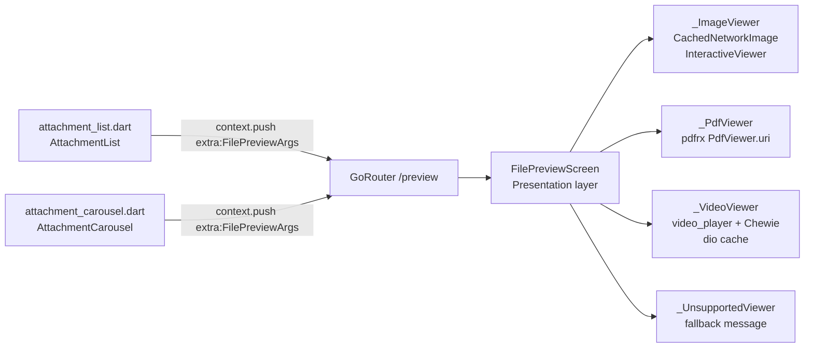

# SPEC-0007: File Preview Screen

**Status:** DRAFT  
**Author:** Architect  
**Date:** 2026-05-07  
**Proposal:** [PROP-0007](../tech-proposals/0007-file-preview-screen.md)  
**Approved by:** (fill in when approved)

---

## Overview

`FilePreviewScreen` is a new GoRouter-registered screen that consolidates all file-preview logic currently scattered across `attachment_list.dart` and `attachment_carousel.dart`. A single `/preview` route receives `url`, `type`, and `filename` as a typed `FilePreviewArgs` object passed via GoRouter `extra`. Inside the screen, a `switch` on `type` selects one of four private sub-widgets: `_ImageViewer`, `_PdfViewer`, `_VideoViewer`, and `_UnsupportedViewer`. All existing inline `MaterialPageRoute` builders and the "Video playback coming soon" `SnackBar` are deleted. The two call sites are each reduced to a single `context.push('/preview', extra: ...)` call. No Firestore reads are involved — all data flows through navigation arguments.

---

## Architecture



There is no Domain layer involvement: `FilePreviewScreen` is a pure presentation concern. It receives all required data as constructor arguments derived from the navigation `extra`; it makes no repository calls and owns no use cases.

---

## File map

| Action | Path | Responsibility |
|---|---|---|
| Create | `apps/mobile/lib/features/post/presentation/screens/file_preview_screen.dart` | `FilePreviewArgs` record, `FilePreviewScreen`, `_ImageViewer`, `_PdfViewer`, `_VideoViewer`, `_UnsupportedViewer`, `_VideoDownloadState` enum |
| Modify | `apps/mobile/lib/core/router/router.dart` | Add `/preview` `GoRoute` above the `StatefulShellRoute`; add import for `FilePreviewScreen`; add `/preview` to `knownPrefixes` in `_RouterNotifier.redirect` |
| Modify | `apps/mobile/lib/features/post/presentation/widgets/attachment_list.dart` | Replace three `Navigator.push` / `SnackBar` blocks in `_AttachmentRow._onView` with a single `context.push('/preview', extra: FilePreviewArgs(...))` |
| Modify | `apps/mobile/lib/features/post/presentation/widgets/attachment_carousel.dart` | Replace `_PdfSlot._openPdfViewer` and the image fallback tap path with `context.push('/preview', extra: FilePreviewArgs(...))`; replace `_VideoSlot` `SnackBar` with the same push |
| Modify | `apps/mobile/pubspec.yaml` | Add `video_player`, `chewie`, `path_provider` under `dependencies` |
| Create | `apps/mobile/test/widget/features/post/file_preview_screen_test.dart` | Widget tests for all four `FilePreviewScreen` branches and error states |
| Create | `apps/mobile/test/unit/features/post/video_cache_path_test.dart` | Unit test for cache-path derivation logic |

---

## API contracts

```dart
// ---- FilePreviewArgs -------------------------------------------------------
// Passed as GoRouter `extra`. Pure Dart record — no Flutter/Firebase imports.

typedef FilePreviewArgs = ({
  String url,
  String type,      // "image" | "pdf" | "video" — anything else → _UnsupportedViewer
  String filename,
});

// ---- FilePreviewScreen -----------------------------------------------------
// Located at:
//   lib/features/post/presentation/screens/file_preview_screen.dart

class FilePreviewScreen extends StatelessWidget {
  const FilePreviewScreen({
    super.key,
    required this.url,
    required this.type,
    required this.filename,
  });

  final String url;
  final String type;
  final String filename;

  // AppBar title is `filename` for all types except video (which shows filename
  // plus " — page N/N" suffix managed by _PdfViewer for pdf type).
}

// ---- _VideoDownloadState ---------------------------------------------------
// Internal enum used by _VideoViewer to drive its StatefulWidget rebuild cycle.

enum _VideoDownloadState {
  /// Checking local cache / initiating download.
  loading,

  /// Downloading from network; progress [0.0, 1.0] tracked separately.
  downloading,

  /// Local file is ready; VideoPlayerController initialised, Chewie rendered.
  ready,

  /// Network download failed (dio error or HTTP error status).
  downloadError,

  /// No cached file AND device is offline.
  offlineUnavailable,
}

// ---- GoRoute registration --------------------------------------------------
// In router.dart, added to the top-level `routes` list alongside
// /welcome, /posts/create, /posts/:postId — NOT nested inside the shell.

GoRoute(
  path: '/preview',
  builder: (context, state) {
    final args = state.extra! as FilePreviewArgs;
    return FilePreviewScreen(
      url: args.url,
      type: args.type,
      filename: args.filename,
    );
  },
),

// ---- Call-site shape (both widgets must use this exact form) ---------------
context.push(
  '/preview',
  extra: (url: url, type: type, filename: _filename(url)),
);
```

---

## Behaviour specification

### `_ImageViewer`

- `StatelessWidget`.
- Scaffold background: `Colors.black`.
- AppBar: title = `filename`, `backgroundColor: Colors.black`, `iconTheme: IconThemeData(color: Colors.white)`.
- Body: `InteractiveViewer(minScale: 0.5, maxScale: 4.0, transformationController: _controller)` wrapping `CachedNetworkImage(fit: BoxFit.contain)`.
- A `GestureDetector` with `onDoubleTap` resets `TransformationController` to `Matrix4.identity()`.
- Because double-tap reset requires a controller, `_ImageViewer` must be a `StatefulWidget` that owns and disposes the `TransformationController`.
- Bottom of body: `Text('Pinch to zoom', style: ...)` centred at 12 dp from bottom, muted colour.
- Error state: `CachedNetworkImage` `errorWidget` callback renders a centred broken-image `Icon` on a black background.

### `_PdfViewer`

- `StatefulWidget`.
- Scaffold background: default (light/dark theme surface).
- AppBar: title = `filename`. Page counter ("Page N / N") added to AppBar actions once the document is loaded; managed via `PdfViewerController` listener.
- Body while loading: `Center(child: CircularProgressIndicator())`.
- Body when loaded: `PdfViewer.uri(Uri.parse(url), controller: _pdfController)` fills the body.
- Error state: `Center` column containing a `Text('Failed to load PDF')` and a `TextButton('Retry')` that calls `_pdfController.reload()` (or re-triggers the `PdfViewer.uri` widget rebuild via a `_loadKey` state variable).
- `PdfViewerController` is instantiated in `initState` and disposed in `dispose`.

### `_VideoViewer`

- `StatefulWidget`. Initial `_VideoDownloadState` = `_VideoDownloadState.loading`.
- Scaffold background: `Colors.black`.
- AppBar: title = `filename`, `backgroundColor: Colors.black`, `iconTheme: IconThemeData(color: Colors.white)`.

**Cache-path derivation** (extract to a package-private function `videoCachePath` for unit testing):

```dart
Future<String> videoCachePath(String url) async {
  final dir = await getTemporaryDirectory();
  final filename = url.split('/').last.split('?').first; // strip query params
  return '${dir.path}/unishare_video/$filename';
}
```

**Initialisation sequence** (called from `initState` via `_init()`):

1. Compute `cachePath` via `videoCachePath(url)`.
2. If `File(cachePath).existsSync()` → set state `ready`, init `VideoPlayerController.file(File(cachePath))`.
3. Else check connectivity via `connectivity_plus` (`ConnectivityResult.none` = offline).
   - If offline → set state `offlineUnavailable`.
   - If online → set state `downloading`, begin `Dio().download(url, cachePath, onReceiveProgress: ...)`, updating `_downloadProgress` (0.0–1.0).
     - On success → set state `ready`, init controller from file.
     - On `DioException` → set state `downloadError`.
4. After controller initialised: `await _videoController!.initialize()`, then create `ChewieController(videoPlayerController: _videoController!, autoPlay: false, looping: false, allowFullScreen: true, materialProgressColors: ChewieProgressColors(playedColor: Colors.amber))`.

**State rendering:**

| `_VideoDownloadState` | Widget shown |
|---|---|
| `loading` | `Center(child: CircularProgressIndicator())` |
| `downloading` | `Center` column: `CircularProgressIndicator(value: _downloadProgress)` + `Text('Downloading… ${(_downloadProgress * 100).toInt()}%')` |
| `ready` | `Center(child: Chewie(controller: _chewieController!))` |
| `downloadError` | `Center` column: `Text('Download failed')` + `TextButton('Retry')` that calls `_init()` again |
| `offlineUnavailable` | `Center` column: `Icon(Icons.wifi_off)` + `Text('Not available offline')` |

**Disposal:** `dispose()` calls `_chewieController?.dispose()` then `_videoController?.dispose()`.

### `_UnsupportedViewer`

- `StatelessWidget`.
- Scaffold background: default surface.
- AppBar: title = `filename`.
- Body: `Center` column: `Icon(Icons.attach_file, size: 64)` + `Text('Preview not available for this file type')`.

---

## Router changes

Two changes are required in `apps/mobile/lib/core/router/router.dart`:

1. Add the `/preview` `GoRoute` to the top-level `routes` list, alongside the existing `/welcome`, `/posts/create`, and `/posts/:postId` entries (before the `StatefulShellRoute`).

2. Add `'/preview'` to the `knownPrefixes` set inside `_RouterNotifier.redirect` so unauthenticated users attempting to deep-link to a preview are redirected to `/welcome` rather than falling through to `/feed`.

```dart
// Change this:
const knownPrefixes = {'/feed', '/posts', '/notifications', '/more'};

// To:
const knownPrefixes = {'/feed', '/posts', '/notifications', '/more', '/preview'};
```

---

## New dependencies

All three were approved by Pyae Sone Shin Thant on 2026-05-07 (recorded in PROP-0007 open questions and ADR-0007).

| Package | Reason | Min version |
|---|---|---|
| `video_player` | Flutter-team-maintained video playback controller | latest stable |
| `chewie` | Control layer over `video_player` (play/pause, seek, fullscreen) | latest stable |
| `path_provider` | `getTemporaryDirectory()` for video cache path | latest stable |

`dio` is already present in `pubspec.yaml` at `^5.9.2` and is used for the video download.  
`connectivity_plus` is already present at `^7.1.1` and is used for the offline check.

---

## Test plan

| Test file | Type | Covers |
|---|---|---|
| `test/widget/features/post/file_preview_screen_test.dart` | Widget | `_ImageViewer` branch: `InteractiveViewer` and `CachedNetworkImage` are present; AppBar shows filename |
| `test/widget/features/post/file_preview_screen_test.dart` | Widget | `_PdfViewer` branch: loading indicator shown initially; `PdfViewer.uri` is present |
| `test/widget/features/post/file_preview_screen_test.dart` | Widget | `_PdfViewer` error state: retry button visible when PDF fails to load |
| `test/widget/features/post/file_preview_screen_test.dart` | Widget | `_VideoViewer` branch: `_VideoDownloadState.offlineUnavailable` — "Not available offline" text visible when offline and no cache |
| `test/widget/features/post/file_preview_screen_test.dart` | Widget | `_VideoViewer` branch: `_VideoDownloadState.downloadError` — "Download failed" text and retry button visible |
| `test/widget/features/post/file_preview_screen_test.dart` | Widget | `_UnsupportedViewer` branch: attachment icon and "Preview not available" text visible for unknown type |
| `test/unit/features/post/video_cache_path_test.dart` | Unit | `videoCachePath` strips query parameters from URL and appends under `unishare_video/` subdirectory |
| `test/unit/features/post/video_cache_path_test.dart` | Unit | `videoCachePath` handles URLs with no query parameters correctly |

**Widget test strategy:** All four branches of `FilePreviewScreen` must be exercised by passing different `type` values to the constructor directly (no GoRouter involved in unit-level widget tests). `CachedNetworkImage`, `PdfViewer`, and `Chewie` should be stubbed or their network calls intercepted using `HttpOverrides` or a fake `HttpClient`.

---

## Out of scope

- Web platform (`kIsWeb` guard is not required — the screen is mobile-only, iOS and Android).
- Multi-image swipe navigation via `PageView` (deferred to a follow-up).
- Audio file types (`.mp3`, `.m4a`, etc.).
- Richly formatted document types beyond PDF (`.docx`, `.pptx`, etc.).
- Download-to-gallery / share-sheet action.
- `url_launcher` fallback for unsupported types.
- Analytics events on preview open (to be added in a separate instrumentation pass).

---

## Open questions

All four open questions from PROP-0007 have been resolved prior to this spec being written:

1. **Video offline support** — resolved. Pre-download via `dio` to `getTemporaryDirectory()/unishare_video/`. See `_VideoViewer` behaviour specification above.
2. **Multi-image swipe navigation** — resolved as deferred. Out of scope for this release.
3. **New dependency approval** — resolved. `video_player`, `chewie`, `path_provider` approved by Pyae Sone Shin Thant (2026-05-07).
4. **Unsupported types** — resolved. Show `_UnsupportedViewer` with attachment icon and message. No `url_launcher` fallback.

There are no remaining open questions. Status may be moved to APPROVED immediately upon architect sign-off.
