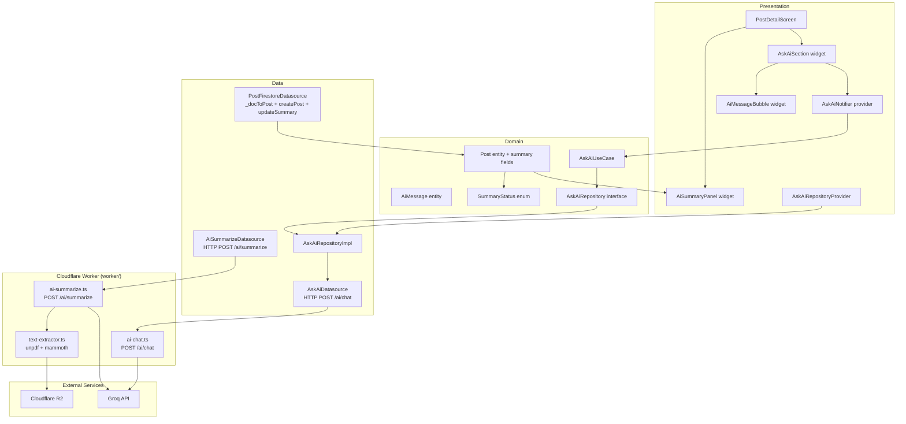

# SPEC-0009: AI Post Summary

**Status:** REVIEW
**Author:** Slade
**Date:** 2026-05-14
**Proposal:** [PROP-0009](../tech-proposals/0009-ai-post-summary.md)
**Approved by:** (fill in when approved)

---

## Overview

When a post is created with a PDF or DOCX attachment, a Firebase Cloud Function extracts the document text, sends it to the Groq LLM API, and writes a bullet-point summary back to the `posts/{postId}` document. The Flutter app surfaces this summary in a collapsible `AiSummaryPanel` widget on the post detail screen. Once the summary is ready, an `AskAiSection` widget allows the viewer to ask free-form questions about the document; answers are generated by a second HTTPS callable Cloud Function and the conversation is held ephemerally in Riverpod state only. Text-only posts (no `mediaUrls`) never show either widget.

---

## Architecture



---

## File map

### Flutter app — modify (existing files)

| Action | Path | Responsibility |
|---|---|---|
| Modify | `apps/mobile/lib/features/post/domain/entities/post.dart` | Add `summary`, `summaryStatus`, `summarizedAt` fields; add `SummaryStatus` enum |
| Modify | `apps/mobile/lib/features/post/data/datasources/post_firestore_datasource.dart` | Update `_docToPost` to read 3 new fields; update `createPost` to conditionally write `summaryStatus: 'pending'` |
| Modify | `apps/mobile/lib/features/post/presentation/screens/post_detail_screen.dart` | Replace stub `_AiSummaryCard` with `AiSummaryPanel` and conditionally insert `AskAiSection` in `_PostHeader` |
| Modify | `apps/mobile/pubspec.yaml` | Add `http: ^1.2.0` under `dependencies` |

### Flutter app — create (new files)

| Action | Path | Responsibility |
|---|---|---|
| Create | `apps/mobile/lib/features/post/domain/entities/ai_message.dart` | Pure-Dart `AiMessage` value class |
| Create | `apps/mobile/lib/features/post/domain/repositories/ask_ai_repository.dart` | Abstract `AskAiRepository` interface |
| Create | `apps/mobile/lib/features/post/domain/usecases/ask_ai.dart` | `AskAiUseCase` and `AskAiParams` |
| Create | `apps/mobile/lib/features/post/data/datasources/ask_ai_datasource.dart` | HTTP POST to Worker `/ai/chat`; reads Firebase ID token for auth |
| Create | `apps/mobile/lib/features/post/data/datasources/ai_summarize_datasource.dart` | HTTP POST to Worker `/ai/summarize`; called after `createPost` |
| Create | `apps/mobile/lib/features/post/data/repositories/ask_ai_repository_impl.dart` | Implements `AskAiRepository` via `AskAiDatasource` |
| Create | `apps/mobile/lib/features/post/presentation/providers/ask_ai_repository_provider.dart` | Riverpod provider that wires `AskAiRepositoryImpl`; paired `.g.dart` via codegen |
| Create | `apps/mobile/lib/features/post/presentation/providers/ask_ai_provider.dart` | `AskAiNotifier` (`AsyncNotifier<List<AiMessage>>`); paired `.g.dart` via codegen |
| Create | `apps/mobile/lib/features/post/presentation/widgets/ai_summary_panel.dart` | Collapsible summary card; renders pending shimmer / done bullets / error chip |
| Create | `apps/mobile/lib/features/post/presentation/widgets/ask_ai_section.dart` | Collapsible Q&A card; hosts message list + input bar |
| Create | `apps/mobile/lib/features/post/presentation/widgets/ai_message_bubble.dart` | Single message bubble — user / AI / off-topic / thinking variants |

### Cloudflare Worker (existing `worker/` — extend in place)

| Action | Path | Responsibility |
|---|---|---|
| Modify | `worker/package.json` | Add `groq-sdk`, `mammoth`, `unpdf` |
| Modify | `worker/wrangler.toml` | Document `GROQ_API_KEY` secret; optional `GROQ_MODEL` var |
| Modify | `worker/src/index.ts` | Add `Env.GROQ_API_KEY`/`GROQ_MODEL`; route `/ai/summarize` and `/ai/chat` to handlers; extract `requireAuth` helper |
| Create | `worker/src/text-extractor.ts` | Fetch file from public R2 URL; extract text via `unpdf` (PDF) or `mammoth` (DOCX); cap at 6,000 chars |
| Create | `worker/src/ai-summarize.ts` | `POST /ai/summarize` — auth, fetch file, extract text, call Groq, return `{summaryStatus, summary}` |
| Create | `worker/src/ai-chat.ts` | `POST /ai/chat` — auth, accept `{summary, question, history}`, call Groq, return `{reply, isOffTopic}` |

---

## API contracts

### Domain — `SummaryStatus` enum

```dart
// lib/features/post/domain/entities/post.dart
// (add alongside existing PostType / PostingIdentity enums)

enum SummaryStatus {
  pending,
  done,
  flagged,
  unsupportedType,
  error;

  /// Deserialise the Firestore string written by the Cloud Function.
  static SummaryStatus? fromFirestore(String? raw) => switch (raw) {
    'pending' => SummaryStatus.pending,
    'done' => SummaryStatus.done,
    'flagged' => SummaryStatus.flagged,
    'unsupported_type' => SummaryStatus.unsupportedType,
    'error' => SummaryStatus.error,
    _ => null,
  };
}
```

### Domain — `Post` entity additions

```dart
// New optional fields added to the existing Post class.
// All three are nullable for backward-compatibility with pre-SPEC-0009 documents.
final String? summary;           // bullet text, newline-separated, written by CF
final SummaryStatus? summaryStatus;
final DateTime? summarizedAt;
```

The existing `Post` constructor gains three optional named parameters. `copyWith` must be extended to include them. No breaking change to existing call sites because the parameters are optional with `null` defaults.

### Domain — `AiMessage` entity

```dart
// lib/features/post/domain/entities/ai_message.dart
// Pure Dart — zero Flutter or Firebase imports.

class AiMessage {
  const AiMessage({
    required this.content,
    required this.isUser,
    this.isOffTopic = false,
    this.isPending = false,
  });

  /// Message text. Empty string when [isPending] is true.
  final String content;

  /// True  → right-aligned user bubble.
  /// False → left-aligned AI bubble.
  final bool isUser;

  /// True when the Cloud Function determined the question is out of scope.
  final bool isOffTopic;

  /// True while the HTTPS call is in-flight (shows "Thinking…" state).
  final bool isPending;
}
```

### Domain — `AskAiRepository` interface

```dart
// lib/features/post/domain/repositories/ask_ai_repository.dart
// Pure Dart — zero Flutter or Firebase imports.

abstract class AskAiRepository {
  /// Sends [question] with the current [history] as context for [postId].
  /// Returns the AI reply as an [AiMessage] with [isUser] == false.
  /// Throws [AskAiException] on network or function error.
  Future<AiMessage> ask({
    required String postId,
    required List<AiMessage> history,
    required String question,
  });
}

class AskAiException implements Exception {
  const AskAiException(this.message);
  final String message;
  @override
  String toString() => 'AskAiException: $message';
}
```

### Domain — `AskAiUseCase`

```dart
// lib/features/post/domain/usecases/ask_ai.dart
// Pure Dart — zero Flutter or Firebase imports.

class AskAiParams {
  const AskAiParams({
    required this.postId,
    required this.history,
    required this.question,
  });

  final String postId;
  final List<AiMessage> history;
  final String question;
}

class AskAiUseCase {
  const AskAiUseCase(this._repository);

  final AskAiRepository _repository;

  Future<AiMessage> call(AskAiParams params) => _repository.ask(
        postId: params.postId,
        history: params.history,
        question: params.question,
      );
}
```

### Data — `AskAiDatasource`

```dart
// lib/features/post/data/datasources/ask_ai_datasource.dart
// HTTP POST to the Cloudflare Worker /ai/chat endpoint.
// Worker URL injected via --dart-define=WORKER_BASE_URL=https://...

import 'dart:convert';
import 'package:firebase_auth/firebase_auth.dart';
import 'package:http/http.dart' as http;

class AskAiDatasource {
  AskAiDatasource({http.Client? client}) : _client = client ?? http.Client();

  final http.Client _client;

  /// Payload: { summary, question, history: [{role, content}] }
  /// Response: { reply: string, isOffTopic: bool }
  Future<Map<String, dynamic>> call({
    required String summary,
    required String question,
    required List<Map<String, String>> history,
  }) async { ... }
}
```

### Data — `AiSummarizeDatasource`

```dart
// lib/features/post/data/datasources/ai_summarize_datasource.dart
// Called once after createPost() when the post has a supported file.

class AiSummarizeDatasource {
  /// Payload: { fileUrl, filename }
  /// Response: { summaryStatus: string, summary: string? }
  Future<Map<String, dynamic>> call({
    required String fileUrl,
    required String filename,
  }) async { ... }
}
```

### Data — `AskAiRepositoryImpl`

```dart
// lib/features/post/data/repositories/ask_ai_repository_impl.dart

class AskAiRepositoryImpl implements AskAiRepository {
  const AskAiRepositoryImpl(this._datasource);

  final AskAiDatasource _datasource;

  @override
  Future<AiMessage> ask({
    required String postId,
    required List<AiMessage> history,
    required String question,
  }) async {
    // Serialize history to [{role, content}] for the function payload.
    final serialized = history
        .where((m) => !m.isPending)
        .map((m) => {
              'role': m.isUser ? 'user' : 'assistant',
              'content': m.content,
            })
        .toList();

    final data = await _datasource.call(
      postId: postId,
      question: question,
      history: serialized,
    );

    return AiMessage(
      content: data['reply'] as String,
      isUser: false,
      isOffTopic: data['isOffTopic'] as bool? ?? false,
    );
  }
}
```

### Presentation — `AskAiNotifier`

```dart
// lib/features/post/presentation/providers/ask_ai_provider.dart
// Uses @riverpod codegen — do not edit the paired .g.dart directly.

import 'package:riverpod_annotation/riverpod_annotation.dart';

part 'ask_ai_provider.g.dart';

@riverpod
class AskAi extends _$AskAi {
  @override
  AsyncValue<List<AiMessage>> build(String postId) =>
      const AsyncData(<AiMessage>[]);

  /// Appends the user message, appends a pending placeholder, calls the use
  /// case, then replaces the placeholder with the real reply.
  Future<void> sendMessage(String question) async {
    final history = state.value ?? [];

    final userMsg = AiMessage(content: question, isUser: true);
    final pending = const AiMessage(content: '', isUser: false, isPending: true);

    state = AsyncData([...history, userMsg, pending]);

    try {
      final params = AskAiParams(
        postId: postId,
        history: [...history, userMsg],
        question: question,
      );
      final reply = await ref.read(askAiUseCaseProvider).call(params);
      final updated = [...(state.value ?? [])];
      updated[updated.length - 1] = reply; // replace pending
      state = AsyncData(updated);
    } on AskAiException catch (e, st) {
      // Remove pending bubble; surface error via AsyncError so the UI can
      // show a snackbar while preserving prior messages.
      final withoutPending = (state.value ?? [])
          .where((m) => !m.isPending)
          .toList();
      state = AsyncData(withoutPending);
      // Re-throw so the calling widget can display a SnackBar.
      Error.throwWithStackTrace(e, st);
    }
  }
}
```

### Presentation — `AskAiRepositoryProvider`

```dart
// lib/features/post/presentation/providers/ask_ai_repository_provider.dart

import 'package:riverpod_annotation/riverpod_annotation.dart';

part 'ask_ai_repository_provider.g.dart';

@riverpod
AskAiRepository askAiRepository(Ref ref) =>
    AskAiRepositoryImpl(AskAiDatasource());

@riverpod
AskAiUseCase askAiUseCase(Ref ref) =>
    AskAiUseCase(ref.watch(askAiRepositoryProvider));
```

### Widget — `AiSummaryPanel` public constructor

```dart
// lib/features/post/presentation/widgets/ai_summary_panel.dart

class AiSummaryPanel extends StatefulWidget {
  const AiSummaryPanel({
    super.key,
    required this.status,  // SummaryStatus? from Post
    this.summary,           // String? bullet text from Post
  });

  final SummaryStatus? status;
  final String? summary;
}
```

Render logic:
- `status == null` — widget returns `const SizedBox.shrink()` (no-op for text-only posts)
- `status == SummaryStatus.pending` — shimmer skeleton (3 lines, `ac.muted` background, animated opacity)
- `status == SummaryStatus.done` — collapsible bullet list (default expanded); each line from `summary.split('\n')` rendered as a row: 6 px amber dot + `bodyMedium` text
- `status == SummaryStatus.flagged` or `status == SummaryStatus.error` — muted chip: `Icons.warning_amber_rounded` + "Summary unavailable" in `ac.textMuted`; chip is `ac.muted` background, no tap target
- `status == SummaryStatus.unsupportedType` — same muted chip with label "Summary not supported for this file type"

### Widget — `AskAiSection` public constructor

```dart
// lib/features/post/presentation/widgets/ask_ai_section.dart

class AskAiSection extends ConsumerStatefulWidget {
  const AskAiSection({
    super.key,
    required this.postId,
  });

  final String postId;
}
```

- Only rendered when `summaryStatus == SummaryStatus.done`
- Default state: collapsed
- When expanded: `ConstrainedBox(maxHeight: 240)` wrapping a `ListView.builder` of `AiMessageBubble`, then a `TextField` + send `IconButton`
- Message list auto-scrolls to bottom on each new message via a `ScrollController`
- Empty state inside the expanded body: hint text "Ask anything about this document…" in `ac.textMuted`

### Widget — `AiMessageBubble` public constructor

```dart
// lib/features/post/presentation/widgets/ai_message_bubble.dart

class AiMessageBubble extends StatelessWidget {
  const AiMessageBubble({super.key, required this.message});

  final AiMessage message;
}
```

Render variants:
- `message.isPending` — left-aligned, `ac.muted` background, three-dot pulsing animation (staggered `AnimationController`) or 12 dp `CircularProgressIndicator`
- `message.isUser` — right-aligned, `cs.primary` background, `cs.onPrimary` text, `bodyMedium`, `BorderRadius.circular(12)` with `0` bottom-right
- `message.isOffTopic` — left-aligned, `ac.muted` background, `Icons.warning_amber_rounded` (size 14, `ac.amber`) + italic `bodySmall` text "I can only answer questions about this document.", `cs.onSurface` text, muted opacity
- default AI reply — left-aligned, `ac.muted` background, `cs.onSurface` text, `bodyMedium`, `BorderRadius.circular(12)` with `0` bottom-left

---

## Firestore schema

### Collection: `posts`

Existing document `posts/{postId}` gains three new optional fields written exclusively by the `generatePostSummary` Cloud Function.

```
posts/{postId}
  ...existing fields...
  summaryStatus:  string?    'pending' | 'done' | 'flagged' | 'unsupported_type' | 'error'
  summary:        string?    Newline-separated bullet points. Present only when summaryStatus == 'done'.
  summarizedAt:   Timestamp? Present only when summaryStatus == 'done'.
```

**Write rules:**
- Flutter client writes `summaryStatus: 'pending'` at post creation time only, and only when the post contains a PDF or DOCX file.
- All subsequent writes to `summaryStatus`, `summary`, and `summarizedAt` are performed by the Cloud Function using the Firebase Admin SDK. The Firestore security rules must deny client writes to these three fields after creation (enforced via a `request.resource.data.diff(resource.data)` check on the `update` rule).
- `summaryStatus: 'pending'` is omitted entirely from the document when the post has no supported attachments, keeping the document lean and the `AiSummaryPanel` invisible via the `status == null` guard.

**No new composite index is needed.** The three fields are never used as query filters; they are only read from individual post documents already fetched by the existing `watchPost` stream.

---

## Cloud Functions

### `generatePostSummary` — Firestore onCreate trigger

**Trigger:** `onDocumentCreated('posts/{postId}')`

**Logic:**
1. Read the new document. If `summaryStatus != 'pending'`, exit immediately.
2. Identify the file to process: iterate `mediaTypes` to find the first `'pdf'` entry; if none found, check `mediaUrls` for a file whose Storage object metadata `contentType` is `application/vnd.openxmlformats-officedocument.wordprocessingml.document` (DOCX).
3. If no supported file is found, write `summaryStatus: 'unsupported_type'` and exit.
4. Call `text-extractor.ts` with the Storage download URL. On extraction failure, write `summaryStatus: 'error'` and exit.
5. Truncate extracted text to 12,000 tokens (approx 48,000 characters) to stay within Groq context limits.
6. Send system prompt + document text to Groq (`llama3-70b-8192` model). System prompt instructs the model to return 3–7 concise bullet points, one per line, prefixed with `•`. If the document appears to contain harmful content, the model is instructed to respond with the single token `FLAGGED`.
7. If Groq response is `FLAGGED`, write `summaryStatus: 'flagged'` and exit.
8. On success, write `{ summary, summaryStatus: 'done', summarizedAt: FieldValue.serverTimestamp() }`.
9. If the post document no longer exists at step 8 (deleted between trigger and write), exit silently.

**Error handling:** Any unhandled exception writes `summaryStatus: 'error'` in a `finally` block.

**Environment variables (set via `firebase functions:config:set` or Secret Manager):**
- `GROQ_API_KEY`

### `askAiAboutPost` — HTTPS callable

**Authentication:** `context.auth` must be present; reject unauthenticated calls with `functions.https.HttpsError('unauthenticated', ...)`.

**Request payload:**
```typescript
{
  postId: string;
  question: string;
  history: Array<{ role: 'user' | 'assistant'; content: string }>;
}
```

**Response payload:**
```typescript
{
  reply: string;
  isOffTopic: boolean;
}
```

**Logic:**
1. Validate `postId`, `question` (non-empty, max 500 chars), and `history` (max 10 turns).
2. Fetch `posts/{postId}` from Firestore. If `summaryStatus != 'done'`, throw `HttpsError('failed-precondition', 'summary_not_ready')`.
3. Build Groq messages array: system message (instructs model to answer only questions about the document; if off-topic, respond with the single token `OFF_TOPIC`), the document summary as an initial assistant message, then the serialized history, then the new user question.
4. Call Groq (`llama3-70b-8192`, max 512 output tokens).
5. If the response is `OFF_TOPIC`, return `{ reply: 'I can only answer questions about this document.', isOffTopic: true }`.
6. Otherwise return `{ reply: <model response>, isOffTopic: false }`.

### `text-extractor.ts`

Exports a single async function:

```typescript
export async function extractText(storageUrl: string): Promise<string>
```

- Downloads the file to a temp buffer using the Firebase Admin Storage SDK.
- Detects format by file extension in the URL path (`.pdf` → `pdf-parse`; `.docx` → `mammoth.extractRawText`).
- Returns the extracted plain-text string.
- Throws `Error('unsupported_format')` for unrecognized extensions.

---

## Test plan

| Test file | Type | Covers |
|---|---|---|
| `test/unit/features/post/domain/usecases/ask_ai_test.dart` | Unit | `AskAiUseCase.call` delegates to repository; passes params correctly; propagates `AskAiException` |
| `test/unit/features/post/data/repositories/ask_ai_repository_impl_test.dart` | Unit | Happy path maps datasource response to `AiMessage`; `isOffTopic: true` correctly set; datasource exception is wrapped in `AskAiException` |
| `test/unit/features/post/data/datasources/ask_ai_datasource_test.dart` | Unit | Callable invoked with correct payload shape; response deserialized without error; `FirebaseFunctionsException` propagates |
| `test/unit/features/post/domain/entities/summary_status_test.dart` | Unit | `SummaryStatus.fromFirestore` correctly maps all 5 string values and returns `null` for unknown strings |
| `test/unit/features/post/presentation/providers/ask_ai_notifier_test.dart` | Unit | `sendMessage` appends user message, appends pending placeholder, replaces placeholder with reply; on error, pending bubble removed and exception re-thrown |
| `test/widget/features/post/widgets/ai_summary_panel_test.dart` | Widget | Pending state → shimmer visible, no bullet text; Done state → bullet list rendered from summary string; Error/flagged state → "Summary unavailable" chip shown; `status == null` → widget not in tree |
| `test/widget/features/post/widgets/ask_ai_section_test.dart` | Widget | Default collapsed state; expand toggle shows input bar; user message appears right-aligned after send; off-topic message shows warning icon + italic text; pending bubble visible during in-flight state |
| `test/widget/features/post/widgets/ai_message_bubble_test.dart` | Widget | User variant: right-aligned, `cs.primary` background; AI variant: left-aligned, `ac.muted` background; off-topic variant: warning icon present; pending variant: progress indicator present |
| `test/widget/features/post/screens/post_detail_screen_test.dart` | Widget | `AiSummaryPanel` not rendered for text-only post; rendered when `summaryStatus` is non-null; `AskAiSection` not rendered when `summaryStatus != done` |

---

## Out of scope

- PPTX and other Office formats (`.xlsx`, `.pptx`)
- Conversation history persisted to Firestore
- Retry button or manual re-trigger when `summaryStatus == 'error'`
- Summary visible in the feed card (post list items)
- Admin moderation UI for posts with `summaryStatus == 'flagged'`
- Summary regeneration when a post's attachments are edited
- Rate limiting per-user on the `askAiAboutPost` callable (deferred to a follow-up spec)
- Streaming (token-by-token) responses from Groq
- Support for `video` media type

---

## Open questions

All questions below must be resolved before status moves to `APPROVED`.

- [ ] **Groq model:** `llama-3.3-70b-versatile` is the default. Confirm or override via `GROQ_MODEL` var in `wrangler.toml`.
- [ ] **Worker base URL:** The Flutter datasources use `--dart-define=WORKER_BASE_URL=...`. Confirm the deployed Worker URL (custom domain or `*.workers.dev`) before wiring the dart-define into CI.
- [ ] **`http` package version:** `http: ^1.2.0` must be compatible with the existing `firebase_auth` / `firebase_core` versions in `pubspec.yaml`. Confirm before `flutter pub get`.
- [ ] **Firestore security rules:** A rule change is needed to block client writes to `summary`, `summaryStatus`, and `summarizedAt` after the initial `createPost`. Confirm whether security-reviewer handles this in the same PR or a follow-up.
- [ ] **`unpdf` WASM in Workers:** `unpdf` uses PDF.js WASM internally. Confirm it initialises correctly under `nodejs_compat` in the Cloudflare Worker sandbox before merging — run `wrangler dev` with a real PDF to verify.
