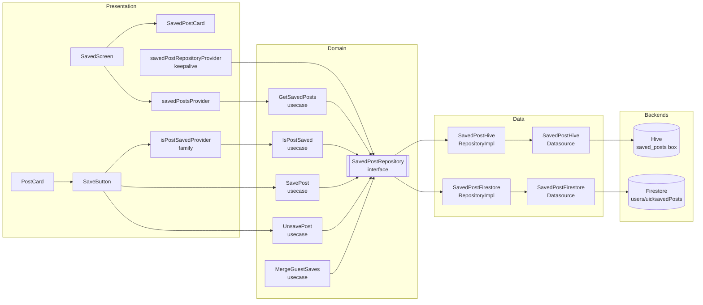

# SPEC-0009: Save Post

**Status:** APPROVED
**Author:** architect
**Date:** 2026-05-07
**Proposal:** [PROP-0009](../tech-proposals/0009-save-post.md)
**Approved by:** Nang Hayman Aye Mya

---

## Overview

This spec covers the implementation of post bookmarking for the Unishare Flutter app. A student can tap a Save button on any `PostCard` in the feed to bookmark it for later retrieval via the Saved tab at `/more/saved`. Guest users' saves are stored locally in a Hive box so that no Firestore write is issued before authentication. Authenticated users' saves are stored in the Firestore subcollection `users/{uid}/savedPosts/{postId}` and stream in real time, enabling cross-device access. When a guest with locally saved posts signs in, a `MergeGuestSaves` use case silently batch-writes those saves into Firestore using `SetOptions(merge: true)` to avoid overwriting existing saves, then clears the Hive box; on merge failure, Hive is retained and the merge is retried on the next login. The `SavedScreen` stub already exists at its final route — it is replaced in-place.

---

## Architecture



The Domain layer (`SavedPostRepository`, all use case classes, all entities) contains zero Flutter or Firebase imports. The Data layer implements the interfaces and owns all Hive and Firestore calls. The Presentation layer depends on the Domain interface only — never on `SavedPostHiveRepositoryImpl` or `SavedPostFirestoreRepositoryImpl` directly. `savedPostRepositoryProvider` is the single seam that selects the correct implementation based on `authStateProvider`.

---

## File map

All paths are relative to `apps/mobile/lib/` unless the `apps/mobile/` prefix is shown explicitly.

### Domain — new files

| Action | Path                                                            | Responsibility                                                           |
| ------ | --------------------------------------------------------------- | ------------------------------------------------------------------------ |
| Create | `features/saved/domain/entities/saved_post.dart`                | Pure Dart `SavedPost` entity — `postId`, `savedAt`, `snapshot`           |
| Create | `features/saved/domain/entities/saved_post_snapshot.dart`       | Pure Dart `SavedPostSnapshot` — denormalized display fields              |
| Create | `features/saved/domain/repositories/saved_post_repository.dart` | Abstract `SavedPostRepository` interface                                 |
| Create | `features/saved/domain/usecases/save_post.dart`                 | Validates `postId` non-empty; delegates to repository                    |
| Create | `features/saved/domain/usecases/unsave_post.dart`               | Delegates to repository                                                  |
| Create | `features/saved/domain/usecases/get_saved_posts.dart`           | Returns `Stream<List<SavedPost>>` from repository                        |
| Create | `features/saved/domain/usecases/is_post_saved.dart`             | Returns `Stream<bool>` for a given `postId`                              |
| Create | `features/saved/domain/usecases/merge_guest_saves.dart`         | Reads Hive saves, batch-writes to Firestore impl, clears Hive on success |

### Data — new files

| Action | Path                                                                         | Responsibility                                                                                |
| ------ | ---------------------------------------------------------------------------- | --------------------------------------------------------------------------------------------- |
| Create | `features/saved/data/models/saved_post_hive_model.dart`                      | `HiveObject` with manual `TypeAdapter` (typeId: 2); stores all snapshot fields as primitives  |
| Create | `features/saved/data/models/saved_post_dto.dart`                             | Freezed + `fromJson`/`toJson` for Firestore document mapping; `toEntity()` extension          |
| Create | `features/saved/data/datasources/saved_post_hive_datasource.dart`            | CRUD against `Box<SavedPostHiveModel>('saved_posts')`                                         |
| Create | `features/saved/data/datasources/saved_post_firestore_datasource.dart`       | Reads/writes `users/{uid}/savedPosts/{postId}`; orders by `savedAt DESC`                      |
| Create | `features/saved/data/repositories/saved_post_hive_repository_impl.dart`      | Implements `SavedPostRepository` against Hive; `mergeFrom` is a no-op                         |
| Create | `features/saved/data/repositories/saved_post_firestore_repository_impl.dart` | Implements `SavedPostRepository` against Firestore; `mergeFrom` batch-writes then clears Hive |

### Core storage — new file

| Action | Path                               | Responsibility                                                                                                                                |
| ------ | ---------------------------------- | --------------------------------------------------------------------------------------------------------------------------------------------- |
| Create | `core/storage/saved_post_box.dart` | `initSavedPostBox()` — registers `SavedPostHiveModelAdapter` (typeId: 2) and opens `'saved_posts'` box; mirrors `post_draft_box.dart` pattern |

### Presentation — new files

| Action | Path                                                                        | Responsibility                                                                                                                                                                                               |
| ------ | --------------------------------------------------------------------------- | ------------------------------------------------------------------------------------------------------------------------------------------------------------------------------------------------------------ |
| Create | `features/saved/presentation/providers/saved_post_repository_provider.dart` | `@Riverpod(keepAlive: true)` — watches `authStateProvider`; returns Hive impl when guest/unauthenticated, Firestore impl when authenticated; triggers `MergeGuestSaves` on guest-to-authenticated transition |
| Create | `features/saved/presentation/providers/saved_posts_provider.dart`           | `@riverpod` `StreamProvider` wrapping `GetSavedPosts`; exposes `AsyncValue<List<SavedPost>>`                                                                                                                 |
| Create | `features/saved/presentation/providers/is_post_saved_provider.dart`         | `@riverpod` family keyed on `postId`; `StreamProvider<bool>`                                                                                                                                                 |
| Create | `features/saved/presentation/widgets/saved_post_card.dart`                  | Renders from `SavedPostSnapshot` — no additional Firestore reads; layout per Figma audit                                                                                                                     |
| Create | `features/saved/presentation/widgets/save_button.dart`                      | Stateless toggle; receives `isSaved`, `onTap`, `isLoading`; used on `PostCard` and available for `PostDetailScreen`                                                                                          |

### Modified files

| Action | Path                                                                         | Change                                                                                                                                                                                                    |
| ------ | ---------------------------------------------------------------------------- | --------------------------------------------------------------------------------------------------------------------------------------------------------------------------------------------------------- |
| Modify | `apps/mobile/lib/main.dart`                                                  | Add `await initSavedPostBox();` immediately after `await initPostDraftBox();` on line 16                                                                                                                  |
| Modify | `apps/mobile/lib/features/saved/presentation/screens/saved_screen.dart`      | Replace "Coming soon" stub; render `savedPostsProvider` result; non-empty list, loading skeleton, error widget, and empty state; guest banner strip                                                       |
| Modify | `apps/mobile/lib/features/feed/presentation/widgets/post_card.dart`          | Place `SaveButton` (filled amber bookmark icon) in the **top-right of the card header row**, alongside the type badge and course code; driven by `isPostSavedProvider(post.id)`                           |
| Modify | `apps/mobile/lib/features/post/presentation/screens/post_detail_screen.dart` | Wire `SaveButton` into the existing action row; display `savesCount` text label beside it (e.g. "1 save"); `SaveButton` driven by `isPostSavedProvider(postId)`                                           |
| Modify | `apps/mobile/lib/core/router/router.dart`                                    | Add guest shell variant: when `guestModeProvider` is true, render a 3-tab `StatefulShellRoute` (FEED, SAVED, SIGN IN) in place of the authenticated 4-tab shell; `/saved` becomes a top-level guest route |

---

## API contracts

### `SavedPostSnapshot` entity

```dart
// features/saved/domain/entities/saved_post_snapshot.dart
// Pure Dart — zero Flutter or Firebase imports.

class SavedPostSnapshot {
  const SavedPostSnapshot({
    required this.title,
    required this.authorName,
    required this.authorAvatar,
    required this.courseId,
    required this.postType,
    required this.tags,
    required this.commentsCount,
  });

  final String title;
  final String authorName;    // empty string when anonymous
  final String authorAvatar;  // empty string when anonymous
  final String courseId;
  final String postType;      // PostType.name — e.g. "note", "assignment"
  final List<String> tags;
  final int commentsCount;    // captured at save time; may be stale
}
```

### `SavedPost` entity

```dart
// features/saved/domain/entities/saved_post.dart
// Pure Dart — zero Flutter or Firebase imports.

import 'package:unishare_mobile/features/saved/domain/entities/saved_post_snapshot.dart';

class SavedPost {
  const SavedPost({
    required this.postId,
    required this.savedAt,
    required this.snapshot,
  });

  final String postId;
  final DateTime savedAt;
  final SavedPostSnapshot snapshot;
}
```

### `SavedPostRepository` abstract interface

```dart
// features/saved/domain/repositories/saved_post_repository.dart
// Pure Dart — zero Flutter or Firebase imports.

import 'package:unishare_mobile/features/saved/domain/entities/saved_post.dart';
import 'package:unishare_mobile/features/saved/domain/entities/saved_post_snapshot.dart';

abstract interface class SavedPostRepository {
  /// Emits the full saved list ordered by savedAt descending.
  /// Re-emits on every change (Firestore snapshots or Hive box change).
  Stream<List<SavedPost>> watchSavedPosts();

  /// Saves the post. Snapshot is captured from the Post entity at call time.
  /// If the post is already saved, this is a no-op (idempotent).
  Future<void> savePost(String postId, SavedPostSnapshot snapshot);

  /// Removes the post from the saved list.
  /// If the post is not saved, this is a no-op (idempotent).
  Future<void> unsavePost(String postId);

  /// Emits true when [postId] is in the saved list; false otherwise.
  Stream<bool> isPostSaved(String postId);

  /// Batch-writes [guestSaves] into the backing store using merge semantics
  /// (existing records are not overwritten).
  /// On the Hive implementation this is a no-op — returns immediately.
  /// On the Firestore implementation this writes all entries and then clears
  /// the Hive box via the injected [SavedPostHiveDatasource].
  Future<void> mergeFrom(List<SavedPost> guestSaves);
}
```

### Use case class signatures

```dart
// features/saved/domain/usecases/save_post.dart
// Pure Dart — zero Flutter or Firebase imports.

import 'package:unishare_mobile/features/saved/domain/entities/saved_post_snapshot.dart';
import 'package:unishare_mobile/features/saved/domain/repositories/saved_post_repository.dart';

class SavePost {
  const SavePost(this._repository);
  final SavedPostRepository _repository;

  /// Throws [ArgumentError] if [postId] is empty after trimming.
  Future<void> call(String postId, SavedPostSnapshot snapshot) {
    if (postId.trim().isEmpty) {
      throw ArgumentError.value(postId, 'postId', 'postId must not be empty');
    }
    return _repository.savePost(postId.trim(), snapshot);
  }
}
```

```dart
// features/saved/domain/usecases/unsave_post.dart
// Pure Dart — zero Flutter or Firebase imports.

import 'package:unishare_mobile/features/saved/domain/repositories/saved_post_repository.dart';

class UnsavePost {
  const UnsavePost(this._repository);
  final SavedPostRepository _repository;

  Future<void> call(String postId) => _repository.unsavePost(postId);
}
```

```dart
// features/saved/domain/usecases/get_saved_posts.dart
// Pure Dart — zero Flutter or Firebase imports.

import 'package:unishare_mobile/features/saved/domain/entities/saved_post.dart';
import 'package:unishare_mobile/features/saved/domain/repositories/saved_post_repository.dart';

class GetSavedPosts {
  const GetSavedPosts(this._repository);
  final SavedPostRepository _repository;

  Stream<List<SavedPost>> call() => _repository.watchSavedPosts();
}
```

```dart
// features/saved/domain/usecases/is_post_saved.dart
// Pure Dart — zero Flutter or Firebase imports.

import 'package:unishare_mobile/features/saved/domain/repositories/saved_post_repository.dart';

class IsPostSaved {
  const IsPostSaved(this._repository);
  final SavedPostRepository _repository;

  Stream<bool> call(String postId) => _repository.isPostSaved(postId);
}
```

```dart
// features/saved/domain/usecases/merge_guest_saves.dart
// Pure Dart — zero Flutter or Firebase imports.

import 'package:unishare_mobile/features/saved/domain/entities/saved_post.dart';
import 'package:unishare_mobile/features/saved/domain/repositories/saved_post_repository.dart';

class MergeGuestSaves {
  const MergeGuestSaves(this._firestoreRepository);
  final SavedPostRepository _firestoreRepository;

  /// Merges [guestSaves] into the Firestore-backed repository.
  /// If [guestSaves] is empty, returns immediately without any writes.
  /// On success the Firestore repository impl clears the Hive box.
  /// On failure the exception propagates to the caller; Hive is not cleared.
  Future<void> call(List<SavedPost> guestSaves) {
    if (guestSaves.isEmpty) return Future.value();
    return _firestoreRepository.mergeFrom(guestSaves);
  }
}
```

### `SavedPostDto` (Freezed model)

```dart
// features/saved/data/models/saved_post_dto.dart

import 'package:cloud_firestore/cloud_firestore.dart';
import 'package:freezed_annotation/freezed_annotation.dart';

import 'package:unishare_mobile/features/saved/domain/entities/saved_post.dart';
import 'package:unishare_mobile/features/saved/domain/entities/saved_post_snapshot.dart';

part 'saved_post_dto.freezed.dart';
part 'saved_post_dto.g.dart';

@freezed
class SavedPostDto with _$SavedPostDto {
  const factory SavedPostDto({
    required String postId,
    // Firestore Timestamps are serialized to/from DateTime via JsonConverter
    // applied at the datasource level — the DTO stores DateTime for simplicity.
    required DateTime savedAt,
    required String title,
    required String authorName,
    required String authorAvatar,
    required String courseId,
    required String postType,
    required List<String> tags,
    @Default(0) int commentsCount,
  }) = _SavedPostDto;

  factory SavedPostDto.fromJson(Map<String, dynamic> json) =>
      _$SavedPostDtoFromJson(json);
}

extension SavedPostDtoMapper on SavedPostDto {
  SavedPost toEntity() => SavedPost(
        postId: postId,
        savedAt: savedAt,
        snapshot: SavedPostSnapshot(
          title: title,
          authorName: authorName,
          authorAvatar: authorAvatar,
          courseId: courseId,
          postType: postType,
          tags: List.unmodifiable(tags),
          commentsCount: commentsCount,
        ),
      );
}
```

Note: `Timestamp` to `DateTime` conversion must be handled at the datasource layer. The datasource reads the raw Firestore `DocumentSnapshot`, converts `savedAt` from `Timestamp` to `DateTime` before constructing `SavedPostDto.fromJson`, and writes `DateTime` back as `Timestamp` when calling `set()`.

### Provider signatures

```dart
// features/saved/presentation/providers/saved_post_repository_provider.dart

// @Riverpod(keepAlive: true)
// savedPostRepositoryProvider(Ref ref) -> SavedPostRepository
//
// Build logic:
//   1. Watch authStateProvider (AsyncValue<AppUser?>).
//   2. If value is null (unauthenticated or loading) OR guestModeProvider is true:
//        return SavedPostHiveRepositoryImpl(hiveDataSource).
//   3. If value is non-null (authenticated):
//        a. Read previous state — if previous state was the Hive impl,
//           schedule MergeGuestSaves after the current build frame completes
//           (use ref.listenSelf or a post-frame callback).
//        b. Return SavedPostFirestoreRepositoryImpl(firestoreDataSource, hiveDataSource).
//   4. ref.onDispose: no special teardown — Hive box remains open.
//
// The MergeGuestSaves trigger fires at most once per authenticated session.
// If the merge throws, the error is caught and logged via AppLogger;
// the Hive box is not cleared on failure.
```

```dart
// features/saved/presentation/providers/saved_posts_provider.dart

// @riverpod
// Stream<List<SavedPost>> savedPosts(Ref ref)
//
// Watches savedPostRepositoryProvider, constructs GetSavedPosts,
// and returns GetSavedPosts().call() as a Stream.
// Provider re-creates when savedPostRepositoryProvider changes
// (auth state switch from guest to authenticated).
```

```dart
// features/saved/presentation/providers/is_post_saved_provider.dart

// @riverpod
// Stream<bool> isPostSaved(Ref ref, String postId)
//
// Family keyed on postId.
// Watches savedPostRepositoryProvider, constructs IsPostSaved,
// and returns IsPostSaved().call(postId) as a Stream.
// Emits false as initial state before the first stream event arrives.
```

---

## Firestore schema

### `users/{uid}/savedPosts/{postId}` document

```
users/{uid}/savedPosts/{postId}:
  postId:        string     (== document ID — stored as a field for query convenience)
  savedAt:       Timestamp  (moment the user tapped Save; used for orderBy)
  title:         string     (denormalized from Post.title at save time)
  authorName:    string     (denormalized from Post.authorName; empty string when anonymous)
  authorAvatar:  string     (denormalized from Post.authorAvatar; empty string when anonymous)
  courseId:      string     (denormalized from Post.courseId)
  postType:      string     (denormalized — PostType.name, e.g. "note", "assignment")
  tags:          string[]   (denormalized from Post.tags)
  commentsCount: number     (denormalized from Post.commentsCount at save time; may be stale; defaults to 0)
```

Denormalized fields enable the Saved tab to render as a flat list without issuing one `posts/{postId}` read per saved entry. Staleness of denormalized fields (e.g., a post title that was later edited) is accepted for v1. A Cloud Function to refresh stale snapshots on post edit is deferred.

### Index requirements

No new composite Firestore indexes are required. The `savedPosts` subcollection is queried with a single `orderBy('savedAt', descending: true)` clause on a single field of a subcollection. Single-field indexes are created automatically by Firestore. No `firestore.indexes.json` changes are needed for this feature.

---

## Hive box

### Registration pattern

`core/storage/saved_post_box.dart` mirrors the existing `post_draft_box.dart` exactly:

```dart
// core/storage/saved_post_box.dart

import 'package:hive_flutter/hive_flutter.dart';
import 'package:unishare_mobile/features/saved/data/models/saved_post_hive_model.dart';

Future<void> initSavedPostBox() async {
  Hive.registerAdapter(SavedPostHiveModelAdapter());
  await Hive.openBox<SavedPostHiveModel>('saved_posts');
}
```

This function is called from `main.dart` immediately after `initPostDraftBox()`.

### Fields stored in `SavedPostHiveModel`

| Hive field index | Dart field      | Type           |
| ---------------- | --------------- | -------------- |
| 0                | `postId`        | `String`       |
| 1                | `savedAt`       | `DateTime`     |
| 2                | `title`         | `String`       |
| 3                | `authorName`    | `String`       |
| 4                | `authorAvatar`  | `String`       |
| 5                | `courseId`      | `String`       |
| 6                | `postType`      | `String`       |
| 7                | `tags`          | `List<String>` |
| 8                | `commentsCount` | `int`          |

`typeId: 2` is reserved for `SavedPostHiveModelAdapter`. typeId 1 is already claimed by `PostDraftModelAdapter`. No other adapter in the codebase uses typeId 2.

The `SavedPostHiveModel` class extends `HiveObject`. Its `TypeAdapter` is written manually (not generated) following the same pattern used by `PostDraftModelAdapter` — see `apps/mobile/lib/features/post/data/models/post_draft_model.dart` for the reference implementation. The `write` method must write exactly 9 fields (writeByte(9) at the start).

---

## SavedPostCard layout

Derived from the Figma audit (Screenshot 2026-05-07 110442). The card renders from `SavedPostSnapshot` without any additional Firestore reads.

```
┌─────────────────────────────────────────────────────────┐
│  [NOTE badge]  [CSC233 course code]          [🔖 icon]  │  ← header row: type + course + bookmark toggle (top-right)
│  LR Parsing                                             │  ← title (bold, body-large)
│  [LYP avatar]  La Yaung Phyo · Year 1 ·                │  ← author initials circle + name + year
│  [💬 icon]  0 comments · 21 days ago                   │  ← commentsCount + relative savedAt timestamp
├─────────────────────────────────────────────────────────┤  ← divider
```

- **Type badge**: bordered chip, matches the `_TypeBadge` pattern from `post_card_widget.dart`; label is `PostType.name` uppercased.
- **Course code**: amber/orange text, `snapshot.courseId`.
- **Bookmark icon** (top-right): filled amber `Icons.bookmark` — tapping it calls `unsavePost(postId)`.
- **Author avatar**: circle with initials (first letters of each word in `authorName`). If `authorName` is empty (anonymous), show a generic person icon.
- **Comments count**: `"${snapshot.commentsCount} comments"`. If `commentsCount` is 0, render `"0 comments"` — do not hide the row.
- **Relative timestamp**: rendered from `SavedPost.savedAt` using a relative formatter (e.g. "21 days ago").

---

## Empty state specification

`SavedScreen` must render one of four mutually exclusive states based on `savedPostsProvider`:

| Provider state     | Widget shown                                                                                                                           |
| ------------------ | -------------------------------------------------------------------------------------------------------------------------------------- |
| `AsyncLoading`     | Skeleton loader — a `ListView.builder` of placeholder cards matching `SavedPostCard` dimensions, using a shimmer or grey box treatment |
| `AsyncError`       | Error widget — icon, "Something went wrong", and a Retry button that calls `ref.invalidate(savedPostsProvider)`                        |
| `AsyncData([])`    | Empty state (see below)                                                                                                                |
| `AsyncData([...])` | `ListView.builder` of `SavedPostCard` items, ordered as received from the stream (savedAt DESC)                                        |

### Guest info banner (always shown for guest users)

When `guestModeProvider` is true, a non-dismissible info strip is pinned **below the AppBar title and above the list/empty state**. From the Figma audit:

- Background: light grey/cream (`Theme.of(context).colorScheme.surfaceVariant` or equivalent).
- Left text: `"Saved posts are stored locally and won't sync across devices."` in body-small, muted.
- Right: amber `TextButton` labeled `"→ Sign in to sync"` — calls `context.go('/welcome')` or the auth entry route.

This banner is **not** shown for authenticated users.

### Empty state requirements

The empty state widget must be visually distinct from both the loading skeleton and the error widget. From the Figma audit (Screenshot 2026-05-07 112118), the empty state contains **only**:

1. **Centered body text** — `"No saved posts yet."` — rendered in the app's body-medium text style, muted grey color. No illustration, no icon, no CTA button.

The empty state must be centered vertically in the available body space using a `Column` with `mainAxisAlignment: MainAxisAlignment.center`.

---

## Test plan

| Test file                                                                                   | Covers                                                                                                                                                                                                                                                                                                                                                                                          |
| ------------------------------------------------------------------------------------------- | ----------------------------------------------------------------------------------------------------------------------------------------------------------------------------------------------------------------------------------------------------------------------------------------------------------------------------------------------------------------------------------------------- |
| `test/unit/features/saved/domain/usecases/save_post_test.dart`                              | `SavePost.call` delegates to repository with trimmed postId; empty postId throws `ArgumentError`; whitespace-only postId throws `ArgumentError`                                                                                                                                                                                                                                                 |
| `test/unit/features/saved/domain/usecases/unsave_post_test.dart`                            | `UnsavePost.call` delegates to repository; return value forwarded                                                                                                                                                                                                                                                                                                                               |
| `test/unit/features/saved/domain/usecases/get_saved_posts_test.dart`                        | Stream from repository is forwarded unchanged; use case does not transform or buffer items                                                                                                                                                                                                                                                                                                      |
| `test/unit/features/saved/domain/usecases/is_post_saved_test.dart`                          | Stream forwarded from repository; emits `false` when repository emits `false`; emits `true` when repository emits `true`                                                                                                                                                                                                                                                                        |
| `test/unit/features/saved/domain/usecases/merge_guest_saves_test.dart`                      | Empty list returns immediately without calling repository; non-empty list delegates to `firestoreRepository.mergeFrom`; on repository throw, exception propagates (Hive not cleared by use case — that is the repository impl's responsibility)                                                                                                                                                 |
| `test/unit/features/saved/data/repositories/saved_post_hive_repository_impl_test.dart`      | `savePost` writes to in-memory Hive box; `unsavePost` removes entry; `watchSavedPosts` emits updated list after writes; `isPostSaved` emits `true` after save and `false` after unsave; `mergeFrom` is a no-op (returns without writing)                                                                                                                                                        |
| `test/unit/features/saved/data/repositories/saved_post_firestore_repository_impl_test.dart` | `savePost` writes the correct Firestore document shape (all seven fields); `unsavePost` deletes the document; `mergeFrom` calls `set` with `SetOptions(merge: true)` for each guest save; duplicate `savePost` (already saved) does not overwrite `savedAt` when `SetOptions(merge: true)` is applied; merge success clears Hive box; merge failure (datasource throws) does not clear Hive box |
| `test/widget/features/saved/screens/saved_screen_test.dart`                                 | Non-empty list renders `SavedPostCard` widgets with correct count; empty list renders only "No saved posts yet." text (no CTA, no icon); loading state renders skeleton; error state renders Retry button; guest banner visible when `guestModeProvider` is true; banner hidden for authenticated users                                                                                         |
| `test/widget/features/saved/widgets/save_button_test.dart`                                  | `isSaved: true` renders filled bookmark icon (`Icons.bookmark`); `isSaved: false` renders outline icon (`Icons.bookmark_border`); `onTap` callback fires when tapped and `isLoading` is false; `isLoading: true` disables tap and shows `CircularProgressIndicator` in place of icon                                                                                                            |
| `test/widget/features/saved/widgets/saved_post_card_test.dart`                              | Renders `title`, `authorName`, `courseId`, `postType` badge, `commentsCount`, and relative timestamp from snapshot; bookmark icon positioned top-right; unsave tap fires the unsave callback; anonymous post (empty `authorName`) renders initials placeholder without crash                                                                                                                    |
| `test/widget/features/feed/widgets/post_card_test.dart`                                     | `SaveButton` bookmark icon is present in the card header row top-right; tapping when unsaved calls `savePost`; tapping when saved calls `unsavePost`; saved state shows filled amber icon; unsaved state shows outline icon                                                                                                                                                                     |

---

## Out of scope

- Full offline sync for authenticated users: Hive is used exclusively as guest storage. Authenticated users require network connectivity to save or unsave; the Firestore SDK's built-in offline cache provides basic resilience, but explicit write-back caching for authenticated users is not implemented in this spec.
- Push notification deep links to the Saved tab.
- Sorting or filtering the Saved list — all saves are shown in reverse-chronological order (savedAt DESC) only.
- Post editing from the Saved tab.
- Sharing or exporting saved posts.
- Folder or collection grouping within Saved.
- Wiring `SaveButton` to `PostDetailScreen` — the `SaveButton` widget is defined and available in this spec. If the Figma shows a Save button on the Post Detail screen, the flutter-engineer must wire it as part of this task; otherwise it is deferred as a follow-up modification. This is an open question requiring the Figma audit to resolve (see below).
- A background Cloud Function to refresh stale denormalized snapshot fields when a post is edited.
- Pagination of the Saved list — all saves are streamed in full for v1.

---

## Open questions

All open questions from the proposal and initial draft are resolved.

| #   | Question                                                      | Resolution                                                                                                                                                                                                                                                                                                                              |
| --- | ------------------------------------------------------------- | --------------------------------------------------------------------------------------------------------------------------------------------------------------------------------------------------------------------------------------------------------------------------------------------------------------------------------------- |
| 1   | Merge behavior on login — silent or user-choice modal?        | **Resolved:** silent auto-merge with no user prompt.                                                                                                                                                                                                                                                                                    |
| 2   | `SavedPostCard` layout — which fields, what order?            | **Resolved:** header row `[type badge][courseId][bookmark icon top-right]`, then title, then `[avatar][authorName · Year N]`, then `[💬][commentsCount comments · relative time]`. Divider at bottom. See SavedPostCard layout section above.                                                                                           |
| 3   | Empty state — illustration asset or icon?                     | **Resolved:** text only — `"No saved posts yet."` centered. No illustration, no icon, no CTA button. Confirmed from Figma.                                                                                                                                                                                                              |
| 4   | `SaveButton` placement on `PostCard` — where?                 | **Resolved:** filled amber bookmark icon in the **top-right of the card header row**, not a separate action row.                                                                                                                                                                                                                        |
| 5   | Does Post Detail screen show a Save button?                   | **Resolved:** yes. Wire `SaveButton` and display `savesCount` label (e.g. `"1 save"`) beside it in the detail action row, per Figma. Note: `savesCount` requires a `Post` entity field or separate Firestore read — the flutter-engineer must confirm whether `savesCount` is available on the existing `Post` entity or must be added. |
| 6   | Guest navbar structure — is Saved a top-level tab for guests? | **Resolved (architectural finding from Figma):** yes. Guest users see a simplified 3-tab shell: FEED \| SAVED \| SIGN IN. This requires a router modification (new guest `StatefulShellRoute` or conditional shell rendering). Added to the modified-files list.                                                                        |
