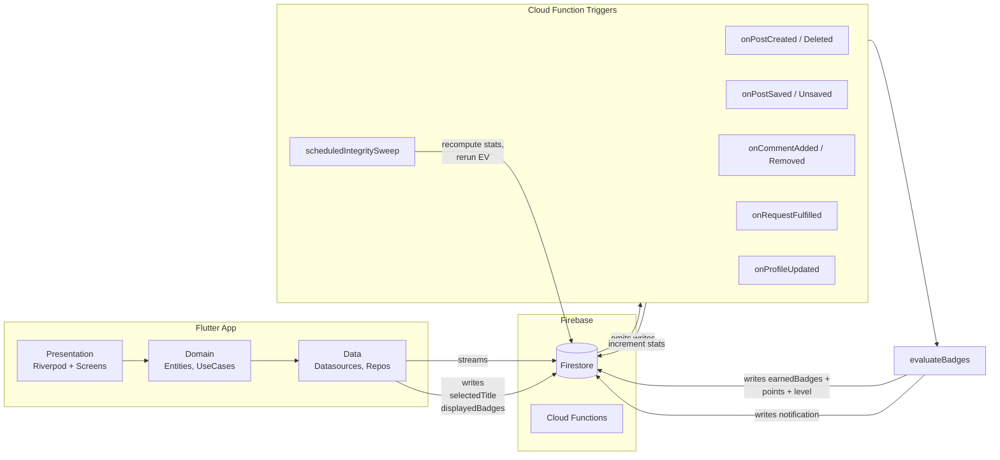

# SPEC-0010: Achievements System

**Status:** DRAFT
**Author:** Pyae Sone Shin Thant
**Date:** 2026-05-18
**Proposal:** [PROP-0010](../tech-proposals/0010-achievements.md)
**Approved by:** (pending)

---

## Overview

A Firebase-native achievement system where points are only awarded by unlocking milestone badges. Cloud Function triggers maintain denormalised counters on the user document and atomically grant badges + points when thresholds are crossed. The Flutter app streams unlock events and surfaces them via the profile card, a dedicated achievements screen, in-app earn moments, and the existing notification feed. The v1 catalog ships 20 badges across onboarding, progression, and prestige tiers. Leaderboards, faculty (ajarn) recognition, and cosmetic profile accents are explicitly v1.1.

## Architecture



**Trust boundary:** All counter updates and badge grants flow through Cloud Functions. The client streams results but cannot write to `stats`, `earnedBadges`, or the protected fields of `gamification`.

**Data freshness:** Earn-moment UX requires real-time client awareness of badge grants, achieved via Firestore document streams on `users/{uid}/earnedBadges` ordered by `earnedAt desc`.

## Data Model

### Firestore — `badges/{badgeId}` (catalog, ~20 docs at v1)

```json
{
  "id": "first_post",
  "name": "First Steps",
  "description": "Share your first post with the community.",
  "glyph": "paper-plane-tilt",
  "points": 15,
  "tier": "onboarding",
  "category": "content",
  "condition": { "type": "postsCreated", "threshold": 1 },
  "order": 1,
  "active": true
}
```

- `tier`: `onboarding` | `progression` | `prestige`
- `category`: `content` | `community` | `profile` | `recognition`
- `condition.type`: must match a key in `users/{uid}.stats`
- `glyph`: a valid Phosphor icon name

### Firestore — `users/{uid}` (extended)

```json
{
  // ...existing fields preserved
  "gamification": {
    "totalPoints": 120,
    "level": 3,
    "selectedTitle": "First Wave",
    "displayedBadges": ["first_post", "first_save_given", "helpful_hand"]
  },
  "stats": {
    "postsCreated": 7,
    "savesReceived": 23,
    "postsWithAtLeastOneSave": 5,
    "uniqueSaversCount": 18,
    "requestsFulfilled": 4,
    "requestsCreated": 2,
    "commentsWritten": 18,
    "savesGiven": 12,
    "uniqueDepartmentsContributed": ["cs", "math"],
    "profileCompleted": true,
    "moderationFlags": 0,
    "updatedAt": "<ts>"
  }
}
```

### Firestore — `users/{uid}/earnedBadges/{badgeId}` (append-only)

```json
{
  "badgeId": "first_post",
  "earnedAt": "<ts>",
  "pointsAwarded": 15,
  "snapshot": { "value": 1, "threshold": 1 }
}
```

### Firestore — `users/{uid}/uniqueSavers/{saverUid}` (presence set)

Empty docs keyed by saver uid. Maintained by `onPostSaved` / `onPostUnsaved`. Used by aggregation to derive `stats.uniqueSaversCount`.

### Firestore — `app_config/levels` (tunable lookup)

```json
{
  "thresholds": [
    { "level": 1, "cumulative": 0 },
    { "level": 2, "cumulative": 30 },
    { "level": 3, "cumulative": 80 },
    { "level": 4, "cumulative": 150 },
    { "level": 5, "cumulative": 250 },
    { "level": 6, "cumulative": 400 },
    { "level": 7, "cumulative": 600 },
    { "level": 8, "cumulative": 900 },
    { "level": 9, "cumulative": 1300 },
    { "level": 10, "cumulative": 1800 }
  ],
  "perLevelAbove10": 500
}
```

## File map

### Flutter app

| Action | Path | Responsibility |
|---|---|---|
| Create | `apps/mobile/lib/features/achievements/domain/entities/badge.dart` | Pure `Badge` entity (id, name, description, glyph, points, tier, category, condition, order). |
| Create | `apps/mobile/lib/features/achievements/domain/entities/earned_badge.dart` | Pure `EarnedBadge` entity (badgeId, earnedAt, pointsAwarded). |
| Create | `apps/mobile/lib/features/achievements/domain/entities/user_gamification.dart` | Pure entity (totalPoints, level, selectedTitle, displayedBadges). |
| Create | `apps/mobile/lib/features/achievements/domain/entities/user_stats.dart` | Pure entity mirroring `users/{uid}.stats` map. |
| Create | `apps/mobile/lib/features/achievements/domain/entities/level_tier.dart` | Level threshold table + `LevelProgress` value object. |
| Create | `apps/mobile/lib/features/achievements/domain/repositories/badge_repository.dart` | Abstract: catalog read, earned-badges stream. |
| Create | `apps/mobile/lib/features/achievements/domain/repositories/gamification_repository.dart` | Abstract: gamification + stats stream, setDisplayedBadges, setSelectedTitle. |
| Create | `apps/mobile/lib/features/achievements/domain/usecases/watch_earned_badges.dart` | Returns `Stream<List<EarnedBadge>>`. |
| Create | `apps/mobile/lib/features/achievements/domain/usecases/get_badge_catalog.dart` | One-shot fetch of active badges. |
| Create | `apps/mobile/lib/features/achievements/domain/usecases/set_displayed_badges.dart` | Validates against earned + cap of 3, calls repo. |
| Create | `apps/mobile/lib/features/achievements/domain/usecases/set_selected_title.dart` | Validates ownership, calls repo. |
| Create | `apps/mobile/lib/features/achievements/domain/usecases/compute_level_progress.dart` | Pure: points + lookup → `LevelProgress(level, pointsIntoLevel, pointsToNext)`. |
| Create | `apps/mobile/lib/features/achievements/data/models/badge_dto.dart` | Freezed + json_serializable. |
| Create | `apps/mobile/lib/features/achievements/data/models/earned_badge_dto.dart` | Freezed. |
| Create | `apps/mobile/lib/features/achievements/data/models/user_gamification_dto.dart` | Freezed. |
| Create | `apps/mobile/lib/features/achievements/data/models/user_stats_dto.dart` | Freezed. |
| Create | `apps/mobile/lib/features/achievements/data/datasources/badge_firestore_datasource.dart` | Streams `badges/`, streams `users/{uid}.gamification`, streams `users/{uid}.stats`. |
| Create | `apps/mobile/lib/features/achievements/data/datasources/earned_badges_firestore_datasource.dart` | Streams `users/{uid}/earnedBadges` ordered by `earnedAt desc`. |
| Create | `apps/mobile/lib/features/achievements/data/repositories/badge_repository_impl.dart` | Implements `BadgeRepository`. |
| Create | `apps/mobile/lib/features/achievements/data/repositories/gamification_repository_impl.dart` | Implements `GamificationRepository`. |
| Create | `apps/mobile/lib/features/achievements/presentation/providers/badge_catalog_provider.dart` | `@riverpod` stream of active badges. |
| Create | `apps/mobile/lib/features/achievements/presentation/providers/earned_badges_provider.dart` | `@riverpod` stream per uid. |
| Create | `apps/mobile/lib/features/achievements/presentation/providers/user_gamification_provider.dart` | `@riverpod` stream of gamification map. |
| Create | `apps/mobile/lib/features/achievements/presentation/providers/level_progress_provider.dart` | Derived: gamification + levels lookup → `LevelProgress`. |
| Create | `apps/mobile/lib/features/achievements/presentation/providers/new_badge_alert_provider.dart` | Watches earnedBadges + Hive `lastSeenAt`, emits unread unlocks; drains on rest surfaces only. |
| Create | `apps/mobile/lib/features/achievements/presentation/screens/achievements_screen.dart` | Grid of earned + locked badges. Route `/achievements` and `/achievements/:uid`. |
| Create | `apps/mobile/lib/features/achievements/presentation/widgets/badge_frame.dart` | Onboarding/progression/prestige/locked frame variants — pure `Container` + `BoxDecoration`, no assets. |
| Create | `apps/mobile/lib/features/achievements/presentation/widgets/badge_icon.dart` | Composes `BadgeFrame` + Phosphor glyph. |
| Create | `apps/mobile/lib/features/achievements/presentation/widgets/profile_achievements_section.dart` | Used by `ProfileCard`: header row, 3 badges (or muted placeholders), progress bar. |
| Create | `apps/mobile/lib/features/achievements/presentation/widgets/level_chip.dart` | Small "Lv N" chip with `ac.amberSubtle` bg + `ac.amber` text. |
| Create | `apps/mobile/lib/features/achievements/presentation/widgets/title_chip.dart` | Selected title display under name. |
| Create | `apps/mobile/lib/features/achievements/presentation/widgets/level_progress_bar.dart` | Bar + "120 / 250 pts to Lv 6" Fira Code label. |
| Create | `apps/mobile/lib/features/achievements/presentation/widgets/badge_detail_sheet.dart` | Bottom sheet: full badge info + when earned. |
| Create | `apps/mobile/lib/features/achievements/presentation/widgets/badge_picker_sheet.dart` | Pick up to 3 displayed badges. |
| Create | `apps/mobile/lib/features/achievements/presentation/widgets/title_picker_sheet.dart` | Pick one earned title (or clear). |
| Create | `apps/mobile/lib/features/achievements/presentation/widgets/earn_moment_modal.dart` | Celebratory bottom sheet for onboarding/prestige/level-up unlocks. |
| Create | `apps/mobile/lib/features/achievements/presentation/widgets/earn_moment_toast.dart` | Subtle snackbar for progression unlocks. |
| Modify | `apps/mobile/lib/features/profile/presentation/widgets/profile_card.dart` | Add level chip to name row, selected title under name, compose `ProfileAchievementsSection`. |
| Modify | `apps/mobile/lib/app.dart` (or wherever routes live) | Register `/achievements` and `/achievements/:uid` GoRoutes; mount the earn-moment dispatcher observer. |
| Modify | `apps/mobile/pubspec.yaml` | Add `phosphor_flutter` dependency (thin variant). |

### Cloud Functions

| Action | Path | Responsibility |
|---|---|---|
| Create | `functions/src/badges/evaluateBadges.ts` | Targeted evaluator: given `uid` + changed stat keys, finds newly-earned badges, writes them + bumps points/level in one transaction, queues notification. |
| Create | `functions/src/badges/levelForPoints.ts` | Pure lookup against `app_config/levels` (cached in memory). |
| Create | `functions/src/badges/grantNotification.ts` | Writes a notification doc for an unlock, using the existing notification schema. |
| Create | `functions/src/triggers/onPostCreated.ts` | Increments `postsCreated`, appends to `uniqueDepartmentsContributed`, calls evaluator. |
| Create | `functions/src/triggers/onPostDeleted.ts` | Decrements counters. Does not revoke earned badges. |
| Create | `functions/src/triggers/onPostSaved.ts` | Author's `savesReceived++`, presence in `uniqueSavers/{saverUid}` → recompute `uniqueSaversCount`; first-save-on-this-post → `postsWithAtLeastOneSave++`. Saver's `savesGiven++`. Self-saves rejected. Calls evaluator for author and saver. |
| Create | `functions/src/triggers/onPostUnsaved.ts` | Mirror of above, decrement-only. |
| Modify | `functions/src/triggers/onCommentAdded.ts` | After existing logic, `commentsWritten++`, call evaluator. |
| Create | `functions/src/triggers/onCommentRemoved.ts` | Decrement. |
| Modify | `functions/src/triggers/onRequestFulfilled.ts` | After existing logic, fulfiller's `requestsFulfilled++`, call evaluator. |
| Create | `functions/src/triggers/onRequestCreated.ts` | Requester's `requestsCreated++`, call evaluator. |
| Create | `functions/src/triggers/onProfileUpdated.ts` | Debounced: recompute `profileCompleted`, call evaluator if it flipped to true. |
| Create | `functions/src/scheduled/integritySweep.ts` | Daily at 03:00 ICT, for users active in last 24h: recompute stats from source-of-truth queries, write corrections, rerun evaluator. Logs drift > 1 to Crashlytics. |
| Modify | `functions/src/index.ts` | Export new triggers + scheduled function. |
| Modify | `functions/src/triggers/onUserDeleted.ts` (or wherever account-deletion cascade lives) | Add cascade delete for `earnedBadges` and `uniqueSavers` subcollections. |

### Firestore rules + indexes

| Action | Path | Responsibility |
|---|---|---|
| Modify | `firestore.rules` | Add rules for `badges/`, `users/{uid}/earnedBadges/`, `users/{uid}/uniqueSavers/`, `users/{uid}.gamification` field-level checks (`displayedBadges` ≤ 3 and ownership-validated, `selectedTitle` ownership-validated, `totalPoints` + `level` server-only), `users/{uid}.stats` server-only. |
| Modify | `firestore.indexes.json` | Add index on `badges` `where active == true && condition.type IN ...` (single-field, auto). Add index on `users/{uid}/earnedBadges` ordered by `earnedAt desc` (auto). |

### Seeds

| Action | Path | Responsibility |
|---|---|---|
| Create | `tools/seeds/badges.js` | Exports array of 20 v1 badges (see catalog below). |
| Create | `tools/seeds/app_config_levels.js` | Exports the level threshold table. |
| Modify | `tools/seed_firestore.js` | Add `seedBadges()` and `seedAppConfig()` steps using `set({ merge: true })` for idempotency. |

## API contracts

### Domain layer (pure Dart, zero Flutter / Firebase imports)

```dart
// domain/entities/badge.dart
class Badge {
  final String id;
  final String name;
  final String description;
  final String glyph;
  final int points;
  final BadgeTier tier;
  final BadgeCategory category;
  final BadgeCondition condition;
  final int order;
  const Badge({...});
}

enum BadgeTier { onboarding, progression, prestige }
enum BadgeCategory { content, community, profile, recognition }

class BadgeCondition {
  final String statKey;
  final int threshold;
  const BadgeCondition(this.statKey, this.threshold);
}

// domain/entities/level_tier.dart
class LevelProgress {
  final int currentLevel;
  final int pointsIntoLevel;
  final int pointsToNextLevel;
  final double fractionToNext; // 0.0–1.0
  const LevelProgress({...});
}

// domain/repositories/badge_repository.dart
abstract class BadgeRepository {
  Stream<List<Badge>> watchCatalog();
  Stream<List<EarnedBadge>> watchEarnedBadges(String uid);
}

// domain/repositories/gamification_repository.dart
abstract class GamificationRepository {
  Stream<UserGamification> watchGamification(String uid);
  Stream<UserStats> watchStats(String uid);
  Future<void> setDisplayedBadges(String uid, List<String> badgeIds);
  Future<void> setSelectedTitle(String uid, String? badgeId);
}

// domain/usecases/compute_level_progress.dart
class ComputeLevelProgress {
  final List<LevelThreshold> thresholds;
  final int perLevelAbove10;
  LevelProgress call(int totalPoints) { /* table lookup */ }
}
```

### Cloud Function evaluator

```ts
// functions/src/badges/evaluateBadges.ts
export type StatKey =
  | 'postsCreated'
  | 'savesReceived'
  | 'postsWithAtLeastOneSave'
  | 'uniqueSaversCount'
  | 'requestsFulfilled'
  | 'requestsCreated'
  | 'commentsWritten'
  | 'savesGiven'
  | 'uniqueDepartmentsContributed'
  | 'profileCompleted';

export async function evaluateBadges(
  uid: string,
  changedStatKeys: StatKey[],
): Promise<{ newlyEarnedIds: string[]; pointsAdded: number; newLevel: number }>;
```

Behaviour contract:
- Reads the user doc, candidate badges (filtered by `condition.type IN changedStatKeys` and `active == true`), and the existing earnedBadges subcollection — in parallel.
- Filters out already-earned badges.
- For each remaining candidate, compares the stat value to its threshold; collects newly-earned.
- If empty, returns early with `{ newlyEarnedIds: [], pointsAdded: 0, newLevel: <current> }`.
- Otherwise, runs one Firestore transaction that: writes each `earnedBadges/{badgeId}` doc (idempotent on re-run because the doc ID is the badge id), sums `pointsAdded`, updates `gamification.totalPoints` and `gamification.level`.
- After the transaction, writes one notification doc per newly-earned badge via `grantNotification`. (Outside the transaction because the notification doc is a separate collection and a failure here should not roll back the grant — but the notification path itself must be retry-safe.)

### Firestore rules — key clauses

```
function earnedBadgeIds(uid) {
  return get(/databases/$(database)/documents/users/$(uid)).data
    .gamification.displayedBadges; // updated atomically by evaluator? NO —
  // displayedBadges is user-curated. Use this helper for read-side only.
}

// Validates that every id in `proposed` is present as a doc id under
// users/{uid}/earnedBadges. Implemented via per-id `exists()` checks in the rule.
function allEarned(uid, proposed) {
  return proposed.size() <= 3
    && proposed.size() == proposed.toSet().size()
    && proposed.hasOnly(/* set of earned ids via exists() per id */);
}
```

(The rule is fully spelled out in `firestore.rules` during implementation; this snippet captures the contract.)

### Riverpod provider signatures

```dart
@riverpod
Stream<List<Badge>> badgeCatalog(Ref ref);

@riverpod
Stream<List<EarnedBadge>> earnedBadges(Ref ref, String uid);

@riverpod
Stream<UserGamification> userGamification(Ref ref, String uid);

@riverpod
LevelProgress levelProgress(Ref ref, String uid); // derived

@riverpod
class NewBadgeAlertNotifier extends _$NewBadgeAlertNotifier {
  @override
  List<EarnedBadge> build() => [];
  void enqueue(EarnedBadge b);
  EarnedBadge? drainNextForCurrentRoute();
  Future<void> markSeen(String badgeId);
}
```

## v1 Badge Catalog

20 badges, seeded by `tools/seeds/badges.js`:

| id | name | tier | category | points | condition | glyph |
|---|---|---|---|---|---|---|
| `profile_complete` | Set the Stage | onboarding | profile | 10 | `profileCompleted == true` | `user-circle` |
| `first_post` | First Steps | onboarding | content | 15 | `postsCreated >= 1` | `paper-plane-tilt` |
| `first_save_given` | Curator | onboarding | content | 10 | `savesGiven >= 1` | `bookmark-simple` |
| `first_comment` | Conversation Starter | onboarding | community | 10 | `commentsWritten >= 1` | `chat-circle-dots` |
| `first_request` | Ask the Community | onboarding | community | 10 | `requestsCreated >= 1` | `hand-waving` |
| `first_save_received` | Someone Found It Useful | onboarding | content | 20 | `savesReceived >= 1` | `sparkle` |
| `steady_sharer` | Steady Sharer | progression | content | 30 | `postsCreated >= 10` | `stack` |
| `useful` | Useful | progression | content | 40 | `savesReceived >= 10` | `lightbulb` |
| `notes_master` | Notes Master | progression | content | 50 | `postsWithAtLeastOneSave >= 5` | `notebook` |
| `active_voice` | Active Voice | progression | community | 30 | `commentsWritten >= 25` | `chats` |
| `helpful_hand` | Helpful Hand | progression | community | 50 | `requestsFulfilled >= 5` | `hand-heart` |
| `cross_discipline` | Cross-Discipline | progression | recognition | 40 | `uniqueDepartmentsContributed.length >= 3` | `compass` |
| `well_versed` | Well-Versed | progression | content | 30 | `postsCreated >= 25` | `books` |
| `lend_an_ear` | Lend an Ear | progression | community | 30 | `commentsWritten >= 50` | `ear` |
| `community_anchor` | Community Anchor | progression | community | 60 | `requestsFulfilled >= 10` | `anchor` |
| `beloved` | Beloved | prestige | content | 100 | `savesReceived >= 100` | `crown-simple` |
| `pillar` | Pillar of the Community | prestige | community | 100 | `requestsFulfilled >= 25` | `tree` |
| `trusted_source` | Trusted Source | prestige | content | 100 | `uniqueSaversCount >= 50` | `seal-check` |
| `renaissance` | Renaissance Contributor | prestige | recognition | 100 | `uniqueDepartmentsContributed.length >= 5` | `globe` |
| `legacy` | Class of {year} | prestige | recognition | 50 | granted at semester end to top-N per department | `medal` |

## UX Contracts

### Profile card layout

Header row: `[Avatar] [Name ............................................. [Lv N]]`. Title appears immediately under the name when set. Existing fields (email, bio, role/dept chips, joined year, year level) follow unchanged. Existing stats row (POSTS / COMMENTS / SAVED) unchanged. New `ProfileAchievementsSection` follows the stats row with: "ACHIEVEMENTS" label + "View all →" tappable; row of 3 displayed badges (or 3 muted placeholders + empty-state hint copy); progress bar with Fira Code "X / Y pts to Lv N+1" label. The whole "View all" row is tappable and navigates to `/achievements` (own profile) or `/achievements/:uid` (other profile).

### Badge frame visual variants

| Variant | Frame fill | Frame border | Glyph color | Notes |
|---|---|---|---|---|
| Onboarding (earned) | `ac.amber` | none | `ac.surfaceDark` | Sticker feel. |
| Progression (earned) | `ac.amberSubtle` | `ac.amber`, 1.5px | `ac.amber` | Restrained. |
| Prestige (earned) | `ac.surfaceDark` | none, but 2px `ac.amber` top accent bar | `ac.amber` | Embossed-medal feel. |
| Locked (any tier) | `ac.muted` | none | `ac.textMuted`, lock glyph | Single muted style. |

Sizes: 48dp (profile row), 72dp (achievements grid), 96dp (earn-moment modal). All corner radii reuse the existing 6–8px from `ProfileCard`.

### Earn-moment dispatcher rules

1. **Buffer:** `NewBadgeAlertNotifier` watches `users/{uid}/earnedBadges` for `earnedAt > lastSeenAt` (persisted in Hive). New unlocks enqueue, never fire directly.
2. **Surface gating:** A `GoRouter` observer tags routes as `rest` or `flow`. Rest routes: `/feed`, `/profile`, `/profile/:uid`, `/achievements`, `/achievements/:uid`, `/notifications`. Flow routes: any compose / edit / request-create / file-preview / settings dialog. Drain only triggers when entering a rest route.
3. **Tier-aware presentation:**
   - Onboarding tier → `EarnMomentModal`
   - Prestige tier → `EarnMomentModal`
   - Progression tier → `EarnMomentToast`
   - Any unlock that caused `level` to increase → `EarnMomentModal` (overrides toast).

### Notification entries

Each unlock writes one notification doc using the existing schema. Title: badge name. Body: `description` plus "+{points} pts". Tapping navigates to `/achievements` with the badge highlighted.

### Theme compliance

All UI uses existing tokens:
- `ac.amber`, `ac.amberHover`, `ac.amberSubtle`, `ac.muted`, `ac.textMuted`, `ac.mutedForeground`, `ac.surfaceDark` — defined in `shared/theme/`.
- `cs.surface`, `cs.onSurface` — `ColorScheme` access.
- `theme.textTheme.*` for all body / label styles (Space Grotesk).
- `AppTypography.mono(base: ...)` for progress text, badge IDs in debug, and the "X / Y pts" label (Fira Code).
- No hardcoded colors, font sizes, or family strings anywhere in the new code.

## Security & Anti-Abuse

### Firestore rules summary

| Path | read | write |
|---|---|---|
| `badges/{id}` | authenticated | denied (seeded only) |
| `users/{uid}.stats` | authenticated | denied (server-only) |
| `users/{uid}.gamification.totalPoints` | authenticated | denied |
| `users/{uid}.gamification.level` | authenticated | denied |
| `users/{uid}.gamification.displayedBadges` | authenticated | owner, ≤ 3 unique, each must exist as `earnedBadges/{id}` |
| `users/{uid}.gamification.selectedTitle` | authenticated | owner, must equal an earned badge id or null |
| `users/{uid}/earnedBadges/{id}` | authenticated | denied (server-only) |
| `users/{uid}/uniqueSavers/{saverUid}` | server-only read | server-only |

### Counter-abuse defences

- **Self-saves rejected** in `onPostSaved` and at rule level (`saverId != authorId`).
- **Save-unsave farming**: saves keyed by `saverUid`, only `onCreate` increments. Unsave+resave by same user is a no-op for counters.
- **Idempotent grants**: `earnedBadges/{badgeId}` keyed by id; re-attempt is a no-op.
- **Sybil rings**: `uniqueSaversCount` caps ring exploit at ring size; email-verified `@kmutt.ac.th` constrains account creation.

### Revocation policy

- Counters decrement on the inverse event, but already-earned badges stay earned.
- Re-crossing a threshold does not re-fire a badge (idempotency).
- Moderation strikes track on `stats.moderationFlags`; a scheduled job (separate from integrity sweep) calls `revokeBadge(uid, badgeId)` admin function at `moderationFlags >= 3`.
- Account deletion cascades earnedBadges + uniqueSavers via the existing account-deletion handler.

### Integrity sweep

Daily 03:00 ICT scheduled function for users active in the last 24h:
1. Re-derive `stats` from source-of-truth queries (count posts by author, count saves received, etc.).
2. Diff against stored counters.
3. Drift > 1 → write correction, re-run evaluator (will only grant missing badges, never re-grant). Log drift to Crashlytics.

## Test plan

| Test file | Covers |
|---|---|
| `apps/mobile/test/unit/features/achievements/level_formula_test.dart` | `ComputeLevelProgress` table boundaries (0 pts, 29, 30, 79, 80, … past Lv 10). |
| `apps/mobile/test/unit/features/achievements/badge_condition_test.dart` | Threshold matching across all 20 v1 badges, edge cases at threshold − 1 / = / + 1. |
| `apps/mobile/test/unit/features/achievements/displayed_badges_validator_test.dart` | Cap of 3, dedup, must be earned, set/unset selectedTitle. |
| `apps/mobile/test/widget/features/achievements/badge_frame_test.dart` | Each tier + locked renders with correct theme tokens at 48 / 72 / 96 dp. |
| `apps/mobile/test/widget/features/achievements/profile_achievements_section_test.dart` | Empty state (3 placeholders + hint), populated state, progress bar fill correctness. |
| `apps/mobile/test/widget/features/achievements/achievements_screen_test.dart` | Grid renders earned + locked sections, tap opens `BadgeDetailSheet`. |
| `apps/mobile/test/widget/features/achievements/earn_moment_modal_test.dart` | Renders payload, dismiss flow, level-up variant. |
| `apps/mobile/test/widget/features/achievements/earn_moment_toast_test.dart` | Renders, auto-dismisses, queues correctly. |
| `apps/mobile/test/widget/features/achievements/badge_picker_sheet_test.dart` | Selection cap enforced; save calls repo with chosen ids. |
| `apps/mobile/test/widget/features/achievements/title_picker_sheet_test.dart` | Selection of earned title only; clear works. |
| `apps/mobile/test/goldens/badges/*.png` | One golden per tier × size variant. |
| `functions/test/badges/evaluateBadges.test.ts` | Table-driven: all 20 v1 badges with stats at threshold − 1 / = / + 1, with various `alreadyEarned` sets. |
| `functions/test/badges/levelForPoints.test.ts` | Lookup boundaries + past-Lv-10 linear extrapolation. |
| `functions/test/triggers/onPostCreated.test.ts` (and one per new/modified trigger) | Emulator-backed: source-doc write → counters increment → expected earnedBadges doc(s) created. |
| `functions/test/badges/idempotency.test.ts` | Run evaluator twice → one grant; pointsAdded sum once. |
| `functions/test/badges/integritySweep.test.ts` | Seed drift, run sweep, assert correction + missing-badge grant. |
| `apps/mobile/integration_test/achievements/first_post_earn_flow_test.dart` | Sign in → create post → wait for earnedBadges stream → assert modal with `first_post`. |
| `apps/mobile/integration_test/achievements/displayed_badges_persistence_test.dart` | Pick → restart → assert persisted. |

### Coverage targets

- Domain & pure helpers: 100%.
- Cloud Functions evaluator + triggers: ≥ 90%.
- Data layer (datasources, repositories): ≥ 80%.
- Presentation widgets: covered by widget tests above; no hard %.

## Out of scope

- **Department / semester leaderboards** — v1.1 once activity data exists.
- **Ajarn recognition feature + ajarn-related badges** — v1.1, blocked on a faculty role flag.
- **Cosmetic profile accents** (e.g., amber border at Lv 10) — v1.1.
- **"Class of {year}" semester-end granting** — scheduled function deferred until semester boundary calendar is configured.
- **Sponsor / partnership static page** — v1.2+, non-blocking.
- **Animated earn moments** (confetti, particle effects) — v1.2+.
- **Localised (Thai) badge names / descriptions** — once catalog stabilises.
- **Share-card image generation** — v1.2+.
- **Daily streaks / engagement-loop mechanics** — out permanently (wrong goal).
- **Paywalled feature unlocks** — out permanently (wrong reward shape).
- **Tangible / sponsored rewards in-app** — handled out-of-band if at all.

## Open questions

- [ ] Confirm Phosphor licence + bundled asset size before merging the `pubspec.yaml` change.
- [ ] Confirm the 03:00 ICT sweep window doesn't clash with any existing scheduled function.
- [ ] Confirm the 3-strike moderation revocation threshold once moderation tooling is specified.
- [ ] Validate that the existing notification schema accommodates badge-unlock entries without a new type field — if not, add `type: 'badge_unlock'`.
