# SPEC-0010: Request Post

**Status:** APPROVED  
**Author:**  
**Date:** 2026-05-09  
**Proposal:** [PROP-0010](../tech-proposals/0010-request-post.md)  
**Approved by:** (fill in when approved)

---

## Overview

Implements a Requests feature under `/more/requests`. Authenticated students post course-scoped requests for specific academic content (notes, past exams, solution sets). Any authenticated user can respond by suggesting one of their own existing posts as a fulfillment. The list supports real-time updates via a Firestore stream and four filter dimensions (status, department, year, course). Upvoting lets the community signal demand priority. The feature lives entirely in `apps/mobile/lib/features/requests/` following the same Clean Architecture layering as `features/post/`.

---

## Architecture

```mermaid
flowchart LR
    subgraph Presentation
        RS[RequestsScreen]
        RDS[RequestDetailScreen]
        NRD[NewRequestDialog]
        SFD[SuggestFulfillmentDialog]
        RC[RequestCard]
        SC[SuggestionCard]
        UB[UpvoteButton]
        RFB[RequestFilterBar]
    end
    subgraph Domain
        WR[WatchRequests]
        CR[CreateRequest]
        WS[WatchSuggestions]
        SF[SuggestFulfillment]
        TU[ToggleUpvoteRequest]
        RR[RequestRepository]
    end
    subgraph Data
        RFD[RequestFirestoreDatasource]
        RDO[RequestDto / SuggestionDto]
        RRI[RequestRepositoryImpl]
    end
    Presentation --> Domain
    Domain --> Data
    Data --> Firestore[(Cloud Firestore)]
```



---

## File map

| Action | Path                                                                            | Responsibility                                                                                |
| ------ | ------------------------------------------------------------------------------- | --------------------------------------------------------------------------------------------- |
| Create | `lib/features/requests/domain/entities/content_request.dart`                    | `ContentRequest` entity + `RequestStatus` enum                                                |
| Create | `lib/features/requests/domain/entities/suggestion.dart`                         | `Suggestion` entity                                                                           |
| Create | `lib/features/requests/domain/repositories/request_repository.dart`             | `RequestRepository` abstract interface                                                        |
| Create | `lib/features/requests/domain/usecases/watch_requests.dart`                     | `WatchRequests` use case                                                                      |
| Create | `lib/features/requests/domain/usecases/create_request.dart`                     | `CreateRequest` use case                                                                      |
| Create | `lib/features/requests/domain/usecases/watch_suggestions.dart`                  | `WatchSuggestions` use case                                                                   |
| Create | `lib/features/requests/domain/usecases/suggest_fulfillment.dart`                | `SuggestFulfillment` use case                                                                 |
| Create | `lib/features/requests/domain/usecases/toggle_upvote_request.dart`              | `ToggleUpvoteRequest` use case                                                                |
| Create | `lib/features/requests/data/models/request_dto.dart`                            | `RequestDto` — Freezed + JSON, maps to/from `ContentRequest`                                  |
| Create | `lib/features/requests/data/models/suggestion_dto.dart`                         | `SuggestionDto` — Freezed + JSON, maps to/from `Suggestion`                                   |
| Create | `lib/features/requests/data/datasources/request_firestore_datasource.dart`      | All Firestore reads/writes for `requests` collection                                          |
| Create | `lib/features/requests/data/repositories/request_repository_impl.dart`          | `RequestRepositoryImpl` — wires datasource to domain interface                                |
| Create | `lib/features/requests/presentation/providers/request_repository_provider.dart` | Riverpod provider for `RequestRepository`                                                     |
| Create | `lib/features/requests/presentation/providers/requests_provider.dart`           | `requestsProvider` — `StreamProvider<List<ContentRequest>>` with filter params                |
| Create | `lib/features/requests/presentation/providers/suggestions_provider.dart`        | `suggestionsProvider(requestId)` — `StreamProvider<List<Suggestion>>`                         |
| Create | `lib/features/requests/presentation/providers/upvote_provider.dart`             | `toggleUpvoteProvider` + `hasUpvotedProvider(requestId)`                                      |
| Modify | `lib/features/requests/presentation/screens/requests_screen.dart`               | Replace placeholder — list UI with filter bar and FAB                                         |
| Create | `lib/features/requests/presentation/screens/request_detail_screen.dart`         | Detail view with request card + suggestions list                                              |
| Create | `lib/features/requests/presentation/widgets/request_card.dart`                  | Card with upvote, status badge, course chip, fulfillment link                                 |
| Create | `lib/features/requests/presentation/widgets/new_request_dialog.dart`            | Modal dialog — title field, dept/year/course pickers, details textarea                        |
| Create | `lib/features/requests/presentation/widgets/suggest_fulfillment_dialog.dart`    | Modal dialog — dropdown of the current user's posts                                           |
| Create | `lib/features/requests/presentation/widgets/suggestion_card.dart`               | Post title + type chip + suggester avatar + relative time                                     |
| Create | `lib/features/requests/presentation/widgets/request_filter_bar.dart`            | Row of 4 dropdowns (status, dept, year, course)                                               |
| Create | `lib/features/requests/presentation/widgets/upvote_button.dart`                 | Chevron (▲) + count, handles toggle                                                           |
| Modify | `lib/core/router/router.dart`                                                   | Add `GoRoute(path: 'requests/:requestId', builder: RequestDetailScreen)` under `/more` branch |
| Modify | `firestore.rules`                                                               | Add rules for `requests`, `requests/*/suggestions`, `requests/*/upvotes`                      |
| Modify | `firestore.indexes.json`                                                        | Add two composite indexes for `requests` collection                                           |

---

## API contracts

```dart
// ── domain/entities/content_request.dart ──────────────────────────────────

enum RequestStatus { open, fulfilled }

class ContentRequest {
  const ContentRequest({
    required this.id,
    required this.requesterId,
    required this.requesterName,
    this.requesterAvatar,
    required this.departmentId,
    required this.departmentName,
    required this.year,
    required this.courseId,
    required this.courseName,
    required this.title,
    this.description,
    required this.status,
    this.fulfilledByPostId,
    this.fulfilledByPostTitle,
    required this.upvoteCount,
    required this.createdAt,
    required this.updatedAt,
  });

  final String id;
  final String requesterId;
  final String requesterName;
  final String? requesterAvatar;
  final String departmentId;
  final String departmentName;
  final String year;
  final String courseId;
  final String courseName;
  final String title;
  final String? description;
  final RequestStatus status;
  final String? fulfilledByPostId;
  final String? fulfilledByPostTitle;
  final int upvoteCount;
  final DateTime createdAt;
  final DateTime updatedAt;
}

// ── domain/entities/suggestion.dart ──────────────────────────────────────

class Suggestion {
  const Suggestion({
    required this.id,
    required this.postId,
    required this.postTitle,
    required this.postType,
    required this.suggestedByUserId,
    required this.suggestedByName,
    this.suggestedByAvatar,
    required this.createdAt,
  });

  final String id;
  final String postId;
  final String postTitle;
  final String postType;
  final String suggestedByUserId;
  final String suggestedByName;
  final String? suggestedByAvatar;
  final DateTime createdAt;
}

// ── domain/repositories/request_repository.dart ──────────────────────────

abstract class RequestRepository {
  /// Streams all requests, optionally filtered. Ordered by createdAt DESC.
  Stream<List<ContentRequest>> watchRequests({
    String? departmentId,
    String? year,
    String? courseId,
    RequestStatus? status,
  });

  Future<void> createRequest({
    required String departmentId,
    required String departmentName,
    required String year,
    required String courseId,
    required String courseName,
    required String title,
    String? description,
  });

  /// Streams all suggestions for a given request, ordered by createdAt ASC.
  Stream<List<Suggestion>> watchSuggestions(String requestId);

  /// Links one of the current user's posts as a fulfillment suggestion.
  /// If this is the first suggestion, also sets request status → fulfilled.
  Future<void> suggestFulfillment({
    required String requestId,
    required String postId,
    required String postTitle,
    required String postType,
  });

  Future<void> toggleUpvote(String requestId);
  Future<bool> hasUpvoted(String requestId);
}
```

---

## Firestore schema

### `requests/{requestId}`

| Field                  | Type        | Notes                                        |
| ---------------------- | ----------- | -------------------------------------------- |
| `id`                   | `string`    | == document ID                               |
| `requesterId`          | `string`    | Firebase UID                                 |
| `requesterName`        | `string`    | Denormalized — snapshot at write time        |
| `requesterAvatar`      | `string?`   | Photo URL — snapshot at write time           |
| `departmentId`         | `string`    | Required — used for dept filter              |
| `departmentName`       | `string`    | Denormalized                                 |
| `year`                 | `string`    | `"1"` – `"4"` — used for year filter         |
| `courseId`             | `string`    | Required                                     |
| `courseName`           | `string`    | Denormalized — shown as chip (e.g. `CSC234`) |
| `title`                | `string`    | Max 120 chars                                |
| `description`          | `string?`   | Max 500 chars                                |
| `status`               | `string`    | `"open"` \| `"fulfilled"`                    |
| `fulfilledByPostId`    | `string?`   | Set to first suggestion's `postId`           |
| `fulfilledByPostTitle` | `string?`   | Denormalized — for list display              |
| `upvoteCount`          | `int`       | Denormalized — default `0`                   |
| `createdAt`            | `Timestamp` |                                              |
| `updatedAt`            | `Timestamp` |                                              |

### `requests/{requestId}/suggestions/{suggestionId}`

| Field               | Type        | Notes                            |
| ------------------- | ----------- | -------------------------------- |
| `id`                | `string`    | == document ID                   |
| `postId`            | `string`    | Reference to `posts/{postId}`    |
| `postTitle`         | `string`    | Denormalized                     |
| `postType`          | `string`    | Denormalized — e.g. `"Exercise"` |
| `suggestedByUserId` | `string`    | Firebase UID                     |
| `suggestedByName`   | `string`    | Denormalized                     |
| `suggestedByAvatar` | `string?`   | Photo URL                        |
| `createdAt`         | `Timestamp` |                                  |

### `requests/{requestId}/upvotes/{userId}`

| Field       | Type        | Notes                         |
| ----------- | ----------- | ----------------------------- |
| `userId`    | `string`    | == document ID (Firebase UID) |
| `createdAt` | `Timestamp` |                               |

### Composite indexes

```json
{
  "indexes": [
    {
      "collectionGroup": "requests",
      "queryScope": "COLLECTION",
      "fields": [
        { "fieldPath": "departmentId", "order": "ASCENDING" },
        { "fieldPath": "year", "order": "ASCENDING" },
        { "fieldPath": "courseId", "order": "ASCENDING" },
        { "fieldPath": "status", "order": "ASCENDING" },
        { "fieldPath": "createdAt", "order": "DESCENDING" }
      ]
    },
    {
      "collectionGroup": "requests",
      "queryScope": "COLLECTION",
      "fields": [
        { "fieldPath": "requesterId", "order": "ASCENDING" },
        { "fieldPath": "createdAt", "order": "DESCENDING" }
      ]
    }
  ]
}
```

### Firestore security rules (additions)

```javascript
match /requests/{requestId} {
  // Anyone authenticated can read requests
  allow read: if request.auth != null;

  // Only authenticated users can create; requesterId must match caller
  allow create: if request.auth != null
    && request.resource.data.requesterId == request.auth.uid
    && request.resource.data.title.size() <= 120
    && (!('description' in request.resource.data)
        || request.resource.data.description.size() <= 500);

  // Only upvoteCount and status/fulfilledBy fields may be updated (not requesterId/title)
  allow update: if request.auth != null
    && request.resource.data.requesterId == resource.data.requesterId;

  allow delete: if false;

  match /suggestions/{suggestionId} {
    allow read: if request.auth != null;
    allow create: if request.auth != null
      && request.resource.data.suggestedByUserId == request.auth.uid;
    allow update, delete: if false;
  }

  match /upvotes/{userId} {
    allow read: if request.auth != null;
    allow create, delete: if request.auth != null
      && request.auth.uid == userId;
    allow update: if false;
  }
}
```

---

## Test plan

| Test file                                                              | Covers                                                                                                     |
| ---------------------------------------------------------------------- | ---------------------------------------------------------------------------------------------------------- |
| `test/unit/features/requests/usecases/watch_requests_test.dart`        | `WatchRequests` — emits filtered stream from mock repository                                               |
| `test/unit/features/requests/usecases/create_request_test.dart`        | `CreateRequest` — calls repository, validates title length guard                                           |
| `test/unit/features/requests/usecases/watch_suggestions_test.dart`     | `WatchSuggestions` — emits stream for given requestId                                                      |
| `test/unit/features/requests/usecases/suggest_fulfillment_test.dart`   | `SuggestFulfillment` — calls repository; verifies first suggestion sets status                             |
| `test/unit/features/requests/usecases/toggle_upvote_request_test.dart` | `ToggleUpvoteRequest` — toggle add/remove against mock repository                                          |
| `test/unit/features/requests/data/request_dto_test.dart`               | `RequestDto.fromJson` / `toJson` round-trip; `toDomain` mapping                                            |
| `test/unit/features/requests/data/suggestion_dto_test.dart`            | `SuggestionDto.fromJson` / `toJson` round-trip; `toDomain` mapping                                         |
| `test/widget/features/requests/requests_screen_test.dart`              | Renders list from mocked stream; shows empty state when list is empty; opens `NewRequestDialog` on FAB tap |
| `test/widget/features/requests/request_detail_screen_test.dart`        | Renders request card + suggestions list; shows "SUGGEST" button; opens `SuggestFulfillmentDialog` on tap   |
| `test/widget/features/requests/request_card_test.dart`                 | Open state shows orange badge; fulfilled state shows green badge + amber "Fulfilled by" link               |
| `test/widget/features/requests/new_request_dialog_test.dart`           | Validates required fields; "Post Request" disabled when title empty; submits on valid input                |
| `test/widget/features/requests/suggest_fulfillment_dialog_test.dart`   | Shows empty state when user has no posts; Submit disabled until a post is selected                         |
| `test/widget/features/requests/upvote_button_test.dart`                | Renders count; tap calls `toggleUpvote`; active/inactive visual states                                     |
| `test/widget/features/requests/request_filter_bar_test.dart`           | Dropdown selections propagate to provider filter params                                                    |

---

## Out of scope

- Push notifications to the requester when a suggestion is submitted
- Voting on individual suggestions (only request-level upvotes are in scope)
- Anonymous requests — ruled out in PROP-0010
- Request expiry / `expiresAt` field — deferred; no Cloud Function needed for v1
- Per-user-per-course request limit enforcement — deferred
- Web keyboard shortcut "Ctrl + Enter to submit" (shown in designs) — deferred to a follow-up
- Requester explicitly accepting/rejecting a suggestion — v1 auto-fulfils on first suggestion

---

## Open questions

- [ ] **Status transition logic**: Should `status` transition to `fulfilled` automatically when the first suggestion is submitted (current spec assumption), or should the requester explicitly accept a suggestion? This affects both the `SuggestFulfillment` use case and the Firestore security rules (who can write `status`).
- [ ] **Requester notification domain event**: Should a `RequestFulfilled` domain event be defined now so the future notifications feature can wire in without a schema change? If yes, does it require a `notifyOnFulfill: bool` field on the request document?
