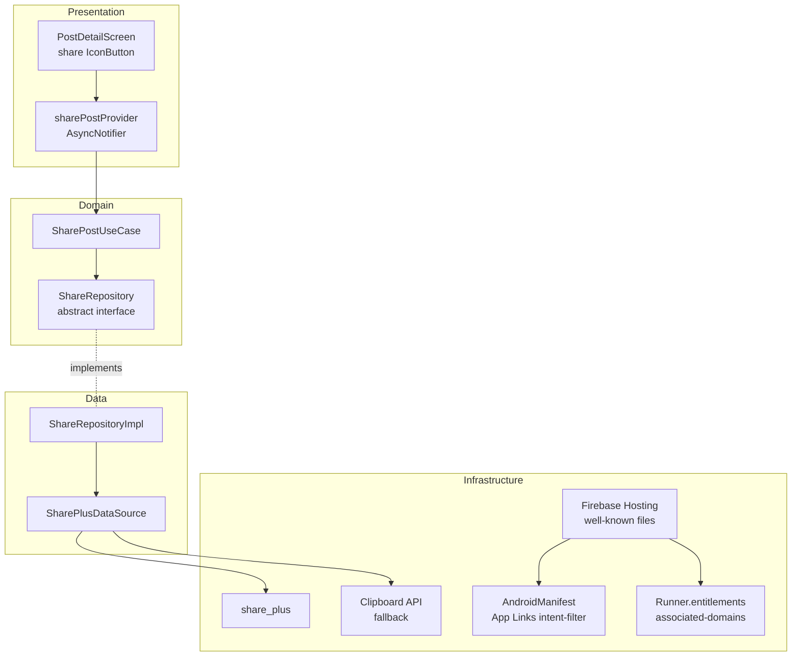

# SPEC-0010: Share Post

**Status:** APPROVED
**Author:** Slade
**Date:** 2026-05-18
**Proposal:** [PROP-0010](../tech-proposals/0010-share-post.md)
**Approved by:** Slade

---

## Overview

When a viewer taps a share icon button on `PostDetailScreen`, the app builds a canonical URL (`https://share.psstee.dev/posts/<postId>`), invokes `share_plus` to surface the OS share sheet (iOS/Android) or the Web Share API (web), and the recipient's device re-opens the Unishare app directly to that post. Firebase Hosting serves the two well-known files required by Universal Links (iOS) and App Links (Android). GoRouter's existing redirect guard preserves the intended `/posts/:postId` path as a redirect destination when the deep link arrives on an unauthenticated device, resuming navigation after sign-in. If the share sheet is dismissed, no action is taken. If the platform rejects the share call, the URL is copied to the clipboard and a SnackBar confirms this. If the target post is not found when the link is opened, `PostDetailScreen` renders an inline "Post not found" error state.

---

## Architecture



---

## File map

All paths are relative to the repo root unless prefixed with `apps/mobile/`.

| Action | Path | Responsibility |
|--------|------|----------------|
| **Domain** | | |
| Create | `apps/mobile/lib/features/post/domain/repositories/share_repository.dart` | Abstract `ShareRepository` interface |
| Create | `apps/mobile/lib/features/post/domain/usecases/share_post.dart` | `SharePostUseCase` — delegates to `ShareRepository.share` |
| **Data** | | |
| Create | `apps/mobile/lib/features/post/data/datasources/share_plus_datasource.dart` | Calls `share_plus`; clipboard fallback on `ShareException` or Web Share unavailable |
| Create | `apps/mobile/lib/features/post/data/repositories/share_repository_impl.dart` | Implements `ShareRepository`; injects `SharePlusDataSource` |
| **Presentation** | | |
| Create | `apps/mobile/lib/features/post/presentation/providers/share_post_provider.dart` | `sharePostProvider` — `AsyncNotifier<void>` scoped to `postId`; exposes `share(Post)` |
| Modify | `apps/mobile/lib/features/post/presentation/screens/post_detail_screen.dart` | Add share `IconButton` to `AppBar.actions`; add "Post not found" inline error state for document-missing errors |
| **Infrastructure** | | |
| Modify | `apps/mobile/android/app/src/main/AndroidManifest.xml` | Add `<intent-filter>` for App Links on `https://<domain>/posts/*` |
| Modify | `apps/mobile/ios/Runner/Runner.entitlements` | Add `com.apple.developer.associated-domains` for `applinks:<domain>` |
| Modify | `firebase.json` | Add `hosting` block: rewrites, `/.well-known/` headers, `posts/**` → `posts/index.html` |
| Modify | `apps/mobile/pubspec.yaml` | Add `share_plus: ^10.x` (pending team approval — OQ2) |
| Create | `hosting/public/.well-known/apple-app-site-association` | iOS AASA JSON — `applinks` component for `/posts/*` |
| Create | `hosting/public/.well-known/assetlinks.json` | Android digital asset links JSON — SHA-256 fingerprints (pending OQ5) |
| Create | `hosting/public/posts/index.html` | Deferred deep-link landing page — JS redirect to App/Play Store when app not installed |
| Modify | `apps/mobile/lib/core/router/router.dart` | Preserve deep-link path through auth redirect using `state.uri.toString()` as `extra` on the `/welcome` redirect |

---

## API contracts

### Domain layer — pure Dart, no framework imports

```dart
// apps/mobile/lib/features/post/domain/repositories/share_repository.dart

abstract class ShareRepository {
  /// Shares the canonical URL for [post] via the platform share mechanism.
  ///
  /// Throws [ShareException] only for hard platform errors.
  /// A user dismissal (share-sheet cancelled) resolves normally.
  Future<void> share(Post post);
}
```

```dart
// apps/mobile/lib/features/post/domain/usecases/share_post.dart

class SharePostUseCase {
  const SharePostUseCase(this._repo);

  final ShareRepository _repo;

  Future<void> call(Post post) => _repo.share(post);
}
```

### Data layer

```dart
// apps/mobile/lib/features/post/data/datasources/share_plus_datasource.dart

class SharePlusDataSource {
  const SharePlusDataSource({
    required SharePlus sharePlus,
    required Clipboard clipboard,
  })  : _sharePlus = sharePlus,
        _clipboard = clipboard;

  final SharePlus _sharePlus;
  final Clipboard _clipboard;

  /// Builds the share text and triggers the OS share sheet.
  ///
  /// Falls back to [_clipboard] if [SharePlatformException] is thrown
  /// or if the platform signals Web Share API is unavailable.
  /// Returns [ShareFallbackResult] to indicate whether the fallback was used.
  Future<ShareFallbackResult> share({
    required String postId,
    required String postTitle,
    required String baseUrl,
  });
}

enum ShareFallbackResult { shared, copiedToClipboard }
```

The share text format is: `"<postTitle> — <baseUrl>/posts/<postId>"`

### Presentation layer

```dart
// apps/mobile/lib/features/post/presentation/providers/share_post_provider.dart

@riverpod
class SharePost extends _$SharePost {
  @override
  FutureOr<void> build() {}

  Future<void> share(Post post) async {
    state = const AsyncLoading();
    state = await AsyncValue.guard(
      () => ref.read(sharePostUseCaseProvider).call(post),
    );
  }
}
```

The provider is a family-less `AsyncNotifier<void>`. One instance lives for the lifetime of `PostDetailScreen`. The screen observes `ref.listen<AsyncValue<void>>(sharePostProvider, ...)` to show the clipboard fallback SnackBar when `ShareRepositoryImpl` signals a fallback was used. The transport of the fallback signal is via a custom exception type `ShareFallbackException` caught by the screen's listener, not by propagating to `AsyncError`.

---

## Firestore schema

No Firestore changes. This feature reads from the existing `posts/{postId}` document only via the already-loaded `Post` entity on `PostDetailScreen`. No new collections, no new fields, no new indexes.

---

## Firebase Hosting and native config

### `firebase.json` additions

```json
"hosting": {
  "public": "hosting/public",
  "ignore": ["firebase.json", "**/.*", "**/node_modules/**"],
  "headers": [
    {
      "source": "/.well-known/apple-app-site-association",
      "headers": [{ "key": "Content-Type", "value": "application/json" }]
    },
    {
      "source": "/.well-known/assetlinks.json",
      "headers": [{ "key": "Content-Type", "value": "application/json" }]
    }
  ],
  "rewrites": [
    {
      "source": "/posts/**",
      "destination": "/posts/index.html"
    }
  ]
}
```

### `hosting/public/.well-known/apple-app-site-association`

```json
{
  "applinks": {
    "apps": [],
    "details": [
      {
        "appID": "<TEAM_ID>.<BUNDLE_ID>",
        "paths": ["/posts/*"]
      }
    ]
  }
}
```

`TEAM_ID` and `BUNDLE_ID` must be confirmed before this file is deployed (related to OQ1 and OQ5).

### `hosting/public/.well-known/assetlinks.json`

```json
[
  {
    "relation": ["delegate_permission/common.handle_all_urls"],
    "target": {
      "namespace": "android_app",
      "package_name": "<ANDROID_PACKAGE_NAME>",
      "sha256_cert_fingerprints": ["<SHA256_FINGERPRINT>"]
    }
  }
]
```

SHA-256 fingerprints for debug, release, and Play App Signing certificate are required (OQ5).

### `hosting/public/posts/index.html`

A minimal HTML page with a `<script>` block that:
1. Reads `window.location.pathname` to extract `postId`.
2. Attempts to open the custom scheme deep link (`unishare://posts/<postId>`) for a brief timeout.
3. Falls back to the Play Store / App Store URL if the app is not installed.

This page is intentionally static — no server-side rendering or OG tags for v1 (OQ4).

### `apps/mobile/android/app/src/main/AndroidManifest.xml`

Add inside the `<activity>` element that hosts the Flutter content:

```xml
<intent-filter android:autoVerify="true">
  <action android:name="android.intent.action.VIEW" />
  <category android:name="android.intent.category.DEFAULT" />
  <category android:name="android.intent.category.BROWSABLE" />
  <data
    android:scheme="https"
    android:host="share.psstee.dev"
    android:pathPrefix="/posts/" />
</intent-filter>
```

### `apps/mobile/ios/Runner/Runner.entitlements`

Add to the existing entitlements dict:

```xml
<key>com.apple.developer.associated-domains</key>
<array>
  <string>applinks:share.psstee.dev</string>
</array>
```

### GoRouter cold-start / redirect preservation

The existing redirect guard in `router.dart` already blocks unauthenticated paths to `/welcome`. The current guard at line 118–122 redirects without preserving the intended URL:

```dart
// Current behaviour — destination is lost:
if (!isAuthenticated && !isGuest) {
  if (!authRoutes.contains(currentPath)) {
    return '/welcome';
  }
  return null;
}
```

The flutter-engineer must extend this redirect to encode the original URI as a query parameter:

```dart
if (!isAuthenticated && !isGuest) {
  if (!authRoutes.contains(currentPath)) {
    final encoded = Uri.encodeComponent(state.uri.toString());
    return '/welcome?redirect=$encoded';
  }
  return null;
}
```

The `/welcome` screen (or its post-auth success handler) must read `state.uri.queryParameters['redirect']`, decode it, and call `context.go(decoded)` after successful sign-in. This is consistent with standard GoRouter redirect patterns and does not require any new package.

---

## Test plan

| Test file | Type | Covers |
|-----------|------|--------|
| `apps/mobile/test/unit/features/post/domain/usecases/share_post_test.dart` | Unit | `SharePostUseCase.call` delegates to `ShareRepository.share`; verifies mock is called with correct `Post` argument |
| `apps/mobile/test/unit/features/post/data/datasources/share_plus_datasource_test.dart` | Unit | Share text format is `"<title> — <baseUrl>/posts/<postId>"`; `ShareFallbackResult.shared` returned on success; `ShareFallbackResult.copiedToClipboard` returned when `SharePlatformException` is thrown; clipboard receives the canonical URL on fallback |
| `apps/mobile/test/unit/features/post/data/repositories/share_repository_impl_test.dart` | Unit | `ShareRepositoryImpl.share` calls `SharePlusDataSource.share` with correct `postId`, `postTitle`, `baseUrl`; propagates `ShareFallbackException` when datasource returns `copiedToClipboard` |
| `apps/mobile/test/widget/features/post/presentation/screens/post_detail_screen_test.dart` | Widget | Share `IconButton` is present in the `AppBar`; tapping it calls `sharePostProvider`; when post document returns null/not-found error, the inline "Post not found" error widget is rendered (not a crash); SnackBar "Link copied to clipboard" is shown when `ShareFallbackException` is received |

---

## Out of scope

- iOS Universal Links — `apple-app-site-association` and `Runner.entitlements` (post-v1; Team ID not yet available). On iOS, tapping a shared link opens the browser landing page which redirects to the App Store. The share button and share sheet work normally on iOS.
- iOS true deferred deep linking via Pasteboard URL / SKAdNetwork (post-v1)
- OG meta tags with post-specific `og:title`, `og:description`, `og:image` (post-v1; current `posts/index.html` uses static placeholder content only)
- Share analytics and share count tracking (no new Firestore fields in this spec)
- Share affordance in feed cards (OQ6 resolved: post detail only)
- Branch.io or any third-party deep-link SDK integration
- Android Play Install Referrer API deferred deep linking (descoped to post-v1)

---

## Open questions

- [x] **OQ1** — Firebase Hosting domain confirmed: `share.psstee.dev`. Replace all `share.psstee.dev` placeholders with this value.
- [x] **OQ2** — `share_plus: ^10.0.0` approved and added to `pubspec.yaml`.
- [ ] **OQ4** — OG meta tag strategy for v1 not confirmed. This spec assumes a static placeholder `posts/index.html` (no post title/description in the page head). A follow-up spec is needed if the team wants per-post social previews.
- [ ] **OQ5** — Android SHA-256 certificate fingerprints not yet enumerated. Three fingerprints are required: debug keystore, release keystore, and Play App Signing certificate. `assetlinks.json` cannot be finalised until all three are provided.
- [x] **OQ3** — iOS deferred deep linking: resolved as best-effort for v1 (descoped; see Out of scope).
- [x] **OQ6** — Share affordance placement: resolved as post detail screen only (no feed card share).
